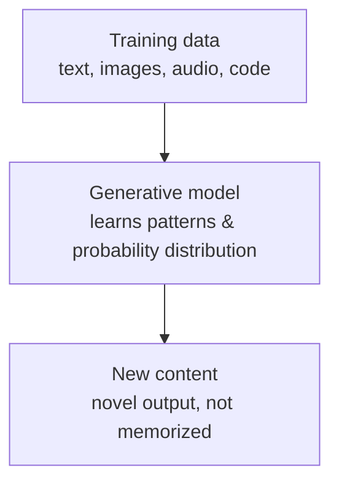
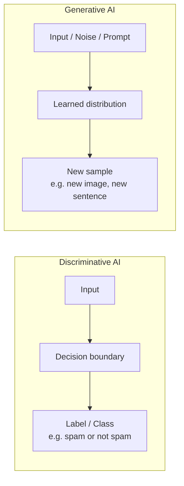
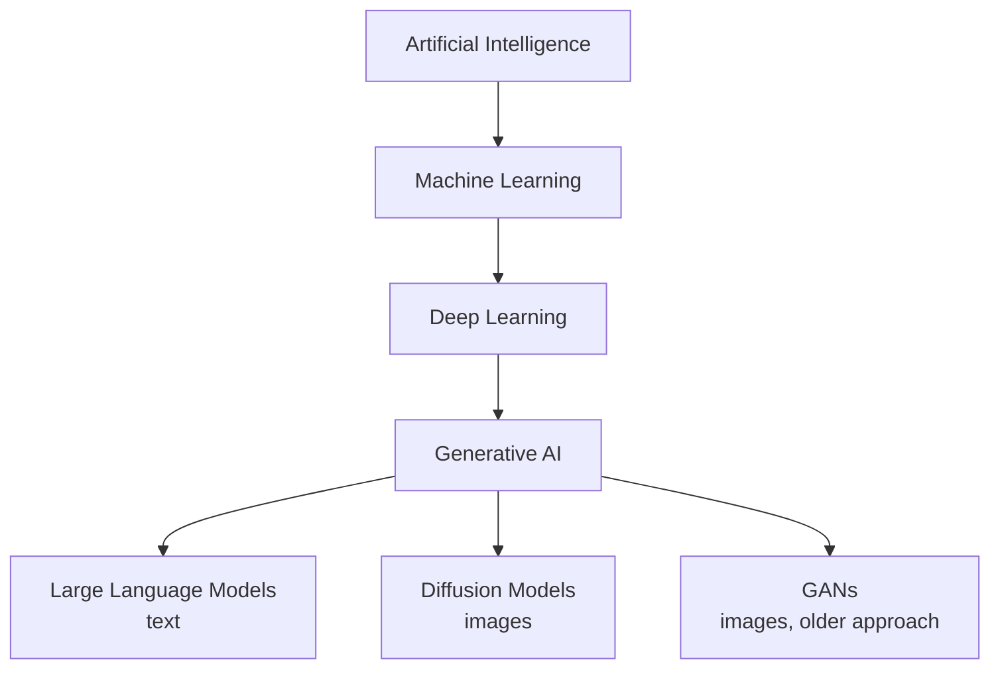

# Generative AI – Fundamentals Guide (Placement Prep)

Hybrid format: Concept + Diagram → Q&A → Code → Mini Assignment.
Diagrams use Mermaid syntax — render natively on GitHub, VS Code, Obsidian, and most markdown viewers.

---

## Part 1: Concept Walkthrough

### What is Generative AI?

Traditional ("discriminative") AI learns to **classify or predict** — given an input, it maps it to a label or a number. Generative AI learns something deeper: the **underlying probability distribution** of the training data itself. Once it has that distribution, it can **sample new, original outputs** from it — text, images, audio, code — that were never literally in the training set, but are statistically plausible given what it learned.



### Discriminative vs Generative AI

This is the single most common "explain the difference" interview question in this space.



**Key distinction:** Discriminative models answer "what is this?" (classification). Generative models answer "what could plausibly come next / exist?" (creation).

### Where Generative AI fits in the AI landscape



---

## Part 2: Q&A

### Module 1: Core Concepts

**Q1. What is Generative AI?**
A subset of AI/ML where models learn the underlying data distribution of training data well enough to generate new, original content — text, images, audio, code — rather than just classifying or predicting labels.

**Q2. Generative vs Discriminative AI — what's the fundamental difference?**
Discriminative models learn a decision boundary to classify/predict (input → label). Generative models learn the full probability distribution of the data (input/noise → new sample).

**Q3. Why is generated output not just "copying" training data?**
The model learns statistical patterns and relationships (a compressed, generalized representation), not a lookup table — so it produces new combinations/outputs that are plausible but not identical to anything it saw.

**Q4. What are the major types of generative models?**
**LLMs** (text — GPT, Claude, Llama), **Diffusion Models** (images — Stable Diffusion, DALL-E), **GANs** (Generative Adversarial Networks — earlier image generation approach), **VAEs** (Variational Autoencoders — probabilistic generative models, often used in research/foundations).

**Q5. What is a GAN, at a high level?**
Two neural networks — a **Generator** (creates fake samples) and a **Discriminator** (tries to distinguish fake from real) — trained adversarially against each other until the generator produces convincingly realistic outputs.

**Q6. What is a Diffusion Model, at a high level?**
A model trained to reverse a gradual noising process — it learns to start from pure noise and iteratively "denoise" it step by step into a coherent output (commonly used for image generation).

**Q7. What is a VAE (Variational Autoencoder)?**
An architecture that compresses input into a compact probabilistic latent space (encoder) and reconstructs/generates data from it (decoder) — foundational to generative modeling theory.

### Module 2: Why Gen AI Now / Practical Landscape

**Q8. Why has Generative AI exploded in popularity recently (post-2022)?**
Convergence of: massive compute availability (GPUs/TPUs at scale), huge internet-scale datasets, the Transformer architecture (parallelizable, scales well), and breakthroughs in self-supervised pre-training.

**Q9. What is "emergent behavior" in large generative models?**
Capabilities (like reasoning, few-shot learning, or code generation) that appear only once a model crosses a certain scale (parameters/data/compute) — not present or reliable in smaller versions of the same architecture.

**Q10. What does "multimodal" mean in Generative AI?**
A model that can process and/or generate across multiple data types — e.g., taking both text and images as input, or generating both text and images as output — rather than being limited to a single modality.

**Q11. What is the difference between Narrow AI and Generative AI's role in "General-purpose" AI discussions?**
Narrow AI is built for one specific task (e.g., spam detection). Modern large generative models are often called "general-purpose" because a single model can handle many different tasks (writing, coding, Q&A, summarization) via prompting alone, without retraining.

**Q12. What is Prompt Engineering?**
The practice of crafting inputs (prompts) to a generative model to reliably elicit the desired type/quality of output — a key practical skill for working with LLMs without modifying the model itself.

### Module 3: Risks & Responsible AI (common interview add-on)

**Q13. What is "hallucination" in Generative AI?**
When a model generates plausible-sounding but factually incorrect or fabricated content, stated with confidence — a core limitation of current generative models.

**Q14. Why do generative models hallucinate?**
They're trained to predict statistically likely continuations, not to verify truth — if a plausible-sounding but incorrect answer fits the learned pattern, the model may produce it without any built-in fact-checking mechanism.

**Q15. What is bias in Generative AI, and where does it come from?**
Systematic skew in model outputs reflecting imbalances or prejudices present in the training data — since models learn statistical patterns from real-world data, they can reproduce or amplify existing societal biases.

**Q16. What are common mitigation strategies for hallucination?**
Grounding outputs in retrieved, verifiable data (see RAG), fine-tuning on curated data, output verification/fact-checking layers, and clear prompting that discourages speculation.

---

## Part 3: Code Snippets

Minimal, runnable examples showing generative AI concepts in practice using Python.

### 3.1 Calling a generative model (text generation) via an API

```python
# Using the Anthropic API as an example generative model call
import anthropic

client = anthropic.Anthropic(api_key="YOUR_API_KEY")

response = client.messages.create(
    model="claude-sonnet-4-6",
    max_tokens=200,
    messages=[
        {"role": "user", "content": "Write one sentence describing what generative AI is."}
    ]
)

print(response.content[0].text)
```

### 3.2 A minimal toy example: sampling from a learned distribution

This isn't a real LLM, but it illustrates the *core idea* — a "model" that has learned a distribution over next words, and generates by sampling from it.

```python
import random

# A tiny "learned" distribution: given a word, probability of the next word
learned_distribution = {
    "the": {"cat": 0.4, "dog": 0.3, "sky": 0.3},
    "cat": {"sat": 0.7, "ran": 0.3},
    "sat": {"on": 1.0},
    "on": {"the": 1.0},
}

def generate(start_word, steps=5):
    word = start_word
    output = [word]
    for _ in range(steps):
        options = learned_distribution.get(word)
        if not options:
            break
        # Sample the next word based on learned probabilities
        next_word = random.choices(
            list(options.keys()), weights=list(options.values())
        )[0]
        output.append(next_word)
        word = next_word
    return " ".join(output)

print(generate("the"))  # e.g. "the cat sat on the"
```

### 3.3 Discriminative vs Generative, in code terms

```python
# Discriminative: input -> label (classification)
def discriminative_model(email_text):
    # simplified logic standing in for a trained classifier
    return "spam" if "win money" in email_text.lower() else "not spam"

# Generative: input/prompt -> new content
def generative_model(prompt):
    # simplified logic standing in for a trained generative model
    return f"Generated response inspired by: '{prompt}'"

print(discriminative_model("You won money! Click here"))   # -> "spam"
print(generative_model("Write a poem about the ocean"))     # -> generated text
```

---

## Part 4: Mini Assignment

**Goal:** Get hands-on with the discriminative vs generative distinction and basic prompting before moving to Transformers.

**Task 1 — Conceptual (no code):**
Pick any app/product you use daily. Identify one feature that is *discriminative* (classifies/predicts) and one that could be (or is) *generative* (creates new content). Write 2-3 sentences explaining why each fits its category.

**Task 2 — Hands-on (requires an API key, e.g. Anthropic/OpenAI, or use a free playground UI):**
1. Write a prompt asking a generative model to explain "hallucination in AI" in exactly 2 sentences.
2. Run it 3 times and compare the outputs — are they identical or different each time? Why do you think that is? (Hint: relates to sampling/randomness in generation.)
3. Now write a prompt intentionally designed to make the model hallucinate (e.g., ask about a fictional event or a very obscure/nonexistent fact). Observe what happens.

**Task 3 — Extend the toy code (Section 3.2):**
Modify the `learned_distribution` dictionary to add at least 3 new words/branches, then generate 5 different sentences by calling `generate()` multiple times with different starting words. Note how the output changes based on the "distribution" you defined — this is a simplified stand-in for how a real model's learned weights shape its output.

**Deliverable:** A short write-up (half a page) covering your Task 1 answer, your 3 generated hallucination-test outputs from Task 2, and your modified code + sample outputs from Task 3.

---

## Quick Revision Checklist

- [ ] Explain Generative vs Discriminative AI with an example
- [ ] Name the 4 major types of generative models (LLM, Diffusion, GAN, VAE)
- [ ] Explain GAN's generator vs discriminator relationship
- [ ] Explain what hallucination is and why it happens
- [ ] Explain emergent behavior and multimodality
- [ ] Be able to write a basic prompt and reason about non-deterministic output

---

*Next: Transformers — the architecture that powers most modern generative AI (attention mechanism, encoder-decoder, why it replaced RNNs).*