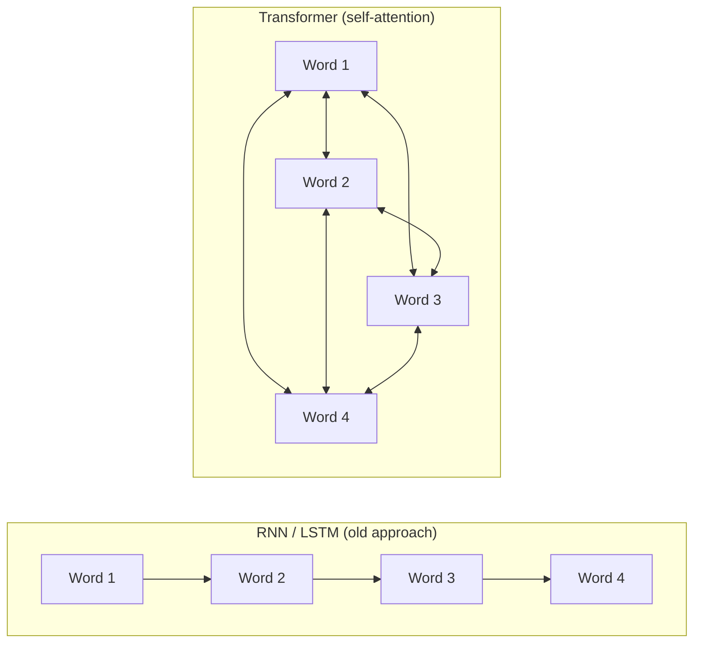
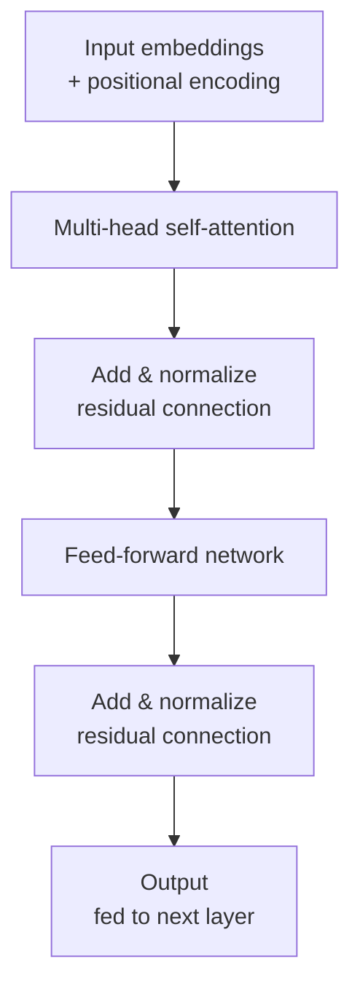
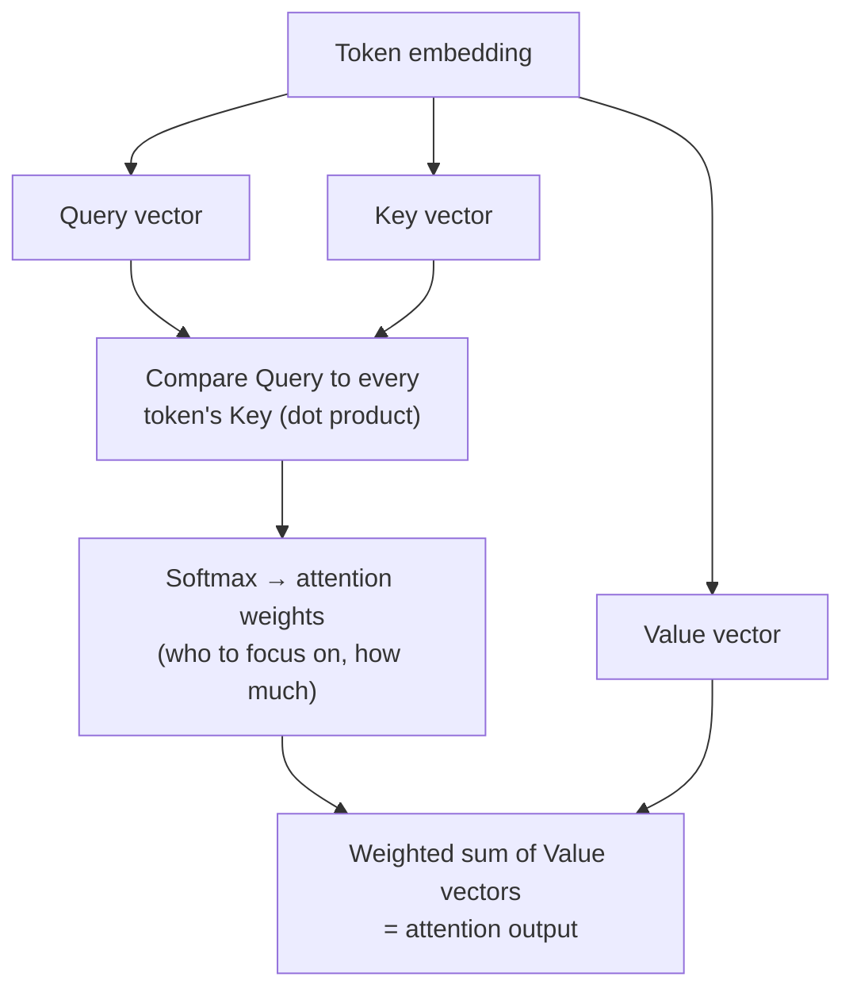
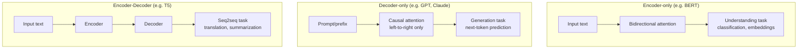

# Transformers – Architecture Guide (Placement Prep)

Hybrid format: Concept + Diagram → Q&A → Code → Mini Assignment.
Diagrams use Mermaid syntax — render natively on GitHub, VS Code, Obsidian, and most markdown viewers.

---

## Part 1: Concept Walkthrough

### The problem Transformers solved

Before Transformers (2017, "Attention Is All You Need"), sequence models like RNNs/LSTMs processed text **one token at a time, in order**. This caused two big problems: they were slow to train (couldn't parallelize across the sequence) and struggled to remember relationships between words that were far apart in a sentence ("long-range dependencies").

Transformers solved both by replacing sequential processing with **self-attention** — every token looks directly at every other token in the sequence simultaneously, and the model learns *how much* attention each token should pay to each other token.



**Key idea:** RNNs process left-to-right, one step depending on the last. Transformers let every word attend to every other word directly and in parallel — faster training, better long-range understanding.

### The Transformer block (encoder or decoder layer)

Every Transformer layer follows the same repeating pattern:



This block is stacked N times (e.g., 12, 24, 96 layers depending on model size) to form the full Transformer.

### Self-Attention, step by step

For each token, the model computes three vectors — **Query (Q)**, **Key (K)**, **Value (V)** — and uses them to decide how much focus to place on every other token.



**Intuition:** Query = "what am I looking for?" Key = "what do I contain?" Value = "what do I actually offer if you pay attention to me?" The dot product of Query and Key gives a relevance score; softmax turns those scores into weights; the output is a blend of all tokens' Values, weighted by relevance.

### The three Transformer architecture variants



---

## Part 2: Q&A

### Module 1: Why Transformers Exist

**Q1. What problem did Transformers solve that RNNs/LSTMs struggled with?**
Sequential processing (slow, hard to parallelize) and difficulty capturing long-range dependencies between distant tokens in a sequence.

**Q2. What paper introduced the Transformer architecture, and what was its title?**
"Attention Is All You Need" (Vaswani et al., 2017, Google) — introduced a model built entirely on attention mechanisms, no recurrence.

**Q3. Why are Transformers faster to train than RNNs?**
RNNs process tokens sequentially (each step depends on the previous one). Transformers process all tokens in a sequence **in parallel** via self-attention, making them far more GPU-friendly.

**Q4. What is a "long-range dependency" problem, and how does self-attention fix it?**
When two related words are far apart in a sentence (e.g., a pronoun referring back to a noun many words earlier), RNNs can "forget" that relationship over distance. Self-attention connects every token to every other token directly, regardless of distance.

### Module 2: Core Architecture Components

**Q5. What are the main components of a single Transformer layer?**
Multi-head self-attention, residual ("skip") connections, layer normalization, and a feed-forward neural network — repeated in a fixed pattern.

**Q6. What is a residual (skip) connection, and why is it used?**
Adds the input of a sub-layer directly to its output (`output = SubLayer(x) + x`) — helps gradients flow through very deep networks and prevents information loss across many stacked layers.

**Q7. What is Layer Normalization, and why does it matter here?**
Normalizes the values within each layer to stabilize and speed up training — applied after residual connections in the standard Transformer block.

**Q8. What does the Feed-Forward Network (FFN) in a Transformer block do?**
A small fully-connected neural network applied independently to each token's representation — adds non-linearity and additional transformation capacity after attention mixes information across tokens.

**Q9. Why is the architecture called "self"-attention specifically?**
Because a sequence attends to **itself** — every token computes attention scores against every other token in the *same* input sequence (as opposed to attending to a separate sequence).

### Module 3: Self-Attention Mechanism

**Q10. What are Query, Key, and Value vectors in self-attention?**
Three learned linear projections of each token's embedding. **Query**: what this token is looking for. **Key**: what this token offers/represents. **Value**: the actual content passed along if attended to.

**Q11. Walk through the self-attention computation step by step.**
1) Compute Q, K, V for every token. 2) Compute attention scores = dot product of each token's Query with every token's Key. 3) Scale the scores (divide by √d_k) and apply softmax to get attention weights (sum to 1). 4) Multiply weights by the Value vectors and sum — this weighted sum is the attention output for that token.

**Q12. Why is the dot product scaled by √d_k before softmax?**
Prevents the dot products from growing too large in magnitude as dimensionality increases, which would push softmax into regions with extremely small gradients (vanishing gradient issue).

**Q13. What is Multi-Head Attention?**
Instead of computing attention once, the model runs several attention "heads" in parallel, each with its own learned Q/K/V projections — allowing the model to capture different types of relationships (e.g., syntax vs. meaning) simultaneously, then concatenates and combines the results.

**Q14. What is the difference between self-attention and cross-attention?**
Self-attention: a sequence attends to itself. Cross-attention: one sequence (e.g., decoder) attends to a *different* sequence (e.g., encoder's output) — used in encoder-decoder architectures like translation models.

**Q15. What is Causal (Masked) Self-Attention, and where is it used?**
A variant where each token can only attend to itself and *earlier* tokens, not future ones — enforced via a masking step. Used in decoder-only models (like GPT/Claude) since they generate text left-to-right, one token at a time.

### Module 4: Positional Encoding & Embeddings

**Q16. Why do Transformers need Positional Encoding?**
Unlike RNNs, self-attention has no inherent sense of token order (it treats the sequence like a "bag" of tokens attending to each other) — positional encoding injects information about each token's position in the sequence.

**Q17. How is positional encoding typically implemented?**
Originally via fixed sine/cosine functions of varying frequency added to token embeddings; many modern models use **learned** positional embeddings, or relative positional schemes like RoPE (Rotary Positional Embeddings).

**Q18. What is a token embedding?**
A dense vector representation of a token (word/subword) learned during training, such that semantically similar tokens end up with similar vector representations.

### Module 5: Encoder vs Decoder vs Encoder-Decoder

**Q19. What is an Encoder-only Transformer, and what is it good for?**
Uses bidirectional self-attention (each token sees the full context, both before and after it) — best for **understanding** tasks: classification, embeddings, sentence similarity. Example: BERT.

**Q20. What is a Decoder-only Transformer, and what is it good for?**
Uses causal (masked) self-attention — each token only sees previous tokens — best for **generation** tasks: predicting the next token repeatedly to produce text. Examples: GPT, Claude, Llama — this is the dominant architecture for modern LLMs.

**Q21. What is an Encoder-Decoder Transformer, and what is it good for?**
Combines both: an encoder processes the full input, a decoder generates output while cross-attending to the encoder's representations — best for **sequence-to-sequence** tasks like translation and summarization. Example: T5, the original translation Transformer.

**Q22. Why do most modern LLMs (GPT, Claude, Llama) use decoder-only architecture?**
It's simpler, scales very well, and a single next-token-prediction objective turns out to generalize to almost any task (Q&A, summarization, translation, code) purely through prompting — no need for a separate encoder.

### Module 6: Training & Practical Considerations

**Q23. What is the pre-training objective for a typical decoder-only LLM?**
Next-token prediction — given all previous tokens, predict the most likely next token, trained on massive text corpora in a self-supervised way (no manual labels needed).

**Q24. What is the pre-training objective for an encoder-only model like BERT?**
Masked Language Modeling (MLM) — randomly mask some tokens in the input and train the model to predict them using bidirectional context.

**Q25. What does "context window" mean in Transformer models?**
The maximum number of tokens (input + output combined) the model can process/attend to at once — attention computation grows quadratically with sequence length, which is why context windows have historically been limited.

**Q26. Why does self-attention have quadratic (O(n²)) complexity, and why does this matter?**
Every token computes attention scores against every other token, so cost grows with the square of sequence length — this is why long-context models require special optimizations (sparse attention, sliding windows, etc.) to remain efficient.

**Q27. What is fine-tuning, in the context of a pre-trained Transformer?**
Taking a model that's already pre-trained on massive general data and further training it (usually on a smaller, task-specific or domain-specific dataset) to specialize its behavior.

---

## Part 3: Code Snippets

### 3.1 Self-attention from scratch (NumPy, minimal, for intuition)

```python
import numpy as np

def softmax(x):
    e_x = np.exp(x - np.max(x, axis=-1, keepdims=True))
    return e_x / e_x.sum(axis=-1, keepdims=True)

def self_attention(X, W_q, W_k, W_v):
    Q = X @ W_q          # Query
    K = X @ W_k          # Key
    V = X @ W_v          # Value

    d_k = K.shape[-1]
    scores = Q @ K.T / np.sqrt(d_k)      # scaled dot-product
    weights = softmax(scores)             # attention weights
    output = weights @ V                  # weighted sum of values
    return output, weights

# 4 tokens, embedding dimension 8
np.random.seed(0)
X = np.random.rand(4, 8)

# Random projection matrices (normally learned during training)
W_q = np.random.rand(8, 8)
W_k = np.random.rand(8, 8)
W_v = np.random.rand(8, 8)

output, weights = self_attention(X, W_q, W_k, W_v)
print("Attention weights (who attends to whom):\n", np.round(weights, 2))
print("Output shape:", output.shape)
```

### 3.2 Multi-head attention using PyTorch's built-in layer

```python
import torch
import torch.nn as nn

embed_dim = 16
num_heads = 4
seq_len = 5
batch_size = 1

mha = nn.MultiheadAttention(embed_dim=embed_dim, num_heads=num_heads, batch_first=True)

x = torch.rand(batch_size, seq_len, embed_dim)   # (batch, seq_len, embed_dim)

# Self-attention: query, key, value are all the same input
attn_output, attn_weights = mha(x, x, x)

print("Output shape:", attn_output.shape)          # (1, 5, 16)
print("Attention weights shape:", attn_weights.shape)  # (1, 5, 5)
```

### 3.3 Using a real pre-trained Transformer (Hugging Face)

```python
from transformers import pipeline

# Encoder-only model example: sentiment classification (understanding task)
classifier = pipeline("sentiment-analysis")
print(classifier("Transformers completely changed how we build AI models."))

# Decoder-only model example: text generation
generator = pipeline("text-generation", model="gpt2")
print(generator("Self-attention allows a model to", max_length=25, num_return_sequences=1))
```

### 3.4 Visualizing which tokens attend to which (conceptual)

```python
# Assuming `weights` from Section 3.1 (a 4x4 attention weight matrix)
tokens = ["The", "cat", "sat", "down"]

for i, token in enumerate(tokens):
    top_attended = tokens[np.argmax(weights[i])]
    print(f"Token '{token}' attends most to '{top_attended}' "
          f"(weight={weights[i].max():.2f})")
```

---

## Part 4: Mini Assignment

**Goal:** Move from reading about self-attention to actually computing and reasoning about it.

**Task 1 — Trace it by hand:**
Take the sentence: `"The dog chased the ball"` (5 tokens). Without writing code, sketch (on paper or in a text file) which tokens you'd *expect* to have high attention weights with each other, and explain why in 1-2 sentences per pair (e.g., does "dog" attend strongly to "chased"? Does "the" attend strongly to anything?).

**Task 2 — Run and modify the NumPy self-attention (Section 3.1):**
1. Run the code as-is and print the attention weight matrix.
2. Change the random seed 3 times and observe how the weights change — since the projection matrices are random (not learned), what does this tell you about the *role* of training in making attention meaningful?
3. Increase the number of tokens from 4 to 8 and re-run — does the shape of the weights matrix change as expected?

**Task 3 — Compare encoder-only vs decoder-only in practice:**
Using Section 3.3's Hugging Face examples:
1. Run the sentiment classifier on 3 different sentences of your choice.
2. Run the GPT-2 text generator with the same starting prompt 3 times — note that outputs differ each time. Relate this back to what you learned about sampling/generation in the Gen AI Basics guide.
3. In 2-3 sentences, explain why you'd use the sentiment classifier (encoder-only) for a "flag negative reviews" feature, but the generator (decoder-only) for a "auto-draft a reply" feature.

**Deliverable:** A short write-up with your Task 1 attention predictions, the 3 attention weight matrices from Task 2 with your observations, and your Task 3 outputs + explanation.

---

## Quick Revision Checklist

- [ ] Explain why Transformers replaced RNNs (parallelism + long-range dependencies)
- [ ] Walk through self-attention step by step (Q, K, V → scores → softmax → weighted sum)
- [ ] Explain Multi-Head Attention and why multiple heads help
- [ ] Explain why positional encoding is necessary
- [ ] Differentiate Encoder-only vs Decoder-only vs Encoder-Decoder, with examples
- [ ] Explain causal (masked) attention and why decoder-only models need it
- [ ] Explain why self-attention is O(n²) and why that matters for context windows

---

*Next: LLM Basics — how Transformers are scaled up and trained into large language models (pre-training, fine-tuning, tokens, context windows, scaling laws).*