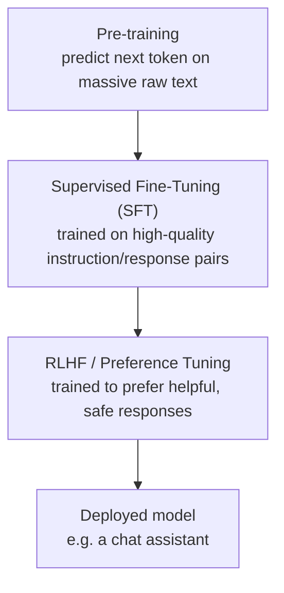
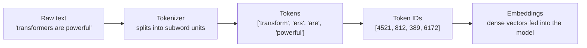
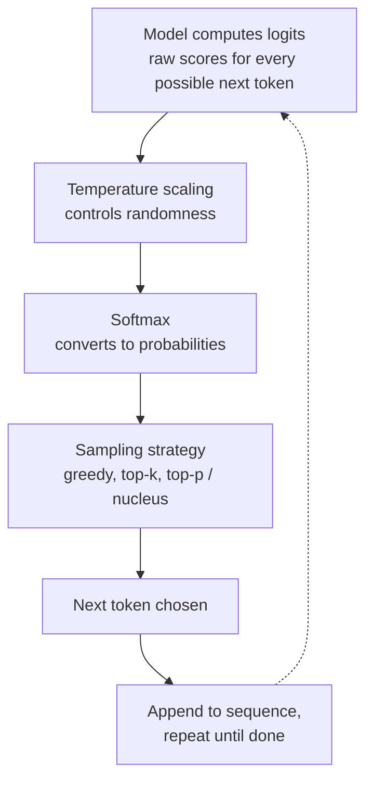

# Large Language Models (LLMs) – Fundamentals Guide (Placement Prep)

Hybrid format: Concept + Diagram → Q&A → Code → Mini Assignment.
Diagrams use Mermaid syntax — render natively on GitHub, VS Code, Obsidian, and most markdown viewers.

---

## Part 1: Concept Walkthrough

### What is an LLM?

An LLM is a decoder-only Transformer (see the Transformers guide) scaled up to billions of parameters and trained on massive amounts of text. At its core, it does one thing: given a sequence of tokens, predict the probability distribution over what token comes next. Everything an LLM can do — writing, coding, reasoning, chatting — emerges from this single objective applied at enormous scale.

### The LLM training pipeline

Building a usable LLM (like the assistant you're talking to) happens in stages, not one shot.



**Key idea:** Pre-training gives the model broad knowledge and language ability but a "raw" model just predicts likely text continuations, it doesn't naturally follow instructions or converse helpfully. SFT and RLHF are what turn a raw next-token predictor into a helpful, aligned assistant.

### Tokenization: how text becomes numbers

Models don't see words — they see numbers. Tokenization is the bridge.



### How an LLM generates text (decoding)

At each step, the model outputs a probability distribution over its entire vocabulary for "what comes next" — then a sampling strategy picks the actual next token.



---

## Part 2: Q&A

### Module 1: What is an LLM

**Q1. What is a Large Language Model?**
A neural network (typically a decoder-only Transformer) with billions of parameters, trained on massive text corpora to predict the next token in a sequence — this simple objective, at scale, gives rise to broad language understanding and generation abilities.

**Q2. What does "large" refer to in LLM?**
Primarily the number of parameters (model weights) — ranging from millions in early models to hundreds of billions/trillions in frontier models — as well as the scale of training data and compute used.

**Q3. What is a parameter in an LLM?**
A learnable numeric weight in the neural network — parameters are adjusted during training to minimize prediction error, and collectively they encode everything the model "knows."

**Q4. What is the fundamental training objective of most LLMs?**
Next-token prediction — given a sequence of tokens, predict the probability distribution over the next token, trained via self-supervised learning on raw text (no manual labeling needed).

**Q5. Why is next-token prediction alone enough to produce capabilities like reasoning or coding?**
At sufficient scale, accurately predicting the next token in diverse, high-quality text (including code, math, dialogue, arguments) requires implicitly learning the underlying patterns of logic, syntax, and reasoning present in that text — capability emerges as a side effect of the objective, not something explicitly programmed.

### Module 2: Training Stages

**Q6. What is Pre-training?**
The first, most compute-intensive stage — training a model from scratch (random weights) on a massive, diverse corpus of raw text using next-token prediction. Produces a "base model" with broad knowledge but no instruction-following behavior.

**Q7. What is Supervised Fine-Tuning (SFT)?**
Further training the pre-trained base model on a smaller, curated dataset of high-quality instruction-response pairs, teaching it to follow instructions and respond helpfully rather than just continue text.

**Q8. What is RLHF (Reinforcement Learning from Human Feedback)?**
A further tuning stage where human preference data (ranking multiple model responses from best to worst) is used to train a reward model, which then guides the LLM (via reinforcement learning) toward more helpful, harmless, and honest outputs.

**Q9. Why is a "base model" (pre-trained only, before SFT/RLHF) not typically useful as a chat assistant directly?**
It only knows how to continue text in a statistically likely way — given a question, it might continue with more questions, or unrelated text, rather than actually answering helpfully, since it was never trained on that specific behavior pattern.

**Q10. What is Instruction Tuning?**
A form of fine-tuning specifically focused on training the model to follow explicit natural-language instructions across a wide variety of tasks — often considered part of or closely related to SFT.

**Q11. What is the difference between pre-training and fine-tuning in terms of data and compute?**
Pre-training: massive, broad, mostly uncurated data, enormous compute (can take months on huge GPU clusters). Fine-tuning: much smaller, high-quality curated data, dramatically less compute (hours to days).

### Module 3: Tokenization

**Q12. What is a token?**
A unit of text the model processes — can be a whole word, part of a word (subword), or a single character, depending on the tokenizer. Roughly, 1 token ≈ 4 characters or ¾ of a word in English.

**Q13. Why do LLMs use subword tokenization instead of whole-word tokenization?**
Whole-word vocabularies would be huge and can't handle unseen/rare words. Subword tokenization (e.g., Byte Pair Encoding) breaks rare/unknown words into familiar smaller pieces, keeping vocabulary size manageable while still representing any input text.

**Q14. What is Byte Pair Encoding (BPE)?**
A common tokenization algorithm that starts with individual characters and iteratively merges the most frequently occurring adjacent pairs into new tokens, building up a vocabulary of common subwords/words.

**Q15. What happens to a word the tokenizer has never seen before?**
It gets broken down into smaller known subword pieces (potentially down to individual characters/bytes) — this is exactly why subword tokenization handles novel/rare words gracefully.

**Q16. Why does tokenization matter for cost and context window?**
API pricing and context window limits are typically measured in tokens, not words or characters — so how efficiently a tokenizer represents text directly affects both cost and how much content fits in a single request.

### Module 4: Context Window & Scaling

**Q17. What is a Context Window?**
The maximum number of tokens (combined input + output) an LLM can process/attend to in a single request — content beyond this limit is simply not seen by the model.

**Q18. Why can't context windows be infinitely large?**
Self-attention has O(n²) computational complexity with sequence length (see Transformers guide) — doubling the context window roughly quadruples the compute/memory needed, making very long contexts expensive.

**Q19. What are Scaling Laws in the context of LLMs?**
Empirical relationships showing that model performance improves predictably as you increase model size (parameters), dataset size, and compute — used to guide decisions on how to allocate resources when training larger models.

**Q20. What is the "knowledge cutoff" of an LLM?**
The date up to which the model's training data was collected — the model has no inherent knowledge of events after that date, which is why tools like web search are often paired with LLMs for current information.

### Module 5: Generation & Sampling Parameters

**Q21. What is Temperature in LLM generation?**
A parameter that controls randomness in sampling — low temperature (near 0) makes output more deterministic/focused (picks highest-probability tokens), high temperature makes output more random/creative/diverse.

**Q22. What is Greedy Decoding?**
Always picking the single highest-probability next token at each step — deterministic, but can produce repetitive or less creative text.

**Q23. What is Top-k Sampling?**
Restricts sampling to only the k most probable next tokens at each step, then samples among those — balances quality (avoiding very unlikely tokens) with some randomness.

**Q24. What is Top-p (Nucleus) Sampling?**
Instead of a fixed count (k), selects the smallest set of tokens whose cumulative probability exceeds a threshold p (e.g., 0.9), then samples among those — adapts dynamically to how "confident" the distribution is at each step.

**Q25. What is In-Context Learning?**
The ability of an LLM to learn a task pattern from examples provided directly in the prompt (without any weight updates/training) — the model "learns" purely from the context of the current conversation.

**Q26. What is Zero-shot vs Few-shot prompting?**
**Zero-shot**: asking the model to perform a task with no examples given, relying purely on its pre-existing knowledge. **Few-shot**: providing a handful of example input-output pairs in the prompt before the actual query, to guide the model's response format/approach.

### Module 6: Practical Considerations & Common Interview Questions

**Q27. What is the difference between training and inference for an LLM?**
**Training**: the (very expensive, one-time) process of learning weights from data. **Inference**: using the already-trained model to generate a response to a given input — what happens every time you send a prompt to a deployed model.

**Q28. Why is LLM inference relatively expensive/slow compared to smaller ML models?**
Billions of parameters must be loaded and computed through for every single token generated, and generation happens one token at a time (autoregressive) — each new token requires another full forward pass.

**Q29. What is Quantization, and why is it used with LLMs?**
Reducing the numerical precision of model weights (e.g., from 32-bit to 8-bit or 4-bit) to shrink model size and speed up inference, with some (often minimal) trade-off in accuracy — makes large models more deployable.

**Q30. What is the difference between a "closed" and "open-weight" LLM?**
**Closed**: weights are not released; access only via API (e.g., Claude, GPT-4). **Open-weight**: model weights are publicly downloadable, allowing self-hosting and direct fine-tuning (e.g., Llama, Mistral).

**Q31. Why can't you just "ask an LLM to be more accurate" to fix hallucination?**
Hallucination stems from the model's fundamental nature (predicting plausible text, not verifying facts) — prompting can reduce it somewhat (e.g., asking it to say "I don't know" when unsure) but doesn't eliminate the underlying limitation; grounding via retrieval (RAG) is a more robust fix.

**Q32. What is Alignment, in the context of LLMs?**
The broad effort (via SFT, RLHF, and other techniques) to make a model's behavior match human intentions and values — helpful, harmless, honest — rather than just fluent.

---

## Part 3: Code Snippets

### 3.1 Tokenization in practice

```python
from transformers import AutoTokenizer

tokenizer = AutoTokenizer.from_pretrained("gpt2")

text = "Transformers are powerful, but tokenization matters too!"
tokens = tokenizer.tokenize(text)
token_ids = tokenizer.encode(text)

print("Tokens:", tokens)
print("Token IDs:", token_ids)
print("Number of tokens:", len(tokens))
print("Decoded back:", tokenizer.decode(token_ids))
```

### 3.2 Sampling strategies compared (temperature, top-k, top-p)

```python
from transformers import pipeline

generator = pipeline("text-generation", model="gpt2")

prompt = "The future of artificial intelligence is"

# Greedy (deterministic)
print("Greedy:", generator(prompt, max_length=25, do_sample=False)[0]["generated_text"])

# Low temperature (more focused)
print("Low temp:", generator(prompt, max_length=25, do_sample=True, temperature=0.3)[0]["generated_text"])

# High temperature (more random/creative)
print("High temp:", generator(prompt, max_length=25, do_sample=True, temperature=1.2)[0]["generated_text"])

# Top-k sampling
print("Top-k:", generator(prompt, max_length=25, do_sample=True, top_k=10)[0]["generated_text"])

# Top-p (nucleus) sampling
print("Top-p:", generator(prompt, max_length=25, do_sample=True, top_p=0.9)[0]["generated_text"])
```

### 3.3 Zero-shot vs Few-shot prompting

```python
import anthropic

client = anthropic.Anthropic(api_key="YOUR_API_KEY")

# Zero-shot: no examples given
zero_shot_prompt = "Classify the sentiment of this review: 'The food was cold and the service was slow.'"

# Few-shot: examples given to guide format
few_shot_prompt = """Classify sentiment as Positive, Negative, or Neutral.

Review: "Amazing experience, loved it!"
Sentiment: Positive

Review: "It was okay, nothing special."
Sentiment: Neutral

Review: "The food was cold and the service was slow."
Sentiment:"""

for label, prompt in [("Zero-shot", zero_shot_prompt), ("Few-shot", few_shot_prompt)]:
    response = client.messages.create(
        model="claude-sonnet-4-6",
        max_tokens=20,
        messages=[{"role": "user", "content": prompt}]
    )
    print(f"{label}: {response.content[0].text}")
```

### 3.4 Estimating token count and cost (rough approximation)

```python
def estimate_tokens(text):
    # Rough rule of thumb: ~4 characters per token in English
    return len(text) // 4

def estimate_cost(input_tokens, output_tokens, price_per_million_input=3.0, price_per_million_output=15.0):
    input_cost = (input_tokens / 1_000_000) * price_per_million_input
    output_cost = (output_tokens / 1_000_000) * price_per_million_output
    return input_cost + output_cost

text = "Explain the difference between pre-training and fine-tuning in two sentences."
in_tokens = estimate_tokens(text)
out_tokens = 60  # assume a short response

print(f"Estimated input tokens: {in_tokens}")
print(f"Estimated cost: ${estimate_cost(in_tokens, out_tokens):.6f}")
```

---

## Part 4: Mini Assignment

**Goal:** Build intuition for tokenization, sampling behavior, and prompting strategy — the practical levers you actually control when working with an LLM.

**Task 1 — Tokenization exploration:**
Using Section 3.1's code (or an online tokenizer visualizer if you don't have a Python environment set up):
1. Tokenize 3 sentences: one plain English sentence, one with a rare/made-up word (e.g., "The zorbulator flickered"), and one containing code (e.g., `for i in range(10): print(i)`).
2. Compare token counts across the three. Which had the most tokens per character, and why?

**Task 2 — Temperature experiment:**
Using Section 3.2's code:
1. Run the same prompt at temperature 0.1, 0.7, and 1.5 (5 times each).
2. Write 2-3 sentences describing the pattern you observe as temperature increases — does output become more repetitive/predictable or more varied/surprising?

**Task 3 — Zero-shot vs Few-shot comparison:**
Using Section 3.3 as a template:
1. Pick a classification task of your choice (not sentiment — e.g., classify a sentence as "formal" or "casual" tone).
2. Write both a zero-shot and a few-shot version of the prompt.
3. Test both on 3 tricky/ambiguous examples. Does few-shot noticeably improve consistency or accuracy over zero-shot? Explain why you think that happened.

**Deliverable:** A short write-up covering your token counts + observations from Task 1, your temperature pattern description from Task 2, and your zero-shot vs few-shot comparison + results from Task 3.

---

## Quick Revision Checklist

- [ ] Explain the 3-stage training pipeline: Pre-training → SFT → RLHF
- [ ] Explain why a base model alone isn't a good chat assistant
- [ ] Explain tokenization and why subword tokenization is used (BPE)
- [ ] Explain context window and why it's limited (O(n²) attention)
- [ ] Explain temperature, top-k, and top-p sampling
- [ ] Explain zero-shot vs few-shot vs in-context learning
- [ ] Explain training vs inference, and why inference can be slow
- [ ] Explain quantization and open-weight vs closed models

---

*Next: Vector Databases — how embeddings and similarity search give LLMs external memory and knowledge (the infrastructure layer that enables RAG).*