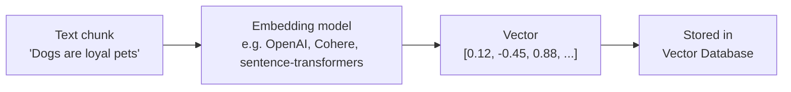
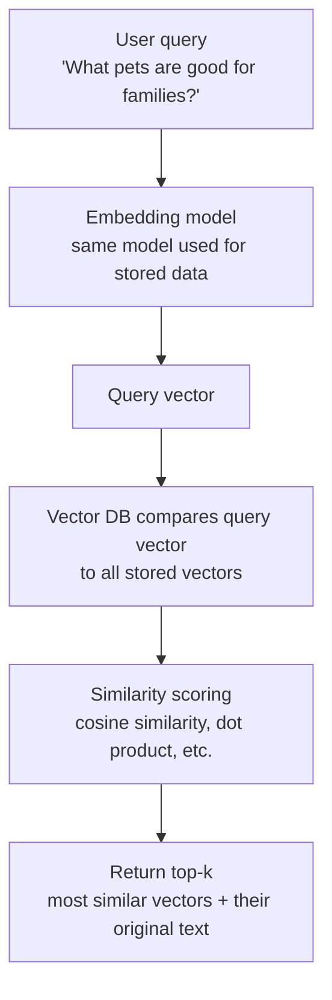
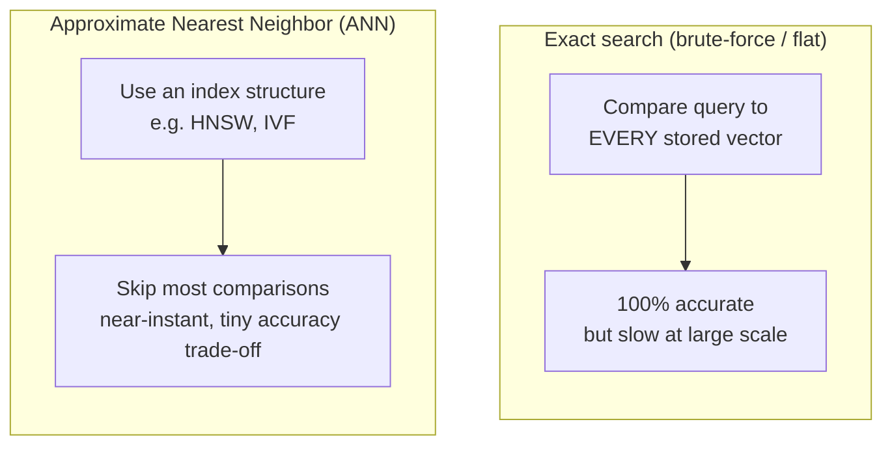

# Vector Databases – Fundamentals Guide (Placement Prep)

Hybrid format: Concept + Diagram → Q&A → Code → Mini Assignment.
Diagrams use Mermaid syntax — render natively on GitHub, VS Code, Obsidian, and most markdown viewers.

---

## Part 1: Concept Walkthrough

### Why LLMs need a "memory" system

An LLM's knowledge is frozen at training time (knowledge cutoff) and its context window is limited — it can't hold your entire company's documents in a single prompt. Vector databases solve this: they store data as **numerical representations of meaning (embeddings)**, so you can later ask "find me the most similar/relevant pieces of information to this query" — even if the exact words don't match. This is the infrastructure layer that makes RAG (next topic) possible.

### From text to searchable vectors



**Key idea:** Semantically similar text produces vectors that are *close together* in high-dimensional space, even if the words are completely different (e.g., "dog" and "puppy" end up near each other; "dog" and "car" end up far apart).

### How similarity search works



### Exact vs Approximate Nearest Neighbor search



**Key idea:** At millions/billions of vectors, comparing a query against every single stored vector (brute-force) becomes too slow. ANN algorithms (like HNSW) build a smart index that finds "good enough" nearest neighbors extremely fast, trading a tiny bit of accuracy for massive speed gains.

---

## Part 2: Q&A

### Module 1: Embeddings

**Q1. What is an embedding?**
A dense numerical vector representation of data (text, image, audio) that captures its semantic meaning — generated by a trained embedding model, such that similar-meaning inputs produce vectors that are close together in vector space.

**Q2. Why can't we just use keyword search instead of embeddings?**
Keyword search matches exact words/phrases and misses semantic similarity — e.g., a search for "affordable laptop" won't match a document saying "budget-friendly notebook" even though they mean the same thing. Embeddings capture meaning, not just literal text.

**Q3. What determines the "dimensionality" of an embedding, and what does it mean?**
The embedding model's architecture determines it (e.g., 384, 768, 1536 dimensions) — each dimension is one number in the vector; more dimensions can capture more nuanced semantic relationships, at the cost of more storage/compute.

**Q4. Can you generate embeddings for things other than text?**
Yes — embedding models exist for images, audio, and even multimodal embeddings that place text and images into the same shared vector space (enabling text-to-image search, for example).

**Q5. What is "chunking," and why does it matter before generating embeddings?**
Splitting long documents into smaller pieces ("chunks") before embedding them — since a single embedding vector for an entire long document would blur together too many different topics/meanings, hurting retrieval precision. Chunk size is a key tuning parameter in RAG systems.

### Module 2: Similarity Metrics

**Q6. What is Cosine Similarity?**
Measures the angle between two vectors (ignoring magnitude) — ranges from -1 to 1, where 1 means identical direction (very similar meaning). The most common similarity metric for text embeddings.

**Q7. What is Euclidean Distance, and how does it differ from cosine similarity?**
Measures the straight-line distance between two points/vectors in space — sensitive to vector magnitude, not just direction. Cosine similarity is generally preferred for text embeddings since it focuses purely on semantic direction/orientation.

**Q8. What is Dot Product similarity?**
The sum of element-wise products of two vectors — related to cosine similarity but also influenced by vector magnitude; commonly used when embeddings are normalized (making it equivalent to cosine similarity).

**Q9. How do you choose which similarity metric to use?**
Depends on the embedding model's training — most modern text embedding models are optimized for and recommend cosine similarity or normalized dot product; check the specific model's documentation.

### Module 3: Vector Database Concepts

**Q10. What is a Vector Database?**
A database purpose-built to store, index, and efficiently query high-dimensional vectors — optimized for similarity search ("find the k most similar vectors to this query") rather than exact-match queries like traditional databases.

**Q11. How is a Vector DB different from a traditional relational database?**
Relational DBs excel at exact-match/structured queries (WHERE, JOIN) over rows and columns. Vector DBs excel at similarity/nearest-neighbor search over high-dimensional numerical data — fundamentally different query pattern and indexing approach.

**Q12. What is Approximate Nearest Neighbor (ANN) search?**
A family of algorithms that find "good enough" (not always exact) nearest neighbors to a query vector, dramatically faster than brute-force exact search — essential for searching over millions/billions of vectors in real time.

**Q13. What is HNSW (Hierarchical Navigable Small World)?**
A popular ANN indexing algorithm that builds a multi-layered graph structure connecting similar vectors, enabling fast traversal from a rough starting point down to the true nearest neighbors — good balance of speed and accuracy.

**Q14. What is IVF (Inverted File Index)?**
An ANN technique that clusters vectors into groups ("cells") during indexing; at query time, it only searches the most relevant clusters instead of the entire dataset — reduces search space significantly.

**Q15. What is metadata filtering in a Vector DB?**
The ability to combine vector similarity search with traditional filters on associated metadata (e.g., "find similar documents, but only from 2024, only in the 'finance' category") — critical for real-world, production-grade retrieval.

**Q16. What is the accuracy/speed trade-off in ANN search, and how is it usually controlled?**
ANN indexes have tunable parameters (e.g., number of graph connections in HNSW) that trade off search speed against recall (how often the true nearest neighbor is actually found) — higher accuracy settings mean slower queries.

### Module 4: Popular Vector Databases & Ecosystem

**Q17. Name some popular Vector Database options.**
**Pinecone** (fully managed, cloud-native), **Weaviate** (open-source, supports hybrid search), **Chroma** (lightweight, popular for prototyping/local dev), **Milvus** (open-source, built for large scale), **Qdrant** (open-source, Rust-based), **FAISS** (Facebook AI Similarity Search — a library, not a full database), **pgvector** (a Postgres extension adding vector search to an existing relational DB).

**Q18. What is FAISS, and how does it differ from a full Vector Database?**
A library (not a standalone database/service) for efficient similarity search and clustering of vectors — provides the underlying algorithms (like IVF, HNSW) but lacks built-in persistence, metadata filtering, or a server/API layer that full vector databases provide out of the box.

**Q19. What is pgvector, and why might a team choose it?**
A PostgreSQL extension that adds vector storage and similarity search directly inside Postgres — attractive for teams that already run Postgres and want to avoid adding a separate specialized database to their stack.

**Q20. What is Hybrid Search?**
Combining traditional keyword/lexical search (e.g., BM25) with vector/semantic search, then merging or re-ranking results — captures both exact keyword matches and semantic similarity, often outperforming either approach alone.

### Module 5: Practical Use Cases & Common Interview Questions

**Q21. What are common real-world use cases for Vector Databases?**
Semantic search (search by meaning, not keywords), Retrieval-Augmented Generation (RAG) for LLMs, recommendation systems (similar products/content), duplicate/anomaly detection, image similarity search.

**Q22. Why is a Vector Database a critical component of a RAG system?**
It stores embeddings of your knowledge base (documents, docs, FAQs) and enables fast retrieval of the most relevant chunks for a given user query — those chunks are then fed into the LLM's context to ground its response in real, specific data.

**Q23. What happens if your embedding model changes after you've already indexed data?**
You typically need to **re-embed and re-index** all existing data — vectors from different embedding models are not comparable to each other (different vector spaces), so mixing them breaks similarity search.

**Q24. How do you decide on chunk size when preparing data for a Vector DB?**
Trade-off: smaller chunks give more precise retrieval (less irrelevant content per chunk) but may lose broader context; larger chunks preserve context but can dilute relevance and waste context window space when retrieved. Typically tuned empirically (e.g., 200-500 tokens per chunk with some overlap).

**Q25. What is "recall" in the context of vector search evaluation?**
The percentage of true relevant/nearest results that were actually returned by the search — a key metric for evaluating how well an ANN index or retrieval pipeline is performing.

---

## Part 3: Code Snippets

### 3.1 Generating embeddings

```python
from sentence_transformers import SentenceTransformer

model = SentenceTransformer("all-MiniLM-L6-v2")  # lightweight, popular embedding model

sentences = [
    "Dogs are loyal pets.",
    "Cats are independent animals.",
    "The stock market fell sharply today."
]

embeddings = model.encode(sentences)
print("Embedding shape:", embeddings.shape)   # e.g. (3, 384)
print("First 5 values of embedding 1:", embeddings[0][:5])
```

### 3.2 Computing similarity manually

```python
import numpy as np

def cosine_similarity(a, b):
    return np.dot(a, b) / (np.linalg.norm(a) * np.linalg.norm(b))

# Using embeddings from 3.1
query_embedding = model.encode("What pets are loyal?")

for sentence, emb in zip(sentences, embeddings):
    score = cosine_similarity(query_embedding, emb)
    print(f"Similarity to '{sentence}': {score:.3f}")

# Expect "Dogs are loyal pets." to score highest
```

### 3.3 Using an actual Vector Database (Chroma — lightweight, local)

```python
import chromadb

client = chromadb.Client()
collection = client.create_collection(name="my_docs")

# Add documents (Chroma handles embedding generation internally by default)
collection.add(
    documents=[
        "Dogs are loyal pets.",
        "Cats are independent animals.",
        "The stock market fell sharply today."
    ],
    ids=["doc1", "doc2", "doc3"]
)

# Query with semantic search
results = collection.query(
    query_texts=["What pets are loyal companions?"],
    n_results=2
)

print("Top matches:", results["documents"])
```

### 3.4 Metadata filtering example (Chroma)

```python
collection.add(
    documents=["Report from 2023 on AI trends.", "Report from 2024 on AI trends."],
    metadatas=[{"year": 2023}, {"year": 2024}],
    ids=["r1", "r2"]
)

# Search only within 2024 documents
results = collection.query(
    query_texts=["latest AI developments"],
    n_results=1,
    where={"year": 2024}
)

print("Filtered result:", results["documents"])
```

---

## Part 4: Mini Assignment

**Goal:** Get hands-on with generating embeddings, computing similarity, and running a real (if lightweight) vector search.

**Task 1 — Embedding intuition:**
Using Section 3.1's code, embed these 5 sentences: `"I love hiking in the mountains"`, `"Mountain trails are great for hiking"`, `"I enjoy cooking Italian food"`, `"Pasta is a staple of Italian cuisine"`, `"The weather today is sunny"`. Then use Section 3.2's cosine similarity function to compute the similarity between every pair. Which pairs score highest, and does that match your intuition about which sentences are semantically related?

**Task 2 — Build a mini semantic search engine:**
Using Section 3.3 (Chroma):
1. Add at least 8 short documents/sentences of your own choosing, covering at least 3 different topics.
2. Write 3 different queries (not exact substrings of your documents) and check whether the top result returned actually matches the topic you intended.
3. Note any surprising or incorrect results — why do you think the model matched (or failed to match) them?

**Task 3 — Chunking experiment:**
Take any paragraph of text (5+ sentences). Split it two ways: (a) one embedding for the entire paragraph, and (b) one embedding per individual sentence. Query with a question that's only answered by one specific sentence in the middle of the paragraph. Compare: does the sentence-level chunking retrieve the relevant piece more precisely than the whole-paragraph embedding? Write 2-3 sentences on what this tells you about chunk size trade-offs.

**Deliverable:** A short write-up with your Task 1 similarity matrix + observations, your Task 2 queries + results + analysis, and your Task 3 chunking comparison.

---

## Quick Revision Checklist

- [ ] Explain what an embedding is and why semantically similar text produces close vectors
- [ ] Explain cosine similarity vs Euclidean distance vs dot product
- [ ] Explain the difference between exact (brute-force) and approximate (ANN) nearest neighbor search
- [ ] Explain HNSW and IVF at a high level
- [ ] Name at least 4 popular vector databases and one key differentiator for each
- [ ] Explain metadata filtering and why it matters in production
- [ ] Explain chunking and its trade-offs
- [ ] Explain why a Vector DB is essential infrastructure for RAG

---

*Next: RAG (Retrieval-Augmented Generation) — combining LLMs with Vector Databases to ground responses in real, retrievable data.*