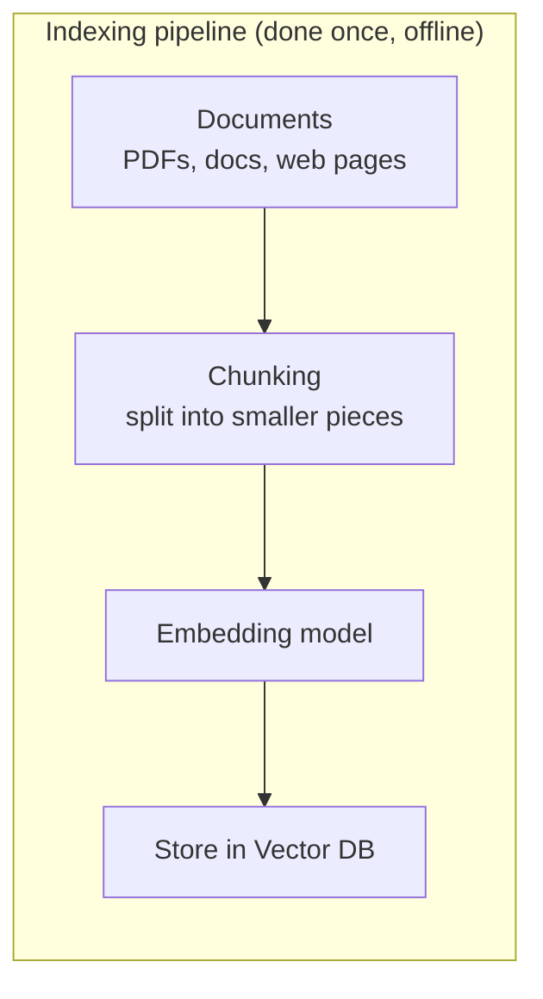
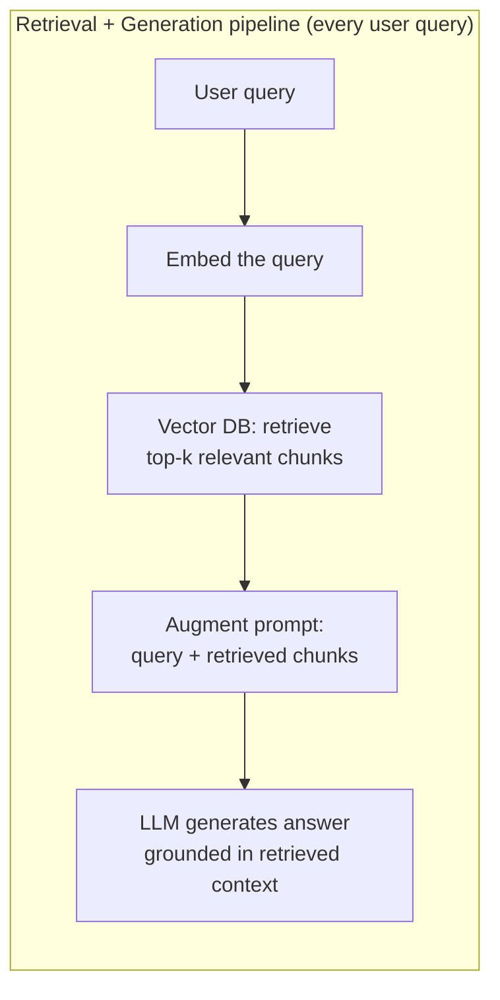
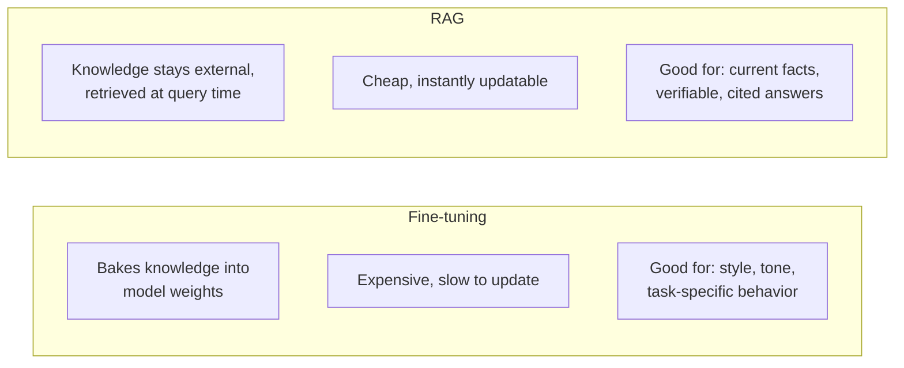

# RAG (Retrieval-Augmented Generation) – Fundamentals Guide (Placement Prep)

Hybrid format: Concept + Diagram → Q&A → Code → Mini Assignment.
Diagrams use Mermaid syntax — render natively on GitHub, VS Code, Obsidian, and most markdown viewers.

---

## Part 1: Concept Walkthrough

### The problem RAG solves

LLMs have two hard limits: a **knowledge cutoff** (no awareness of anything after training) and a tendency to **hallucinate** when they don't actually know something. Fine-tuning to "teach" a model new facts is expensive, slow, and still doesn't guarantee factual grounding. RAG takes a different approach: instead of baking knowledge into the model's weights, it **retrieves relevant information at query time** from an external knowledge source and feeds it into the prompt — so the model generates its answer grounded in real, current, verifiable data.

### The two pipelines: Indexing (offline) and Retrieval + Generation (online)

RAG systems have two distinct phases that happen at different times.





### RAG vs Fine-tuning



**Key idea:** These aren't mutually exclusive — many production systems use a fine-tuned model *and* RAG together, fine-tuning for behavior/format, RAG for factual grounding.

---

## Part 2: Q&A

### Module 1: Core RAG Concept

**Q1. What is RAG (Retrieval-Augmented Generation)?**
An architecture that combines an information retrieval system (typically a vector database) with an LLM — relevant information is retrieved based on the user's query and injected into the prompt, so the LLM generates a response grounded in that retrieved context rather than relying solely on its trained-in knowledge.

**Q2. What two core problems does RAG address?**
**Knowledge cutoff** (LLM has no knowledge of events/data after training) and **hallucination** (LLM confidently generating incorrect information) — RAG grounds responses in real, retrievable, up-to-date data.

**Q3. Why is RAG generally cheaper and faster to implement than fine-tuning for adding new knowledge?**
Fine-tuning requires retraining (even partially) the model on new data — compute-intensive and slow to iterate. RAG just requires updating the external knowledge base (adding/removing documents in the vector DB) — no model retraining needed, updates take effect immediately.

**Q4. Can RAG completely eliminate hallucination?**
No — it significantly reduces it by grounding responses in retrieved data, but the LLM can still misinterpret, ignore, or blend retrieved context incorrectly. RAG reduces but doesn't eliminate hallucination risk.

**Q5. What are the two distinct pipelines in a RAG system?**
The **Indexing pipeline** (offline, done once/periodically — chunk documents, embed them, store in vector DB) and the **Retrieval + Generation pipeline** (online, runs per user query — embed query, retrieve relevant chunks, augment prompt, generate response).

### Module 2: The Retrieval Step

**Q6. What happens during the "Retrieval" step of RAG?**
The user's query is embedded into a vector (using the same embedding model used for indexing), then the vector database searches for the most similar stored chunks (via similarity search) and returns the top-k most relevant ones.

**Q7. Why must the same embedding model be used for both indexing and querying?**
Embeddings from different models exist in different, incompatible vector spaces — a query embedded with Model A cannot be meaningfully compared to documents embedded with Model B.

**Q8. What is "top-k" in the context of RAG retrieval?**
The number of most relevant chunks retrieved and passed to the LLM — a tunable parameter; too small risks missing relevant context, too large wastes context window space and can dilute relevance ("lost in the middle" problem).

**Q9. What is Re-ranking in a RAG pipeline?**
An optional second-pass step after initial retrieval — a separate, often more powerful (but slower) model re-scores and re-orders the retrieved chunks for relevance before passing the final, refined set to the LLM, improving precision.

**Q10. What is Hybrid Search, and why is it often used in production RAG systems?**
Combining vector/semantic search with traditional keyword search (e.g., BM25) — captures both exact-match terms (like product codes, names) that embeddings sometimes miss, and semantic similarity — often outperforms either approach alone.

### Module 3: The Augmentation & Generation Steps

**Q11. What does "augmentation" mean in RAG?**
Constructing the final prompt sent to the LLM by combining the original user query with the retrieved context chunks — typically formatted with clear instructions (e.g., "answer using only the following context").

**Q12. Why is prompt structure/formatting important in the augmentation step?**
Poorly structured prompts (e.g., dumping unlabeled chunks) can confuse the model about what's context vs. instruction vs. query — clear delimiters and instructions (e.g., "Use ONLY the provided context to answer") improve grounding and reduce the model ignoring or misusing retrieved data.

**Q13. What is the "Lost in the Middle" problem?**
Research finding that LLMs tend to pay less attention to information placed in the middle of a long context window, favoring content at the beginning and end — relevant when deciding how much retrieved context to include and how to order it.

**Q14. How should a well-designed RAG prompt handle the case where retrieved context doesn't actually answer the question?**
It should explicitly instruct the model to say it doesn't know or that the answer isn't in the provided context, rather than falling back on ungrounded (potentially hallucinated) knowledge.

**Q15. What is Citation/Attribution in RAG systems, and why is it valuable?**
Having the LLM reference which specific retrieved chunk/source supports each part of its answer — builds user trust and allows verification, since the source document is traceable (unlike knowledge baked into model weights).

### Module 4: Chunking & Indexing Strategy

**Q16. Why does chunk size matter so much in RAG quality?**
Too small: loses surrounding context, may fragment a coherent idea across multiple chunks. Too large: dilutes relevance (a chunk about many topics scores lower for a specific query) and wastes context window budget. Usually tuned empirically per use case.

**Q17. What is Chunk Overlap, and why is it used?**
Including a bit of shared text between consecutive chunks (e.g., last 50 tokens of chunk 1 repeated at the start of chunk 2) — prevents a relevant idea from being awkwardly split exactly at a chunk boundary and losing coherence.

**Q18. What is Semantic Chunking (as opposed to fixed-size chunking)?**
Splitting documents based on natural semantic boundaries (paragraphs, sections, topic shifts) rather than a fixed token/character count — can produce more coherent, meaningful chunks at the cost of more complex preprocessing.

**Q19. How often should the vector database be re-indexed in a production RAG system?**
Depends entirely on how frequently the underlying knowledge source changes — could be real-time (as documents are added), scheduled batch updates (daily/weekly), or manual triggers, depending on freshness requirements.

### Module 5: Advanced RAG & Evaluation

**Q20. What is Query Rewriting/Expansion in advanced RAG?**
Using the LLM itself (or a smaller model) to rephrase or expand the user's original query into a form better suited for retrieval — e.g., resolving ambiguous pronouns, adding synonyms, or breaking a complex question into sub-queries.

**Q21. What is Multi-hop RAG?**
A pattern where answering a question requires multiple sequential retrieval steps — e.g., first retrieving who founded a company, then retrieving that person's birth year — because the final answer depends on chaining information across separate retrieved facts.

**Q22. What is a common way to evaluate RAG system quality?**
Metrics like **retrieval precision/recall** (are the right chunks being retrieved?), **faithfulness** (does the generated answer actually match/stay grounded in the retrieved context?), and **answer relevance** (does the final answer actually address the user's question?) — often assessed with a combination of automated metrics and human/LLM-based judging.

**Q23. What is "Faithfulness" specifically measuring in RAG evaluation?**
Whether the generated answer is factually consistent with and supported by the retrieved context — a high-faithfulness answer doesn't introduce claims that aren't grounded in what was actually retrieved.

**Q24. What is Agentic RAG (brief preview)?**
An evolution of RAG where the retrieval process itself becomes dynamic and multi-step — an LLM-driven agent decides what to search for, evaluates whether retrieved results are sufficient, and can issue additional/refined searches autonomously, rather than a single fixed retrieve-then-generate pass. (Covered in depth in the Agentic AI guide.)

---

## Part 3: Code Snippets

### 3.1 A minimal end-to-end RAG pipeline

```python
import chromadb
import anthropic

# --- Indexing pipeline (offline) ---
chroma_client = chromadb.Client()
collection = chroma_client.create_collection(name="knowledge_base")

documents = [
    "The Eiffel Tower was completed in 1889 and stands 330 meters tall.",
    "Python was created by Guido van Rossum and first released in 1991.",
    "The Great Wall of China is over 13,000 miles long.",
]
collection.add(documents=documents, ids=["doc1", "doc2", "doc3"])

# --- Retrieval + Generation pipeline (per query) ---
def rag_query(user_query, top_k=2):
    # Retrieval
    results = collection.query(query_texts=[user_query], n_results=top_k)
    retrieved_chunks = results["documents"][0]

    # Augmentation
    context = "\n\n".join(retrieved_chunks)
    prompt = f"""Answer the question using ONLY the context below.
If the answer isn't in the context, say you don't know.

Context:
{context}

Question: {user_query}"""

    # Generation
    client = anthropic.Anthropic(api_key="YOUR_API_KEY")
    response = client.messages.create(
        model="claude-sonnet-4-6",
        max_tokens=150,
        messages=[{"role": "user", "content": prompt}]
    )
    return response.content[0].text, retrieved_chunks

answer, sources = rag_query("How tall is the Eiffel Tower?")
print("Answer:", answer)
print("Sources used:", sources)
```

### 3.2 Chunking a long document with overlap

```python
def chunk_text(text, chunk_size=200, overlap=50):
    words = text.split()
    chunks = []
    start = 0
    while start < len(words):
        end = start + chunk_size
        chunk = " ".join(words[start:end])
        chunks.append(chunk)
        start += chunk_size - overlap   # move forward, keeping overlap
    return chunks

long_document = "..." * 500  # imagine a long document here
chunks = chunk_text(long_document, chunk_size=100, overlap=20)
print(f"Split into {len(chunks)} chunks")
print("First chunk:", chunks[0][:100])
```

### 3.3 A simple faithfulness check (LLM-as-judge pattern)

```python
def check_faithfulness(answer, context):
    client = anthropic.Anthropic(api_key="YOUR_API_KEY")
    judge_prompt = f"""Given the CONTEXT and the ANSWER below, determine if the
ANSWER is fully supported by the CONTEXT. Reply with only "FAITHFUL" or "NOT FAITHFUL"
followed by a one-sentence reason.

Context: {context}
Answer: {answer}"""

    response = client.messages.create(
        model="claude-sonnet-4-6",
        max_tokens=50,
        messages=[{"role": "user", "content": judge_prompt}]
    )
    return response.content[0].text

# Using output from 3.1
verdict = check_faithfulness(answer, " ".join(sources))
print(verdict)
```

### 3.4 Query rewriting example

```python
def rewrite_query(original_query, conversation_history=""):
    client = anthropic.Anthropic(api_key="YOUR_API_KEY")
    prompt = f"""Rewrite the following query to be fully self-contained and
optimized for a search/retrieval system, resolving any ambiguous references
using the conversation history.

History: {conversation_history}
Original query: {original_query}

Rewritten query:"""

    response = client.messages.create(
        model="claude-sonnet-4-6",
        max_tokens=50,
        messages=[{"role": "user", "content": prompt}]
    )
    return response.content[0].text

rewritten = rewrite_query(
    "How tall is it?",
    conversation_history="User previously asked about the Eiffel Tower."
)
print("Rewritten:", rewritten)  # e.g. "How tall is the Eiffel Tower?"
```

---

## Part 4: Mini Assignment

**Goal:** Build a working RAG pipeline end-to-end and stress-test where it breaks.

**Task 1 — Build and query your own knowledge base:**
Using Section 3.1 as a template:
1. Create a knowledge base of at least 8 facts/documents on a topic of your choice.
2. Ask 5 questions that should be directly answerable from your documents, and verify the answers are correct and grounded.
3. Ask 2 questions that are **not** covered by your documents at all — confirm the system correctly says "I don't know" rather than hallucinating an answer. If it hallucinates, revise your prompt instructions and retest.

**Task 2 — Break it with chunk size:**
Using Section 3.2:
1. Take a paragraph containing one specific important fact (e.g., a number or name) in the *middle* of the paragraph.
2. Chunk it with a very small chunk_size (so the fact ends up split awkwardly across two chunks) vs. a chunk_size that keeps the whole paragraph intact.
3. Run retrieval for a query targeting that specific fact with both versions — does the poorly-chunked version fail to retrieve the fact correctly? Write up what happened.

**Task 3 — Faithfulness stress test:**
Using Section 3.3:
1. Manually write an answer that intentionally includes one small false claim NOT supported by your context (simulating a hallucination).
2. Run it through `check_faithfulness()` — does the LLM-as-judge correctly flag it as "NOT FAITHFUL"?
3. Try 2 more manually-crafted answers (one fully faithful, one partially faithful) and see if the judge is consistent.

**Deliverable:** A short write-up with your Task 1 Q&A results (including the "I don't know" cases), your Task 2 chunking comparison + observations, and your Task 3 faithfulness judge results.

---

## Quick Revision Checklist

- [ ] Explain what problem RAG solves and why it beats fine-tuning for factual grounding
- [ ] Explain the two RAG pipelines: Indexing (offline) vs Retrieval+Generation (online)
- [ ] Explain top-k retrieval, re-ranking, and hybrid search
- [ ] Explain why context/prompt structure matters (Lost in the Middle)
- [ ] Explain chunk size and chunk overlap trade-offs
- [ ] Explain faithfulness and how it's evaluated
- [ ] Explain what Agentic RAG adds on top of standard RAG

---

*Next: Agentic AI — the capstone topic, where LLMs use tools, memory, and multi-step reasoning (often including RAG as one of many tools) to autonomously complete complex tasks.*