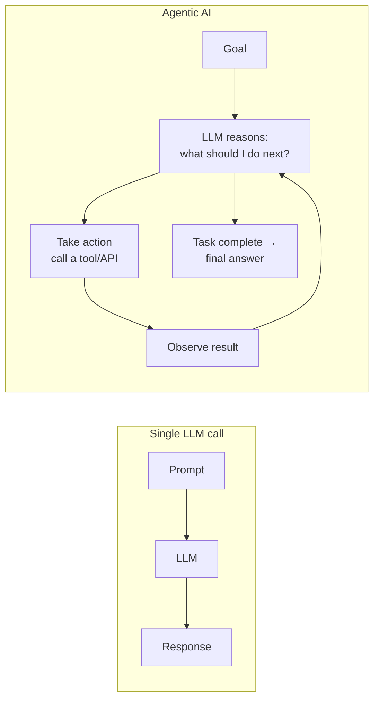
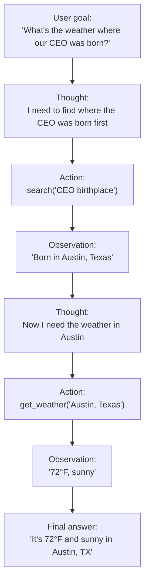
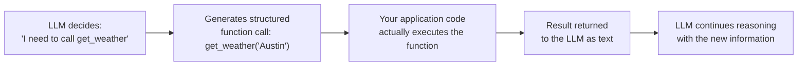
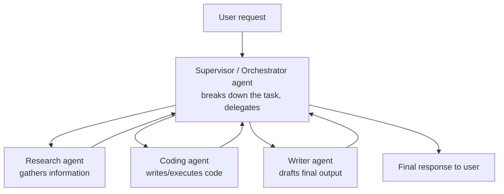

# Agentic AI – Fundamentals Guide (Placement Prep)

Capstone topic — builds on Gen AI, Transformers, LLMs, Vector DB, and RAG.
Hybrid format: Concept + Diagram → Q&A → Code → Mini Assignment.
Diagrams use Mermaid syntax — render natively on GitHub, VS Code, Obsidian, and most markdown viewers.

---

## Part 1: Concept Walkthrough

### From a single LLM call to an Agent

A plain LLM call is a one-shot exchange: you send a prompt, it sends back text, done. An **agent** is different — it's an LLM wrapped in a loop that can decide to take **actions** (call tools/APIs, search, run code), observe the results, and decide what to do next, repeating until the task is actually complete.



### The ReAct loop (Reason + Act)

The most common agent pattern: the model alternates between **reasoning** (thinking about what to do) and **acting** (calling a tool), using each tool's output to inform the next step.



### Tool use / Function calling

Agents interact with the world through **tools** — functions the LLM can choose to call, with structured inputs/outputs.



### Multi-agent systems

For complex tasks, a single agent can be split into multiple specialized agents coordinated by a supervisor.



---

## Part 2: Q&A

### Module 1: What Makes AI "Agentic"

**Q1. What is Agentic AI?**
AI systems where an LLM doesn't just generate a single response, but autonomously plans, takes actions (via tools), observes results, and iterates — pursuing a goal through multiple steps rather than a single input-output exchange.

**Q2. What is the core difference between a simple LLM call and an agent?**
A simple call is a single request-response with no memory of taking actions in the world. An agent operates in a **loop**: reason → act (call a tool) → observe the result → reason again → repeat until the goal is achieved.

**Q3. What is a "Tool" in the context of an agent?**
A function/API the LLM can choose to invoke — e.g., a web search, a calculator, a database query, code execution — extending the model's capabilities beyond just generating text.

**Q4. What is Function Calling (or Tool Calling)?**
A capability where the LLM, given a set of available tool definitions (name, description, expected parameters), can output a structured request to call a specific tool with specific arguments — the actual execution happens in your application code, not inside the model.

**Q5. Why can't the LLM itself execute the tool/function directly?**
The LLM only generates text/structured output — it has no direct access to your systems, APIs, or the internet. It's your application code's job to receive the model's tool-call request, actually execute it, and feed the result back.

### Module 2: The Agent Loop (ReAct & Variants)

**Q6. What does ReAct stand for, and what does it describe?**
"Reason + Act" — a prompting/agent pattern where the model explicitly alternates between reasoning steps ("Thought: I need to...") and action steps ("Action: call this tool"), using each observation to inform the next thought.

**Q7. Why is explicit "reasoning" (Thought steps) useful in an agent loop, rather than just jumping straight to actions?**
Making the model articulate its reasoning before acting improves decision quality (similar to chain-of-thought prompting) and makes the agent's behavior more interpretable/debuggable — you can see *why* it chose a particular action.

**Q8. What is an "Observation" in the ReAct loop?**
The result returned after executing an action (tool call) — fed back into the model's context so it can incorporate that new information into its next reasoning step.

**Q9. How does an agent know when to stop looping and give a final answer?**
The model itself decides, based on its reasoning, that it has gathered enough information/completed enough steps to answer the original goal — it generates a final response instead of another tool call. (Production systems also enforce a max iteration limit as a safety net.)

**Q10. What is Chain-of-Thought (CoT) prompting, and how does it relate to agents?**
A prompting technique where the model is encouraged to reason step-by-step before giving a final answer — improves performance on complex/multi-step problems. It's the reasoning foundation that agent loops like ReAct build on top of.

**Q11. What is Planning in the context of agents?**
A step (sometimes explicit, sometimes implicit in reasoning) where the agent breaks a complex goal into a sequence of smaller sub-tasks before executing them — as opposed to purely reactive, one-step-at-a-time decision-making.

### Module 3: Memory in Agents

**Q12. What is Short-term (working) memory in an agent?**
The current conversation/task context held within the LLM's context window — includes the ongoing sequence of thoughts, actions, and observations within a single task execution.

**Q13. What is Long-term memory in an agent, and why is it needed?**
Persistent storage (often a vector database) that retains information across separate sessions/tasks — needed because the context window resets between conversations, but useful facts, past interactions, or user preferences should ideally persist.

**Q14. How does a Vector DB support an agent's long-term memory?**
Past interactions, facts, or learned information can be embedded and stored; when relevant, the agent retrieves related memories via similarity search (the same retrieval mechanism used in RAG) and injects them into its current context.

**Q15. What is the risk of an agent's context window filling up during a long task?**
Older thoughts/observations may need to be truncated or summarized to fit within the context window — risking loss of earlier important information, which is why context management/summarization strategies matter for long-running agents.

### Module 4: Multi-Agent Systems & Orchestration

**Q16. Why use multiple specialized agents instead of one general agent?**
Specialization can improve reliability and focus (a "coding agent" with coding-specific tools/prompts performs better on code tasks than a jack-of-all-trades agent), and complex tasks can be parallelized/decomposed across agents with different roles.

**Q17. What is the Supervisor/Orchestrator pattern in multi-agent systems?**
One agent acts as a coordinator — it breaks down the overall task, delegates sub-tasks to specialized worker agents, and synthesizes their results into a final response, rather than handling everything itself.

**Q18. What are common orchestration frameworks used to build agentic systems?**
LangChain/LangGraph, CrewAI, AutoGen, and similar frameworks provide abstractions for defining tools, managing agent loops, state, and multi-agent coordination — reducing the boilerplate needed to build agentic applications from scratch.

**Q19. What is a potential downside of multi-agent systems compared to a single agent?**
Increased complexity, higher latency/cost (multiple LLM calls instead of one), and harder-to-debug failure modes (an error can originate in inter-agent communication, not just a single model's reasoning).

### Module 5: Agentic RAG

**Q20. What is Agentic RAG, and how does it differ from standard RAG?**
Standard RAG: one fixed retrieve-then-generate pass. Agentic RAG: the agent can decide *whether* to retrieve, formulate/refine its own search queries, evaluate if retrieved results are sufficient, and issue additional searches if needed — retrieval becomes a dynamic, multi-step tool use pattern rather than a single fixed step.

**Q21. Give an example of when Agentic RAG would outperform standard RAG.**
A multi-hop question like "What's the revenue of the company founded by the person who invented X?" — standard single-pass RAG might retrieve chunks about "X" but miss the company's revenue entirely; an agentic approach can search for the inventor first, then search again for the company, then again for revenue — chaining retrievals as needed.

### Module 6: Risks, Safety & Common Interview Questions

**Q22. What is the risk of an agent getting stuck in an infinite/repetitive loop?**
Without safeguards, an agent might repeatedly call the same tool, misinterpret results, or fail to recognize task completion — production systems mitigate this with max iteration limits, loop detection, and timeout mechanisms.

**Q23. Why is tool access a security consideration for agentic systems?**
An agent with tools that can send emails, make purchases, modify files, or execute code has real-world side effects — poorly scoped permissions or prompt injection attacks (malicious instructions hidden in retrieved content) could cause unintended, harmful actions.

**Q24. What is Prompt Injection, in the context of agents with tool access?**
An attack where malicious instructions are embedded in content the agent processes (e.g., a webpage it reads, a document it retrieves) — designed to hijack the agent into taking unintended actions, since the agent can't always distinguish "trusted instructions from the user" from "text it happened to read."

**Q25. What is Human-in-the-Loop (HITL) in agentic system design?**
Requiring explicit human approval before an agent executes high-stakes or irreversible actions (e.g., sending an email, making a payment, deleting data) — a key safety pattern for production agentic systems.

**Q26. How would you evaluate whether an agentic system is performing well?**
Task completion rate (did it actually achieve the goal?), number of steps/cost taken to complete it (efficiency), correctness of intermediate tool calls, and whether it appropriately asks for help/stops rather than confidently proceeding when uncertain.

**Q27. Agentic AI vs Traditional Automation (e.g., scripted workflows) — what's the key difference?**
Traditional automation follows a fixed, pre-programmed sequence of steps. Agentic AI dynamically decides its own sequence of actions based on reasoning about the current situation — adaptable to novel scenarios the developer didn't explicitly hand-code for.

---

## Part 3: Code Snippets

### 3.1 A minimal agent loop with tool calling (Anthropic API)

```python
import anthropic
import json

client = anthropic.Anthropic(api_key="YOUR_API_KEY")

# Define available tools
tools = [
    {
        "name": "get_weather",
        "description": "Get the current weather for a given city",
        "input_schema": {
            "type": "object",
            "properties": {"city": {"type": "string"}},
            "required": ["city"]
        }
    }
]

def get_weather(city):
    # Stubbed for demo purposes — replace with a real weather API call
    return f"72°F and sunny in {city}"

def run_agent(user_goal, max_steps=5):
    messages = [{"role": "user", "content": user_goal}]

    for step in range(max_steps):
        response = client.messages.create(
            model="claude-sonnet-4-6",
            max_tokens=500,
            tools=tools,
            messages=messages
        )

        if response.stop_reason == "tool_use":
            tool_call = next(b for b in response.content if b.type == "tool_use")
            print(f"Step {step}: Agent calls {tool_call.name}({tool_call.input})")

            # Execute the tool
            if tool_call.name == "get_weather":
                result = get_weather(tool_call.input["city"])

            # Feed the result back to the model
            messages.append({"role": "assistant", "content": response.content})
            messages.append({
                "role": "user",
                "content": [{
                    "type": "tool_result",
                    "tool_use_id": tool_call.id,
                    "content": result
                }]
            })
        else:
            # Model gave a final text answer, loop is done
            final_text = next(b.text for b in response.content if b.type == "text")
            print(f"Final answer: {final_text}")
            return final_text

    return "Max steps reached without a final answer."

run_agent("What's the weather in Austin, Texas?")
```

### 3.2 A simplified ReAct-style reasoning trace (illustrative, not a real loop)

```python
# This demonstrates the *shape* of ReAct reasoning explicitly, for teaching purposes
react_trace = [
    {"type": "Thought", "content": "I need to find where the CEO was born first."},
    {"type": "Action", "content": "search('company CEO birthplace')"},
    {"type": "Observation", "content": "Born in Austin, Texas."},
    {"type": "Thought", "content": "Now I need the weather in Austin."},
    {"type": "Action", "content": "get_weather('Austin, Texas')"},
    {"type": "Observation", "content": "72°F, sunny."},
    {"type": "Thought", "content": "I now have enough information to answer."},
    {"type": "Final Answer", "content": "It's 72°F and sunny in Austin, TX, where the CEO was born."},
]

for step in react_trace:
    print(f"[{step['type']}] {step['content']}")
```

### 3.3 A simple max-iteration safety guard

```python
def safe_agent_loop(user_goal, max_iterations=5):
    iteration = 0
    task_complete = False

    while not task_complete and iteration < max_iterations:
        iteration += 1
        print(f"--- Iteration {iteration} ---")
        # In a real system: call the LLM, execute any tool calls, check completion
        # task_complete = ... (determined by the model's response)

        if iteration == max_iterations:
            print("Safety limit reached — stopping to avoid infinite loop.")
            return "Task could not be completed within the iteration limit."

    return "Task completed."
```

### 3.4 Human-in-the-loop approval gate (conceptual)

```python
HIGH_RISK_TOOLS = {"send_email", "make_payment", "delete_file"}

def execute_tool_with_approval(tool_name, tool_input):
    if tool_name in HIGH_RISK_TOOLS:
        print(f"⚠️  Agent wants to call: {tool_name}({tool_input})")
        approval = input("Approve this action? (yes/no): ")
        if approval.lower() != "yes":
            return "Action rejected by human reviewer."

    # Proceed with execution if approved or not high-risk
    return f"Executed {tool_name} with {tool_input}"

print(execute_tool_with_approval("send_email", {"to": "boss@company.com", "subject": "Resign"}))
```

---

## Part 4: Mini Assignment

**Goal:** Build and interrogate a real (if simple) agent loop, then reason about its failure modes.

**Task 1 — Run and extend the agent (Section 3.1):**
1. Run the weather agent as-is and confirm it correctly calls the tool and returns a final answer.
2. Add a **second tool** (e.g., `get_time(timezone)` — can be stubbed like `get_weather`) and update the `tools` list and `run_agent` logic to support it.
3. Ask a question that requires **both** tools (e.g., "What's the weather and current time in Austin?") — does the agent correctly call both tools before answering?

**Task 2 — Break the agent intentionally:**
1. Ask the agent a question involving a city that your stubbed `get_weather` function doesn't handle gracefully (e.g., pass something malformed) — observe how it behaves. Does it retry, give up, or hallucinate a plausible-sounding answer instead of using the tool result?
2. Lower `max_steps` to 1 and ask a question that clearly needs 2+ tool calls — confirm the "Max steps reached" safety message triggers correctly instead of the program crashing or looping forever.

**Task 3 — Design (no code required) a Human-in-the-Loop policy:**
Imagine you're building an agent that manages a company's social media account (can read messages, draft replies, and post content). Using Section 3.4 as inspiration:
1. List which actions should require human approval before execution, and which are safe to fully automate.
2. Write 2-3 sentences justifying your choices — what's the worst-case consequence of getting each one wrong?

**Deliverable:** A short write-up with your Task 1 multi-tool run output, your Task 2 failure observations, and your Task 3 HITL policy + reasoning.

---

## Quick Revision Checklist

- [ ] Explain the difference between a single LLM call and an agent
- [ ] Explain the ReAct loop: Thought → Action → Observation → repeat
- [ ] Explain function/tool calling and why the LLM can't execute tools itself
- [ ] Explain short-term vs long-term memory in agents
- [ ] Explain the Supervisor/Orchestrator multi-agent pattern
- [ ] Explain Agentic RAG vs standard RAG, with a multi-hop example
- [ ] Explain prompt injection risk and Human-in-the-Loop as a mitigation
- [ ] Explain how you'd evaluate an agentic system's performance

---

## 🎓 You've completed the full learning path

**Gen AI Basics → Transformers → LLM Basics → Vector DB → RAG → Agentic AI**

Each guide built directly on the last: Transformers gave you the architecture behind LLMs; LLM Basics showed how that architecture is trained and used; Vector DB gave you the retrieval infrastructure; RAG combined LLMs + Vector DB to ground answers in real data; and Agentic AI showed how LLMs can use RAG (and other tools) autonomously to complete multi-step tasks. This is the same conceptual stack used in real production AI systems today — you now have both the interview-ready theory and hands-on code/assignments behind each layer.