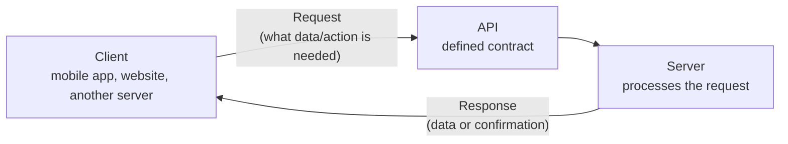
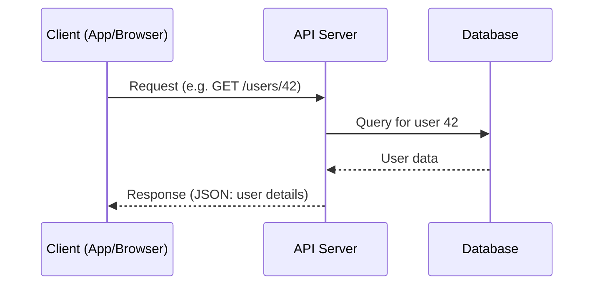
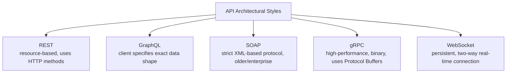
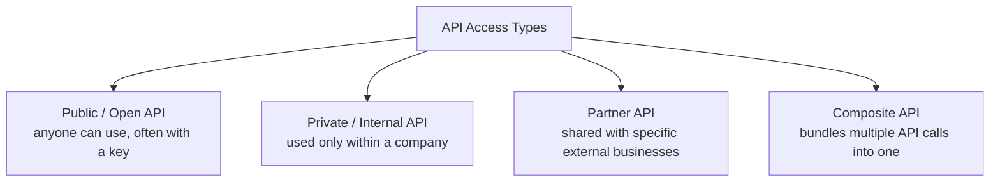

# APIs – Basics & Types Guide (Placement Prep)

---

## Part 1: Concept Walkthrough

### What is an API?

An API (Application Programming Interface) is a defined contract that lets two pieces of software talk to each other — without either side needing to know how the other is built internally. You send a request in an agreed-upon format, and you get a response back in an agreed-upon format. Almost every app you use — a weather app, a food delivery app, this very chat interface — is making API calls behind the scenes.



**Key idea:** The client doesn't need to know *how* the server works internally (what database it uses, what language it's written in) — it only needs to know the API's contract: what requests to send and what responses to expect.

### The client-server model, in more detail



### Types of APIs — by architectural style



### Types of APIs — by access/audience



---

## Part 2: Q&A

### Module 1: What is an API

**Q1. What is an API?**
A defined set of rules/contract that allows two software systems to communicate — specifying what requests can be made, what data format to use, and what responses to expect, without exposing internal implementation details.

**Q2. What does "API" stand for?**
Application Programming Interface.

**Q3. Why are APIs important in modern software development?**
They enable modularity and integration — different teams/companies can build independent systems (frontend, backend, third-party services) that talk to each other through a stable contract, without needing to share source code or internal architecture.

**Q4. What is the client-server model, and how does it relate to APIs?**
The **client** (app, browser, another server) initiates a request; the **server** (hosting the API) processes it and returns a response. APIs define the exact structure of that request/response exchange.

**Q5. Give a simple real-world analogy for an API.**
A restaurant menu and waiter: you (the client) don't need to know how the kitchen (server) cooks the food — you just order from the menu (API contract), and the waiter (API) brings back what you asked for.

**Q6. What is an API Endpoint?**
A specific URL/address where an API can be accessed to perform a particular operation — e.g., `/users/42` might be the endpoint to get details of user 42.

### Module 2: API Architectural Styles

**Q7. What is REST (brief intro — covered in depth separately)?**
An architectural style for APIs based on resources (nouns, like `/users`) and standard HTTP methods (GET, POST, PUT, DELETE) to act on them — the most widely used API style on the web today.

**Q8. What is GraphQL, and how does it differ from REST?**
A query language/API style where the **client specifies exactly what data fields it needs** in a single request — unlike REST, where the server defines fixed response shapes per endpoint, often requiring multiple calls to gather related data.

**Q9. What is SOAP?**
An older, strict, XML-based protocol for exchanging structured information — heavily used in enterprise/legacy systems (banking, telecom), with built-in standards for security and transactions, but more verbose and rigid than REST.

**Q10. What is gRPC, and where is it commonly used?**
A high-performance API framework developed by Google, using binary serialization (Protocol Buffers) instead of text-based JSON/XML — common in internal microservice-to-microservice communication where speed matters more than human-readability.

**Q11. What is a WebSocket API, and how does it differ from REST?**
REST APIs are request-response (client always initiates) and stateless. WebSockets establish a **persistent, two-way connection** allowing the server to push data to the client in real time — used for live chat, live notifications, stock tickers, multiplayer games.

**Q12. When would you choose GraphQL over REST?**
When clients (especially varied ones — mobile vs web) need different, flexible subsets of data and you want to avoid over-fetching/under-fetching — GraphQL lets each client request exactly what it needs in one round trip.

**Q13. When would you choose REST over GraphQL?**
When you want simplicity, strong caching support (REST leverages HTTP caching naturally), and a well-understood, widely-supported standard — REST is usually the default choice unless GraphQL's flexibility specifically solves a real problem you have.

### Module 3: API Access & Audience Types

**Q14. What is a Public (Open) API?**
An API made available for external developers/anyone to use, often requiring an API key for access and usage tracking — e.g., the OpenWeatherMap API, Google Maps API.

**Q15. What is a Private (Internal) API?**
An API used only within an organization, connecting internal systems/microservices — not exposed to external developers or the public internet.

**Q16. What is a Partner API?**
An API shared with specific, pre-approved external business partners (not fully public) — often requires a formal agreement and stricter access control than a public API.

**Q17. What is a Composite API?**
An API that combines multiple underlying API calls/resources into a single request-response cycle — reduces the number of round trips a client needs to make for a complex operation.

### Module 4: Core Concepts Every API Uses

**Q18. What is a Request in an API call?**
The message sent from client to server — includes a method (what action), an endpoint/URL (what resource), headers (metadata), and often a body (data being sent, e.g., in POST requests).

**Q19. What is a Response in an API call?**
The message sent back from server to client — includes a status code (success/failure indicator), headers, and typically a body containing the requested data or a confirmation message.

**Q20. What data formats are commonly used in API requests/responses?**
**JSON** (JavaScript Object Notation — lightweight, human-readable, dominant format today), **XML** (older, more verbose, still used in SOAP/enterprise systems), occasionally plain text or binary formats.

**Q21. What is an API Key, and why is it used?**
A unique identifier/credential passed with API requests to authenticate the caller and track/limit usage — a basic (though not the most secure) form of API access control.

**Q22. What is Rate Limiting in the context of APIs?**
Restricting how many requests a client can make within a given time window (e.g., 100 requests/minute) — protects the server from overload/abuse and ensures fair usage across all API consumers.

**Q23. What is API Versioning, and why is it necessary?**
Maintaining multiple versions of an API (e.g., `/v1/users`, `/v2/users`) so that existing clients don't break when the API's structure/behavior changes — allows evolution without disrupting current integrations.

**Q24. What is API Documentation, and why does it matter?**
Human-readable reference describing an API's endpoints, required parameters, expected responses, and authentication — critical for developers to correctly integrate with an API without needing to read its source code. Tools like Swagger/OpenAPI auto-generate this from code.

### Module 5: Common Interview Questions

**Q25. What is the difference between an API and a Web Service?**
All web services are APIs, but not all APIs are web services — a web service specifically operates over a network (typically HTTP), while "API" is a broader term that also covers things like OS-level APIs or library APIs that don't involve any network at all.

**Q26. What is the difference between synchronous and asynchronous API calls?**
**Synchronous**: the client waits for the server's response before continuing execution (blocking). **Asynchronous**: the client sends the request and continues other work, handling the response later (e.g., via a callback or polling) — important for long-running operations.

**Q27. What is API Latency, and why does it matter?**
The time delay between sending a request and receiving a response — critical for user experience (slow APIs feel like a slow app) and is a key metric monitored in production systems.

**Q28. What is idempotency in the context of APIs, at a conceptual level (detail covered under REST)?**
An operation is idempotent if calling it multiple times has the same effect as calling it once — an important property for designing safe, retry-friendly API operations (e.g., "set my status to active" is idempotent; "add $10 to my balance" is not).

**Q29. Why might a company choose to expose a public API for their product?**
Enables third-party developers to build integrations/extensions (growing the ecosystem around the product), can create new revenue streams (API-as-a-product), and increases platform stickiness/adoption.

---

## Part 3: Code Snippets

### 3.1 Making your first API call (Python, `requests` library)

```python
import requests

# A free public API for demo purposes (no key required)
response = requests.get("https://api.github.com/users/octocat")

print("Status code:", response.status_code)
print("Response JSON:", response.json())
```

### 3.2 Making a POST request (sending data to an API)

```python
import requests

# JSONPlaceholder is a free fake API for testing
url = "https://jsonplaceholder.typicode.com/posts"
payload = {
    "title": "My first API post",
    "body": "Learning how APIs work!",
    "userId": 1
}

response = requests.post(url, json=payload)

print("Status code:", response.status_code)
print("Created resource:", response.json())
```

### 3.3 Using an API key (query param and header patterns)

```python
import requests

API_KEY = "YOUR_API_KEY"

# Pattern 1: API key as a query parameter
response1 = requests.get(
    "https://api.example.com/data",
    params={"api_key": API_KEY}
)

# Pattern 2: API key in the request header (more common/secure)
headers = {"Authorization": f"Bearer {API_KEY}"}
response2 = requests.get(
    "https://api.example.com/data",
    headers=headers
)
```

### 3.4 Handling rate limits and errors gracefully

```python
import requests
import time

def call_api_with_retry(url, max_retries=3):
    for attempt in range(max_retries):
        response = requests.get(url)

        if response.status_code == 200:
            return response.json()
        elif response.status_code == 429:  # Too Many Requests
            wait_time = 2 ** attempt  # exponential backoff
            print(f"Rate limited. Waiting {wait_time}s before retry...")
            time.sleep(wait_time)
        else:
            print(f"Request failed with status {response.status_code}")
            return None

    return None

result = call_api_with_retry("https://api.github.com/users/octocat")
print(result)
```

---

## Part 4: Mini Assignment

**Goal:** Move from reading about API concepts to actually sending and inspecting real HTTP traffic.

**Task 1 — Explore a public API:**
Using Section 3.1's pattern:
1. Pick any free public API that requires no key (e.g., `https://api.github.com/users/<any-username>`, `https://jsonplaceholder.typicode.com/posts/1`, or `https://api.publicapis.org/entries`).
2. Make a GET request and print the full response — status code, headers, and JSON body.
3. Identify and list 5 different fields in the JSON response and what each represents.

**Task 2 — POST and inspect the response:**
Using Section 3.2's pattern:
1. Send a POST request to `https://jsonplaceholder.typicode.com/posts` with your own custom payload (change the title/body/userId).
2. Print the status code — is it 200 or 201? Look up what each means and explain why this particular response uses that code.
3. Note: this is a fake/testing API, so the resource isn't actually persisted — but observe what it *echoes back* to you as if it were created.

**Task 3 — Compare REST vs GraphQL vs WebSocket conceptually (no code, research-based):**
Pick one real product/company you use (e.g., Twitter/X, Slack, Spotify). Research (or reason from what you know about the product) which type of API it likely uses for: (a) loading your main feed/timeline, (b) receiving a live notification/message instantly, (c) a third-party developer building an app on top of it. Justify each choice in 1-2 sentences using what you learned about REST, GraphQL, and WebSockets.

**Deliverable:** A short write-up with your Task 1 API exploration + 5 fields explained, your Task 2 status code + explanation, and your Task 3 REST/GraphQL/WebSocket reasoning for your chosen product.

---

## Quick Revision Checklist

- [ ] Explain what an API is using the client-server model
- [ ] Name the 5 architectural API styles (REST, GraphQL, SOAP, gRPC, WebSocket) and one use case each
- [ ] Explain REST vs GraphQL trade-offs
- [ ] Name the 4 API access types (Public, Private, Partner, Composite)
- [ ] Explain API keys, rate limiting, and versioning
- [ ] Explain synchronous vs asynchronous API calls
- [ ] Make a real GET and POST request using Python's `requests` library

---

*Next: REST — deep dive into HTTP methods, status codes, statelessness, and REST API design principles.*