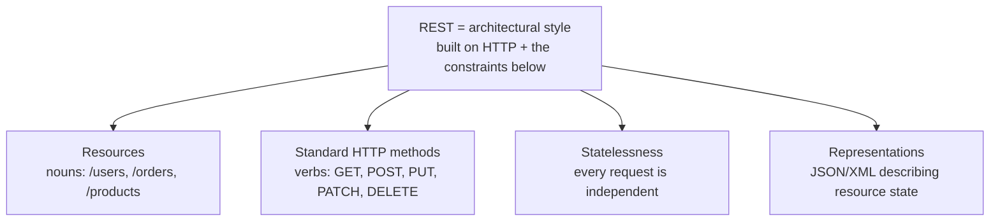
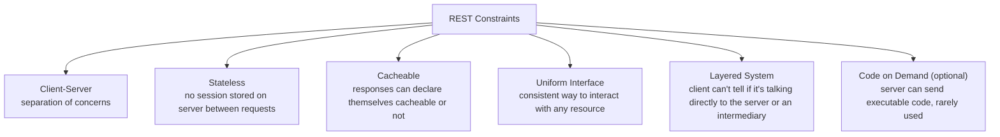
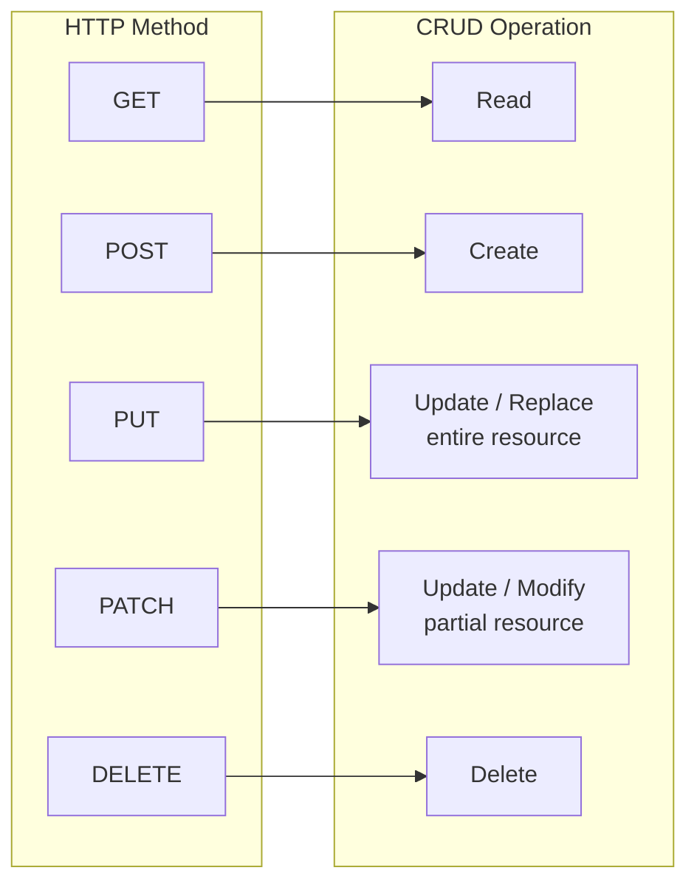
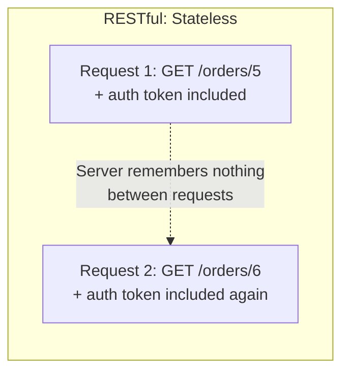

# REST APIs – Deep Dive Guide (Placement Prep)

---

## Part 1: Concept Walkthrough

### What is REST?

REST (**RE**presentational **S**tate **T**ransfer) isn't a protocol or a standard — it's an architectural **style** for designing networked APIs, defined by a set of constraints. When an API follows these constraints, it's called "RESTful." At its core, REST treats everything as a **resource** (a user, an order, a product) identified by a URL, and uses standard HTTP methods to act on that resource.



### REST's six architectural constraints



### HTTP methods mapped to CRUD operations



### Statelessness in practice



**Key idea:** The server never relies on memory of previous requests — every single request must carry all the information needed to understand and process it (e.g., an auth token), typically in headers. This is *why* REST APIs scale so well: any server instance can handle any request, since no server-side session state needs to be shared/synced.

---

## Part 2: Q&A

### Module 1: REST Fundamentals

**Q1. What does REST stand for?**
REpresentational State Transfer.

**Q2. Is REST a protocol?**
No — REST is an architectural **style** (a set of design constraints/principles), not a strict protocol like HTTP or a standard like SOAP. This is why RESTful APIs can vary somewhat in implementation while still being "RESTful."

**Q3. What is a Resource in REST?**
Any piece of information/entity that can be named and addressed via a URL — e.g., a user, an order, a product. Resources are nouns, not actions (`/users`, not `/getUsers`).

**Q4. What is a Representation in REST?**
The format in which a resource's current state is sent to/from the client — typically JSON (most common today) or XML — the client interacts with this representation, not the resource itself directly.

**Q5. What does "RESTful" mean?**
An API that adheres to REST's architectural constraints — client-server separation, statelessness, cacheability, uniform interface, layered system.

### Module 2: The Six REST Constraints

**Q6. What is the Client-Server constraint?**
Client (UI/consumer) and server (data/logic) are separated and can evolve independently — the client doesn't need to know how data is stored, and the server doesn't need to know how the client displays it.

**Q7. What is the Statelessness constraint, and why is it central to REST?**
Each request from client to server must contain all information needed to process it — the server stores no client session state between requests. This enables horizontal scaling (any server can handle any request) and simplifies server design.

**Q8. What is the Cacheable constraint?**
Responses must explicitly (or implicitly, by convention) indicate whether they can be cached — allowing clients/intermediaries to reuse a previous response instead of making a redundant request, improving performance.

**Q9. What is the Uniform Interface constraint?**
A consistent, standardized way of interacting with resources regardless of which specific resource — achieved via consistent use of URLs, HTTP methods, and status codes across the entire API, making it predictable/learnable.

**Q10. What is the Layered System constraint?**
The client cannot tell (and shouldn't need to know) whether it's connected directly to the end server or to an intermediary (load balancer, proxy, cache, gateway) — allows infrastructure flexibility without affecting the client's behavior.

**Q11. What is the (optional) Code on Demand constraint?**
The server can optionally extend client functionality by sending executable code (e.g., JavaScript) — the only *optional* constraint in REST; rarely emphasized in typical API discussions.

### Module 3: HTTP Methods in Depth

**Q12. What does GET do, and what are its key properties?**
Retrieves a resource's current representation. **Safe** (doesn't modify server state) and **idempotent** (calling it multiple times has the same effect as calling it once).

**Q13. What does POST do, and what are its key properties?**
Creates a new resource (or triggers a processing action). **Not safe** (changes state) and **not idempotent** (calling it twice typically creates two separate resources).

**Q14. What does PUT do, and how does it differ from PATCH?**
PUT **replaces** an entire resource with the provided representation (idempotent — sending the same PUT twice results in the same final state). PATCH **partially updates** a resource, modifying only the specified fields (not guaranteed idempotent, depending on implementation).

**Q15. What does DELETE do, and is it idempotent?**
Removes a resource. It's considered idempotent — deleting an already-deleted resource still results in "the resource doesn't exist," the same end state as the first delete call (even though the second call might return a 404 instead of a 200/204).

**Q16. What is Idempotency, precisely?**
An operation is idempotent if performing it multiple times produces the same result/end-state as performing it once — critical for safe retries (e.g., if a network failure makes you unsure whether your request succeeded, you can safely retry an idempotent request without unintended side effects).

**Q17. What does "Safe" mean for an HTTP method, and how does it differ from idempotent?**
Safe means the method doesn't alter server state at all (read-only) — GET and HEAD are safe. All safe methods are automatically idempotent, but not all idempotent methods are safe (e.g., DELETE is idempotent but not safe, since it does change state).

**Q18. What do HEAD and OPTIONS methods do?**
**HEAD**: identical to GET but returns only headers, no body — used to check if a resource exists or get metadata without downloading the full content. **OPTIONS**: asks the server what HTTP methods/operations are supported for a given resource — often used in CORS preflight checks.

### Module 4: Status Codes

**Q19. What are the 5 categories of HTTP status codes?**
**1xx** (Informational — rare in practice), **2xx** (Success), **3xx** (Redirection), **4xx** (Client Error), **5xx** (Server Error).

**Q20. What is the difference between 200, 201, and 204?**
**200 OK**: general success, response has a body. **201 Created**: a new resource was successfully created (typically returned by POST), often includes the new resource's location. **204 No Content**: success, but there's intentionally no body to return (common for DELETE).

**Q21. What is the difference between 400 and 422?**
**400 Bad Request**: the request itself is malformed (invalid syntax, missing required fields). **422 Unprocessable Entity**: the request is well-formed but fails semantic/business validation (e.g., an email field contains text that isn't a valid email format).

**Q22. What is the difference between 401 and 403?**
**401 Unauthorized**: the client isn't authenticated at all (missing/invalid credentials) — "who are you?" **403 Forbidden**: the client is authenticated but doesn't have permission for this action — "I know who you are, but you can't do this."

**Q23. What does 404 mean, and is it always about a "missing" resource?**
Not Found — the requested resource doesn't exist at that URL. Sometimes deliberately used even when a resource *does* exist but the server wants to hide that fact for security reasons (avoiding leaking information via 403 vs 404 differences).

**Q24. What does 429 mean?**
Too Many Requests — the client has exceeded a rate limit; typically includes a `Retry-After` header indicating when to try again.

**Q25. What is the difference between 500 and 503?**
**500 Internal Server Error**: a generic, unexpected failure on the server side. **503 Service Unavailable**: the server is temporarily unable to handle the request (overloaded, down for maintenance) — implies retrying later might succeed.

**Q26. What is a 301 vs a 302 redirect?**
**301 Moved Permanently**: the resource has permanently moved to a new URL — clients/browsers should update their references. **302 Found (Temporary Redirect)**: the resource is temporarily at a different URL — the original URL should still be used for future requests.

### Module 5: REST API Design Practices

**Q27. What are best practices for naming REST resource URLs?**
Use **nouns, not verbs** (`/users` not `/getUsers`), use **plural nouns** for collections (`/users` not `/user`), use **nested paths** for relationships (`/users/42/orders`), and keep URLs lowercase with hyphens for readability.

**Q28. How should filtering, sorting, and pagination typically be handled in REST?**
Via **query parameters** — e.g., `/products?category=shoes&sort=price&page=2&limit=20` — keeps the core resource URL clean while allowing flexible querying.

**Q29. What are common REST API versioning strategies?**
**URL path versioning** (`/v1/users`, `/v2/users` — most common/explicit), **header versioning** (custom header like `Accept-Version: 2`), **query parameter versioning** (`/users?version=2`).

**Q30. What is HATEOAS?**
"Hypermedia as the Engine of Application State" — a REST principle where API responses include links to related actions/resources (e.g., an order response includes a link to "cancel this order"), allowing clients to navigate the API dynamically rather than hardcoding URLs. Rarely fully implemented in practice, but a known theoretical REST maturity concept.

**Q31. What is the Richardson Maturity Model?**
A model describing 4 levels of REST API maturity: **Level 0** (single URL, one HTTP method, e.g., SOAP-style), **Level 1** (multiple resource URLs, still one HTTP method), **Level 2** (proper use of HTTP methods and status codes — most real-world "RESTful" APIs stop here), **Level 3** (full HATEOAS implementation).

**Q32. How should error responses be structured in a well-designed REST API?**
Consistently, with a clear status code plus a JSON body containing a machine-readable error code/type and a human-readable message — e.g., `{"error": "invalid_email", "message": "The email field must be a valid email address."}`.

### Module 6: Headers & Content Negotiation

**Q33. What is the `Content-Type` header used for?**
Tells the receiver what format the request/response body is in — e.g., `application/json`, `application/xml`, `multipart/form-data` (for file uploads).

**Q34. What is the `Accept` header used for?**
Tells the server what response format(s) the client can understand/prefers — enables **content negotiation**, where the same endpoint can return JSON or XML depending on what the client requests.

**Q35. What is the `Authorization` header typically used for?**
Carrying authentication credentials — commonly `Bearer <token>` for token-based auth (e.g., JWT, OAuth) or `Basic <base64-credentials>` for basic auth.

**Q36. What is CORS, and why does it matter for REST APIs consumed by web browsers?**
Cross-Origin Resource Sharing — a browser security mechanism that blocks web pages from making requests to a different domain than the one that served the page, unless the server explicitly allows it via CORS headers — a very common real-world API integration issue.

---

## Part 3: Code Snippets

### 3.1 Full CRUD operations against a REST API

```python
import requests

BASE_URL = "https://jsonplaceholder.typicode.com/posts"

# CREATE (POST)
create_resp = requests.post(BASE_URL, json={"title": "New Post", "body": "Content", "userId": 1})
print("POST:", create_resp.status_code, create_resp.json())

# READ (GET)
read_resp = requests.get(f"{BASE_URL}/1")
print("GET:", read_resp.status_code, read_resp.json())

# UPDATE - full replace (PUT)
put_resp = requests.put(f"{BASE_URL}/1", json={"id": 1, "title": "Updated Title", "body": "Updated body", "userId": 1})
print("PUT:", put_resp.status_code, put_resp.json())

# UPDATE - partial (PATCH)
patch_resp = requests.patch(f"{BASE_URL}/1", json={"title": "Only title changed"})
print("PATCH:", patch_resp.status_code, patch_resp.json())

# DELETE
delete_resp = requests.delete(f"{BASE_URL}/1")
print("DELETE:", delete_resp.status_code)
```

### 3.2 Inspecting status codes and headers

```python
import requests

response = requests.get("https://jsonplaceholder.typicode.com/posts/999999")  # doesn't exist

print("Status code:", response.status_code)          # expect 404
print("Content-Type header:", response.headers.get("Content-Type"))
print("Is it a client error?", 400 <= response.status_code < 500)
print("Is it a server error?", 500 <= response.status_code < 600)
```

### 3.3 Query parameters for filtering, sorting, pagination

```python
import requests

params = {
    "userId": 1,     # filter
    "_sort": "id",   # sort
    "_page": 1,      # pagination
    "_limit": 5
}

response = requests.get("https://jsonplaceholder.typicode.com/posts", params=params)
print("Requested URL:", response.url)
print("Number of results:", len(response.json()))
```

### 3.4 Demonstrating idempotency (PUT vs POST behavior)

```python
import requests

BASE_URL = "https://jsonplaceholder.typicode.com/posts"

# POST twice — creates two "different" resources conceptually (not idempotent)
post1 = requests.post(BASE_URL, json={"title": "Same Title", "userId": 1})
post2 = requests.post(BASE_URL, json={"title": "Same Title", "userId": 1})
print("Two POSTs — new resource IDs:", post1.json().get("id"), post2.json().get("id"))

# PUT twice with identical data — same end state both times (idempotent)
put1 = requests.put(f"{BASE_URL}/1", json={"id": 1, "title": "Fixed Title", "userId": 1})
put2 = requests.put(f"{BASE_URL}/1", json={"id": 1, "title": "Fixed Title", "userId": 1})
print("Two identical PUTs — same result both times:", put1.json() == put2.json())
```

### 3.5 Setting headers manually (Content-Type, Accept, Authorization)

```python
import requests

headers = {
    "Content-Type": "application/json",
    "Accept": "application/json",
    "Authorization": "Bearer fake_token_12345"
}

response = requests.get("https://jsonplaceholder.typicode.com/posts/1", headers=headers)
print("Status:", response.status_code)
print("Request headers sent:", response.request.headers)
```

---

## Part 4: Mini Assignment

**Goal:** Perform and reason about full CRUD operations, status codes, and idempotency using a real (test) REST API.

**Task 1 — Full CRUD cycle:**
Using Section 3.1 as a template, perform a complete CRUD cycle on `https://jsonplaceholder.typicode.com/posts`:
1. Create a resource, note the status code returned.
2. Read it back, note the status code.
3. Update it fully with PUT, then partially with PATCH — compare what each response body looks like.
4. Delete it, note the status code.
5. For each step, write down the status code and explain in one sentence why that specific code makes sense for that operation.

**Task 2 — Idempotency investigation:**
Using Section 3.4:
1. Run the POST-twice and PUT-twice comparisons.
2. In your own words (2-3 sentences), explain what would go wrong in a real production system if POST were treated as idempotent by a client that automatically retries failed requests.

**Task 3 — Design a mini REST API on paper (no code):**
You're designing a REST API for a simple "Library" system with Books and Members who can borrow them. Design (as a list, not code):
1. At least 5 resource URLs (following proper REST naming conventions — nouns, plurals, nesting where appropriate).
2. Which HTTP method each URL should support and what it does (e.g., `POST /members/7/borrow` might not be perfectly RESTful — think about how to model "borrowing" as a resource instead, e.g., `/loans`).
3. At least 4 different status codes your API would realistically return, and the specific scenario that triggers each one.

**Deliverable:** A short write-up with your Task 1 CRUD cycle results + status code reasoning, your Task 2 idempotency explanation, and your Task 3 API design.

---

## Quick Revision Checklist

- [ ] Explain REST as an architectural style (not a protocol) and its 6 constraints
- [ ] Map HTTP methods to CRUD operations (GET/POST/PUT/PATCH/DELETE)
- [ ] Explain idempotency vs safety, with examples of each method
- [ ] Explain the 5 status code categories and key codes in each (200/201/204, 400/401/403/404/422/429, 500/503)
- [ ] Explain REST resource naming and versioning best practices
- [ ] Explain HATEOAS and the Richardson Maturity Model
- [ ] Explain Content-Type vs Accept headers and content negotiation
- [ ] Explain CORS and why it matters for browser-based API consumption

---

*Next: FastAPI — building your own REST API from scratch in Python: path/query params, request bodies with Pydantic, auto-generated docs, and authentication basics.*