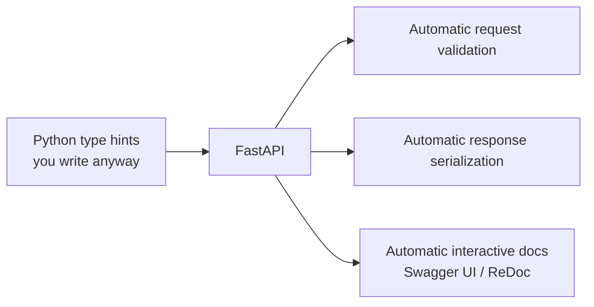
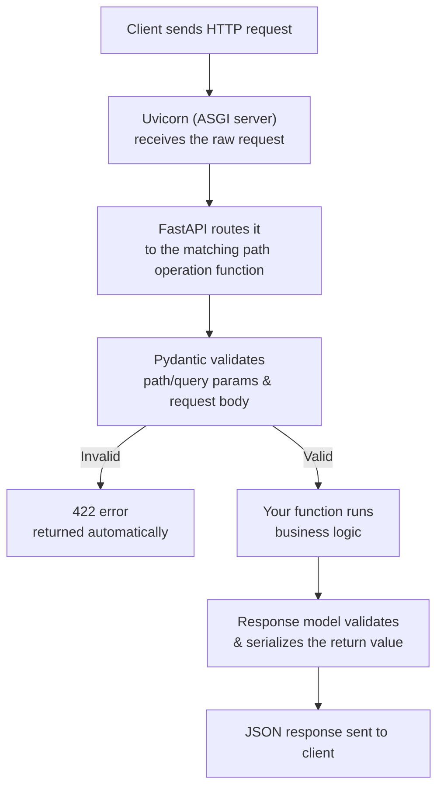
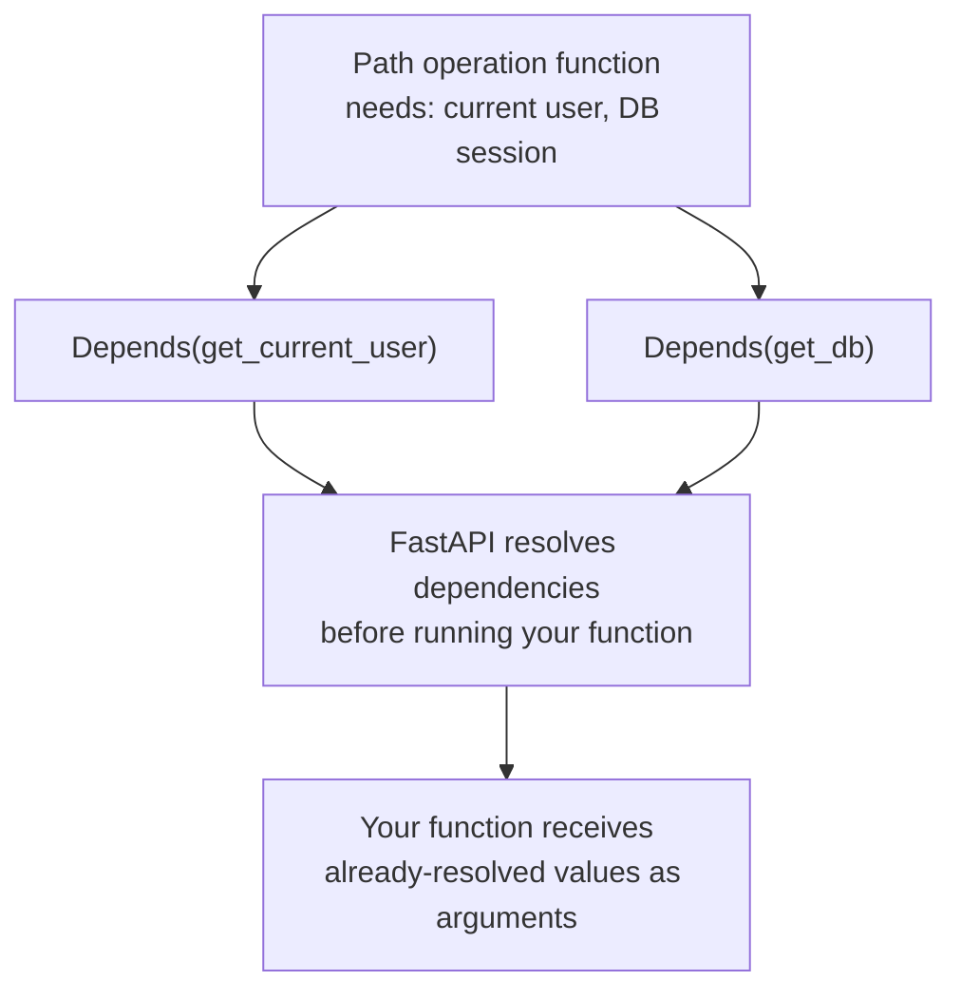
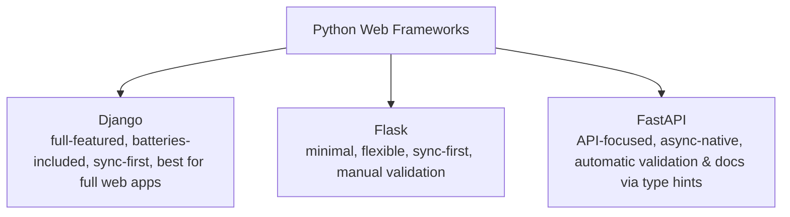

# FastAPI – Building REST APIs Guide (Placement Prep)

---

## Part 1: Concept Walkthrough

### What is FastAPI, and why does it matter?

Every previous guide had you *calling* APIs. FastAPI is where you *build* one. It's a modern Python web framework specifically designed for building APIs — fast (built on top of Starlette and Pydantic, with native async support), and it uses Python type hints to automatically validate requests, serialize responses, and generate interactive documentation, with almost no extra code from you.



### The request lifecycle in a FastAPI app



**Key idea:** You write plain Python functions with type-hinted parameters. FastAPI handles the entire validation → execution → serialization pipeline around them automatically — this is the core productivity win over manually parsing/validating requests yourself.

### Dependency Injection in FastAPI



### FastAPI's place in the Python web framework landscape



---

## Part 2: Q&A

### Module 1: FastAPI Fundamentals

**Q1. What is FastAPI?**
A modern, high-performance Python web framework for building APIs, built on top of Starlette (for the web parts) and Pydantic (for data validation) — uses standard Python type hints to automatically validate data and generate documentation.

**Q2. What makes FastAPI "fast" (both in development speed and runtime performance)?**
**Runtime**: built on Starlette/ASGI with native async support, comparable in performance to Node.js/Go frameworks. **Development**: automatic validation, serialization, and interactive docs from type hints alone mean far less boilerplate code than manually parsing requests.

**Q3. What is ASGI, and how does it relate to FastAPI?**
Asynchronous Server Gateway Interface — the modern successor to WSGI (used by Flask/Django traditionally), enabling native async request handling. FastAPI is built on ASGI (via Starlette), which is why it natively supports `async def` endpoints.

**Q4. What is Uvicorn, and why is it needed to run a FastAPI app?**
An ASGI server — the actual program that receives HTTP requests from the network and passes them to your FastAPI application code. FastAPI defines *how* to handle requests; Uvicorn is what actually listens on a port and serves them.

**Q5. What is Pydantic, and what role does it play in FastAPI?**
A data validation library that uses Python type hints to define data models (schemas) and automatically validates/parses/serializes data against them — FastAPI uses Pydantic models to validate request bodies and shape response data.

**Q6. FastAPI vs Flask — key differences?**
Flask: minimal/unopinionated, synchronous by default, manual request validation and serialization. FastAPI: async-native, automatic validation via type hints, automatic interactive documentation — generally less boilerplate for building APIs specifically (Flask is more general-purpose web framework, not API-specific).

**Q7. FastAPI vs Django REST Framework — key differences?**
Django (and DRF on top of it): full-featured "batteries-included" framework with ORM, admin panel, templating — great for full web applications with APIs as one part. FastAPI: lightweight, API-focused, async-first — better suited when you're building primarily an API/microservice rather than a full traditional web app.

### Module 2: Path Operations, Parameters & Request Bodies

**Q8. What is a "path operation" in FastAPI?**
A function decorated with an HTTP method + path (e.g., `@app.get("/users/{user_id}")`) that handles requests to that specific endpoint — FastAPI's term for what's often called a "route" or "view function" elsewhere.

**Q9. What is a Path Parameter, and how do you declare one?**
A dynamic segment of the URL path (e.g., the `42` in `/users/42`) — declared by including it in curly braces in the route decorator and as a matching function argument: `def get_user(user_id: int):`.

**Q10. What is a Query Parameter, and how do you declare one?**
A parameter passed after `?` in the URL (e.g., `?limit=10`) — declared simply as a function argument that's *not* part of the path: `def list_users(limit: int = 10):` — FastAPI infers it's a query param since it's not in the path template.

**Q11. How does FastAPI use type hints to validate incoming data?**
If a path/query parameter is type-hinted as `int` but the client sends a non-numeric value, FastAPI automatically returns a 422 error with a clear message — no manual `try/except` or validation code needed from you.

**Q12. How do you define a Request Body in FastAPI?**
By creating a Pydantic model (a class inheriting from `BaseModel`) describing the expected JSON structure, then using it as a type-hinted function parameter — FastAPI automatically parses and validates the incoming JSON body against it.

**Q13. What happens if a client sends a request body that doesn't match the Pydantic model?**
FastAPI automatically returns a 422 Unprocessable Entity response with details about exactly which field(s) failed validation and why — without you writing any validation logic.

**Q14. What is a Response Model in FastAPI, and why use one?**
A Pydantic model specified via the `response_model` parameter (or return type hint) that defines the exact shape of data returned to the client — ensures consistent output structure and can filter out fields you don't want exposed (e.g., hiding a password hash).

### Module 3: Documentation & Developer Experience

**Q15. What is OpenAPI (formerly Swagger), and how does FastAPI use it?**
A standard specification format for describing REST APIs (endpoints, parameters, schemas). FastAPI automatically generates an OpenAPI schema for your entire API based on your code and type hints — no separate documentation file to maintain manually.

**Q16. What do `/docs` and `/redoc` provide in a FastAPI app?**
Automatically generated, interactive API documentation — `/docs` is Swagger UI (lets you try out endpoints directly in the browser), `/redoc` is an alternative, cleaner read-focused documentation view — both generated live from your code with zero extra effort.

**Q17. Why is auto-generated documentation from code (rather than hand-written docs) valuable?**
It can never go out of sync with the actual API behavior — since the docs are generated directly from your type hints and Pydantic models, any code change automatically updates the documentation.

### Module 4: Async, Dependency Injection & Middleware

**Q18. When should you use `async def` vs regular `def` for a path operation in FastAPI?**
Use `async def` when your function performs I/O-bound operations (database calls, external API requests) using async-compatible libraries — allows FastAPI to handle other requests while waiting. Regular `def` is fine for CPU-bound or simple synchronous logic; FastAPI runs these in a thread pool automatically so they don't block the event loop.

**Q19. What is Dependency Injection in FastAPI, using `Depends`?**
A system for declaring reusable pieces of logic (e.g., "get the current authenticated user," "get a database session") that FastAPI automatically resolves and injects as function arguments before your path operation runs — avoids repeating the same setup code in every endpoint.

**Q20. Give a practical example of when Dependency Injection is useful.**
Authentication: instead of manually checking a token in every single endpoint, you define one `get_current_user` dependency function and add `user: User = Depends(get_current_user)` to any endpoint that needs authentication — FastAPI handles calling it and passing the result in.

**Q21. What is Middleware in FastAPI?**
Code that runs on every request/response, before it reaches your path operation or after it leaves — used for cross-cutting concerns like logging, timing requests, adding CORS headers, or global error handling.

**Q22. What is CORS Middleware, and why would you add it to a FastAPI app?**
Middleware that adds the necessary headers to allow (or restrict) which external domains/origins can call your API from a browser — necessary if your API will be consumed by a frontend web app hosted on a different domain.

### Module 5: Error Handling & Status Codes

**Q23. How do you return a custom error response in FastAPI?**
Raise an `HTTPException` with a specific status code and detail message — e.g., `raise HTTPException(status_code=404, detail="User not found")` — FastAPI automatically converts this into a proper JSON error response.

**Q24. How do you set a custom success status code for an endpoint (e.g., 201 for creation)?**
Via the `status_code` parameter in the path operation decorator: `@app.post("/users", status_code=201)`.

**Q25. How can you handle validation errors globally with custom formatting?**
By defining a custom exception handler using `@app.exception_handler(RequestValidationError)` — lets you override FastAPI's default 422 error response format with your own structure.

### Module 6: Practical & Common Interview Questions

**Q26. How do you run a FastAPI application?**
Using an ASGI server like Uvicorn: `uvicorn main:app --reload` (where `main` is the Python file and `app` is your FastAPI instance) — the `--reload` flag enables auto-restart during development.

**Q27. What is the difference between `app.get()`, `app.post()`, etc. decorators?**
Each corresponds directly to the HTTP method the decorated function should handle — `@app.get()` handles GET requests to that path, `@app.post()` handles POST, and so on, mirroring REST's use of HTTP methods.

**Q28. How would you structure a larger FastAPI project with many endpoints?**
Using `APIRouter` to split endpoints into separate modules/files by resource (e.g., `users.py`, `orders.py`), then including them in the main app via `app.include_router(users_router)` — keeps large APIs organized rather than one massive file.

**Q29. How does FastAPI handle data going out (response) differently from data coming in (request)?**
Incoming data is validated against request body/parameter models (raises 422 on mismatch). Outgoing data is validated/filtered against the `response_model` if specified — ensuring the client only receives the fields you intend to expose, even if your internal function returns extra data.

**Q30. Why might FastAPI be a strong choice specifically for serving ML/AI models (relevant to your earlier guides)?**
Async support handles concurrent inference requests efficiently, automatic request validation ensures malformed inputs are rejected before reaching your model, and auto-generated docs make it easy for other teams/services to discover and correctly call your model-serving endpoint — a very common real-world pattern for deploying LLM/ML applications.

---

## Part 3: Code Snippets

### 3.1 A minimal FastAPI app

```python
from fastapi import FastAPI

app = FastAPI()

@app.get("/")
def read_root():
    return {"message": "Hello, FastAPI!"}

# Run with: uvicorn main:app --reload
# Then visit http://127.0.0.1:8000/docs for interactive documentation
```

### 3.2 Path parameters and query parameters

```python
from fastapi import FastAPI

app = FastAPI()

@app.get("/users/{user_id}")
def get_user(user_id: int, include_orders: bool = False):
    # user_id comes from the URL path, e.g. /users/42
    # include_orders comes from the query string, e.g. ?include_orders=true
    return {"user_id": user_id, "include_orders": include_orders}

# GET /users/42                     -> {"user_id": 42, "include_orders": false}
# GET /users/42?include_orders=true -> {"user_id": 42, "include_orders": true}
# GET /users/abc                    -> automatic 422 error (user_id must be int)
```

### 3.3 Request body with Pydantic + response model

```python
from fastapi import FastAPI
from pydantic import BaseModel

app = FastAPI()

class UserCreate(BaseModel):
    name: str
    email: str
    age: int

class UserResponse(BaseModel):
    id: int
    name: str
    email: str
    # note: age is intentionally excluded from what we return

fake_db = {}
next_id = 1

@app.post("/users", response_model=UserResponse, status_code=201)
def create_user(user: UserCreate):
    global next_id
    new_user = {"id": next_id, "name": user.name, "email": user.email, "age": user.age}
    fake_db[next_id] = new_user
    next_id += 1
    return new_user   # FastAPI filters this to match UserResponse shape automatically
```

### 3.4 Dependency Injection for shared logic (e.g., auth)

```python
from fastapi import FastAPI, Depends, HTTPException, Header

app = FastAPI()

def get_current_user(authorization: str = Header(None)):
    if authorization != "Bearer valid_token_123":
        raise HTTPException(status_code=401, detail="Invalid or missing token")
    return {"username": "demo_user"}

@app.get("/profile")
def read_profile(current_user: dict = Depends(get_current_user)):
    return {"profile": current_user}

@app.get("/settings")
def read_settings(current_user: dict = Depends(get_current_user)):
    # Same dependency reused — no duplicated auth-checking code
    return {"settings": "some settings", "user": current_user["username"]}
```

### 3.5 Error handling with HTTPException

```python
from fastapi import FastAPI, HTTPException

app = FastAPI()

fake_items = {1: "Widget", 2: "Gadget"}

@app.get("/items/{item_id}")
def get_item(item_id: int):
    if item_id not in fake_items:
        raise HTTPException(status_code=404, detail=f"Item {item_id} not found")
    return {"item_id": item_id, "name": fake_items[item_id]}

# GET /items/1 -> 200, {"item_id": 1, "name": "Widget"}
# GET /items/99 -> 404, {"detail": "Item 99 not found"}
```

### 3.6 A minimal async endpoint calling an external API

```python
from fastapi import FastAPI
import httpx

app = FastAPI()

@app.get("/github/{username}")
async def get_github_user(username: str):
    async with httpx.AsyncClient() as client:
        response = await client.get(f"https://api.github.com/users/{username}")
        return response.json()

# async def + await here means FastAPI can handle other requests
# while waiting on this external API call to complete
```

---

## Part 4: Mini Assignment

**Goal:** Build a small but complete FastAPI application from scratch, covering CRUD, validation, and auth.

**Task 1 — Build a mini "Book Library" API:**
Using Sections 3.1-3.5 as reference, build a FastAPI app with:
1. A Pydantic `Book` model with fields: `title` (str), `author` (str), `year` (int), `available` (bool, default `True`).
2. `POST /books` — create a book (return 201, use a response model that excludes any field you choose to treat as "internal").
3. `GET /books` — list all books (support an optional query parameter to filter by `available`).
4. `GET /books/{book_id}` — get a single book, returning a 404 with a clear message if it doesn't exist.
5. `DELETE /books/{book_id}` — delete a book, returning 204 on success.

**Task 2 — Add validation and observe automatic behavior:**
1. Run your app (`uvicorn main:app --reload`) and open `/docs`.
2. Try creating a book with a missing field, and with `year` as a string instead of an int — screenshot or copy the exact 422 error response and note which part of FastAPI generated it automatically (you didn't write this validation code yourself).

**Task 3 — Add a simple auth dependency:**
Using Section 3.4 as a template:
1. Add a `get_current_user` dependency that checks for a specific fake token.
2. Protect your `DELETE /books/{book_id}` endpoint with it (require authentication to delete, but not to read).
3. Test both with and without the correct Authorization header and confirm you get 401 vs success appropriately.

**Deliverable:** Your full `main.py` code, plus a short write-up of your Task 2 error response example and your Task 3 auth test results (with/without valid token).

---

## Quick Revision Checklist

- [ ] Explain what FastAPI is and why it's fast (dev speed + runtime, via type hints + ASGI)
- [ ] Explain the request lifecycle: Uvicorn → FastAPI routing → Pydantic validation → function → response
- [ ] Explain path parameters vs query parameters vs request body
- [ ] Explain how Pydantic models drive both validation and automatic docs
- [ ] Explain Dependency Injection (`Depends`) and a practical use case (auth)
- [ ] Explain when to use `async def` vs `def`
- [ ] Explain how to raise custom errors with `HTTPException`
- [ ] Be able to build a basic CRUD API from scratch

---

## 🎓 API Track Complete

**API Basics & Types → Networking Fundamentals → REST → FastAPI**

You now understand APIs from every angle: what they are and how they're classified, the networking machinery underneath every call, REST's design principles for building them well, and FastAPI as a practical, modern framework to actually build one yourself — including the validation, documentation, and auth patterns used in real production systems (including, notably, serving ML/LLM models — tying this back to your Gen AI/Agentic AI track).