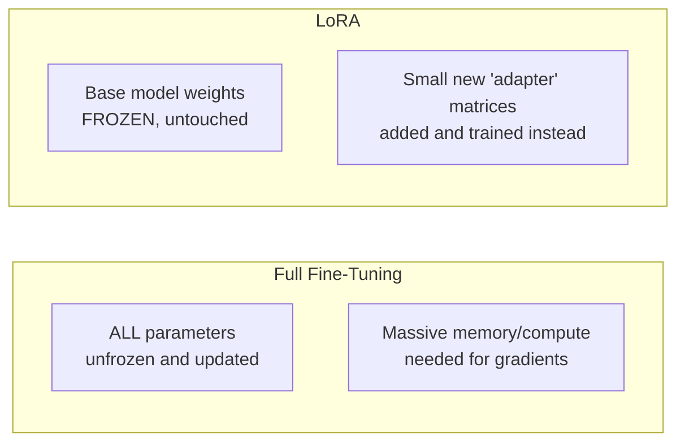
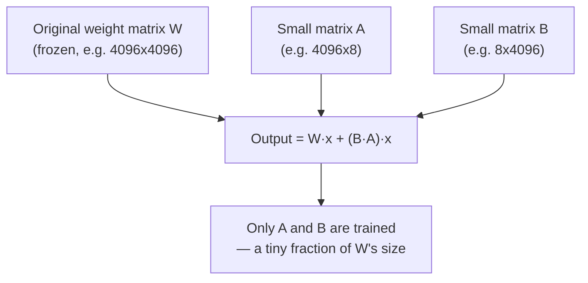
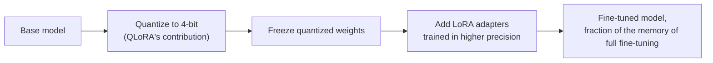
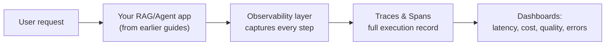
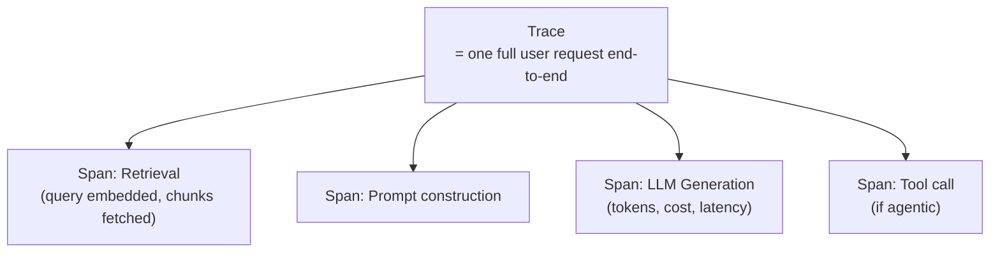
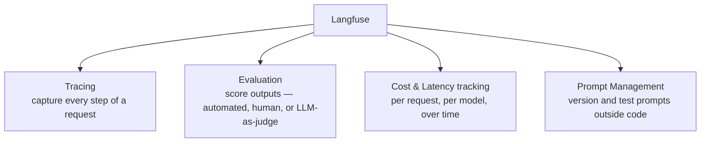

# LoRA/QLoRA & LLM Observability – Awareness Guide (Placement Prep)

Light-weight treatment — concept + Q&A only, no code/assignment. These are supplementary topics: useful differentiators for GenAI-focused roles, not core interview material the way REST or Docker is. See the note at the end of each part on who actually needs the deeper version.

---

# Part A: LoRA & QLoRA (Parameter-Efficient Fine-Tuning)

## Concept Walkthrough

### The problem: full fine-tuning is expensive

Your LLM Basics guide covered fine-tuning conceptually — taking a pre-trained model and further training it on task-specific data. The problem: a **full fine-tune** updates *every single parameter* in the model. For a model with tens/hundreds of billions of parameters, that means enormous GPU memory (to store gradients and optimizer states for every parameter) and compute cost — often impractical outside large labs.

### How LoRA works, conceptually

LoRA (**Lo**w-**R**ank **A**daptation) freezes the entire pre-trained model and instead injects small, trainable "adapter" matrices alongside the original weight matrices. Mathematically, it approximates the *change* needed in a weight matrix using two much smaller low-rank matrices — dramatically fewer parameters to train, while the frozen base model still does the heavy lifting.

### QLoRA: LoRA + Quantization combined

QLoRA takes LoRA one step further by first **quantizing** the frozen base model to 4-bit precision (recall quantization from your LLM Basics guide — reducing numerical precision to shrink model size), then applying LoRA adapters on top of that quantized model. This makes it possible to fine-tune very large models on a single consumer/prosumer GPU.

## Q&A

**Q1. What problem does LoRA solve?**
Full fine-tuning requires updating and storing gradients/optimizer states for every parameter in a large model — extremely memory and compute intensive. LoRA drastically reduces the number of trainable parameters, making fine-tuning feasible with far less hardware.

**Q2. What does LoRA actually train, if not the original model weights?**
It freezes the original pre-trained weight matrices entirely and instead trains small additional "low-rank" matrices injected alongside them — only these new, much smaller matrices are updated during training.

**Q3. What does "low-rank" mean in this context?**
Instead of learning a full-sized update matrix (as large as the original weight matrix), LoRA approximates that update as the product of two much smaller matrices — a mathematical simplification that captures most of the useful adaptation with vastly fewer parameters.

**Q4. What is an "adapter" in the context of LoRA?**
The small set of trainable low-rank matrices themselves — often called an adapter because it can be trained, saved, and swapped independently of the frozen base model, like a plug-in.

**Q5. What is a practical benefit of adapters being swappable?**
You can keep one large frozen base model in memory and swap in different lightweight LoRA adapters for different tasks/domains on demand, instead of hosting multiple full fine-tuned copies of the entire model.

**Q6. What is QLoRA, and how does it differ from plain LoRA?**
QLoRA combines LoRA with **quantization** — the frozen base model is first compressed to 4-bit precision before LoRA adapters are trained on top of it, further reducing memory requirements beyond what LoRA alone achieves.

**Q7. Why does QLoRA make a meaningful practical difference?**
It makes it feasible to fine-tune very large models (tens of billions of parameters) on a single high-end consumer or prosumer GPU, rather than requiring a multi-GPU server cluster — significantly lowering the barrier to entry for custom fine-tuning.

**Q8. LoRA/QLoRA vs RAG — when would you choose fine-tuning over RAG (revisiting your RAG guide's Q3)?**
RAG is generally preferred for injecting *facts/knowledge* (cheap, instantly updatable). Fine-tuning (via LoRA/QLoRA) is better suited for changing a model's *behavior, style, tone, or format* — e.g., teaching it to always respond in a specific structured format or a particular brand voice — something retrieval alone can't reliably achieve.

**Q9. What is a key trade-off of LoRA compared to full fine-tuning?**
LoRA typically captures *most* but not always *all* of the benefit of full fine-tuning — for tasks requiring very deep changes to the model's fundamental behavior, full fine-tuning can still outperform LoRA, though LoRA is sufficient for the vast majority of practical customization needs.

**Q10. Who actually needs to know LoRA/QLoRA in depth for their job?**
ML Engineers, MLOps engineers, or research roles at companies that train/customize their own models. If you're building GenAI applications on top of API-based foundation models (the majority of campus GenAI roles), you're far more likely to use RAG and prompting than to personally run a LoRA fine-tune — but knowing *what it is and why it exists* is enough for most interviews.

---

# Part B: LLM Observability & Langfuse

## Concept Walkthrough

### Why observability matters once you deploy an LLM app

Once your RAG pipeline or agent (from your earlier guides) is live and handling real user traffic, new questions appear that pure development doesn't answer: Is it slow? Is it expensive? Are responses actually good? Which step in a multi-step agent failed? **LLM Observability** is the practice of instrumenting your application to answer these questions — essentially, monitoring and debugging tools built specifically for LLM/agent workflows.

### Traces and Spans — the core observability concepts

**Key idea:** A **trace** captures one complete request through your system (e.g., one RAG query, or one full agent run). It's broken into **spans** — individual steps within that trace (the retrieval step, the LLM call, a tool call) — each with its own timing, inputs, outputs, and metadata. This directly mirrors the RAG pipeline diagram and the ReAct loop diagram from your earlier guides — observability tools essentially instrument each node/step you already designed.

### What Langfuse specifically provides

## Q&A

**Q11. What is LLM Observability, broadly?**
The practice of instrumenting an LLM-powered application to capture visibility into its behavior in production — tracking what prompts were sent, what was retrieved, what tools were called, how long each step took, what it cost, and whether outputs were good.

**Q12. Why is observability especially important for LLM/agent applications compared to typical software?**
LLM outputs are non-deterministic (same input can produce different outputs), multi-step pipelines (RAG, agents) have many places something can go subtly wrong, and quality issues (a bad or hallucinated answer) don't throw an exception the way a traditional bug would — you need to actually inspect the full execution trace to catch and diagnose these.

**Q13. What is a Trace, in observability terms?**
A record of one complete end-to-end request through your system — e.g., a single user's RAG query or a single agent run from start to final answer.

**Q14. What is a Span, and how does it relate to a Trace?**
A single step or operation within a trace (e.g., "retrieval," "LLM generation," "tool call") — a trace is composed of multiple spans, each capturing that specific step's inputs, outputs, timing, and metadata.

**Q15. What is Langfuse?**
An open-source LLM observability and analytics platform — provides tracing, evaluation, prompt management, and cost/latency monitoring specifically designed for LLM and agent applications (as opposed to generic software monitoring tools).

**Q16. How does observability tracing map onto what you already built in your RAG/Agentic AI guides?**
Directly — each step in your RAG pipeline diagram (retrieve → augment → generate) or your ReAct loop diagram (thought → action → observation) becomes a span; the entire pipeline/loop execution becomes a trace. Observability tools essentially auto-capture the diagrams you drew conceptually, as real runtime data.

**Q17. What does "LLM-as-judge" mean in the context of evaluation (connects to your RAG guide's faithfulness check)?**
Using a separate LLM call to automatically score/evaluate the quality of another LLM's output (e.g., faithfulness, relevance, correctness) — the same pattern as the `check_faithfulness()` function from your RAG guide's code, but run systematically across production traffic rather than manually.

**Q18. Why would you track cost and latency per request in an LLM application?**
LLM API calls are billed per token and can vary significantly in cost/speed depending on model choice, prompt length, and number of steps (especially in agentic loops that make multiple LLM calls) — without tracking this, unexpected cost spikes or slow user experiences can go unnoticed until they're a major problem.

**Q19. What is Prompt Management/Versioning, and why does it matter?**
Treating prompts as versioned artifacts (like code) rather than hardcoded strings buried in application logic — lets teams test, compare, and roll back prompt changes systematically, and track which prompt version was used for any given trace when debugging.

**Q20. How would observability help you debug a failing agent (connects to your Agentic AI guide's failure modes)?**
Instead of guessing why an agent gave a wrong answer or got stuck in a loop, you can inspect the full trace — see exactly which tool was called with what arguments, what it returned, and at which step the reasoning went wrong — turning a black-box failure into a debuggable, inspectable sequence of spans.

**Q21. Is Langfuse the only tool in this space?**
No — this is a growing category (broadly "LLMOps" tooling); other examples include LangSmith (LangChain's own observability tool, tightly integrated with LangChain/LangGraph from your earlier guide), Helicone, and Arize Phoenix. Langfuse is a commonly cited open-source option, but the underlying concepts (traces, spans, evals) are shared across all of them.

**Q22. Who actually needs to know this in depth?**
Anyone building and *operating* production LLM/agent systems — a natural next question after you've built a RAG or agent app is "how do you know it's working well in production?" Having a clear, concise answer here (traces, evals, cost/latency monitoring) signals production-readiness thinking, even without deep hands-on tool experience — that's exactly what this light-weight, concept-level treatment is meant to equip you with.

---

## Quick Revision Checklist

**LoRA/QLoRA:**
- [ ] Explain why full fine-tuning is expensive at scale
- [ ] Explain what LoRA freezes vs trains (low-rank adapter matrices)
- [ ] Explain what QLoRA adds on top of LoRA (quantization)
- [ ] Explain LoRA/QLoRA vs RAG — when to fine-tune vs when to retrieve

**Observability:**
- [ ] Explain why LLM apps specifically need observability (non-determinism, multi-step pipelines)
- [ ] Explain Trace vs Span
- [ ] Explain what Langfuse (or similar tools) provide: tracing, evals, cost/latency, prompt management
- [ ] Explain how observability maps onto your RAG/Agentic AI pipeline diagrams as real runtime data

---

*This concludes the supplementary/awareness-level additions to your Gen AI track. Both topics are here so you have a confident answer if asked, without the deep hands-on investment that's genuinely only necessary for ML Engineering/MLOps-specific roles.*