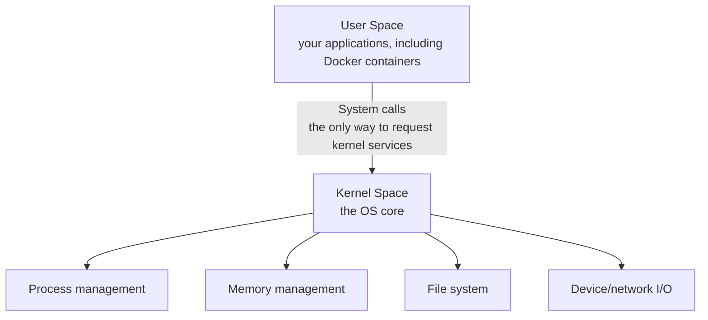
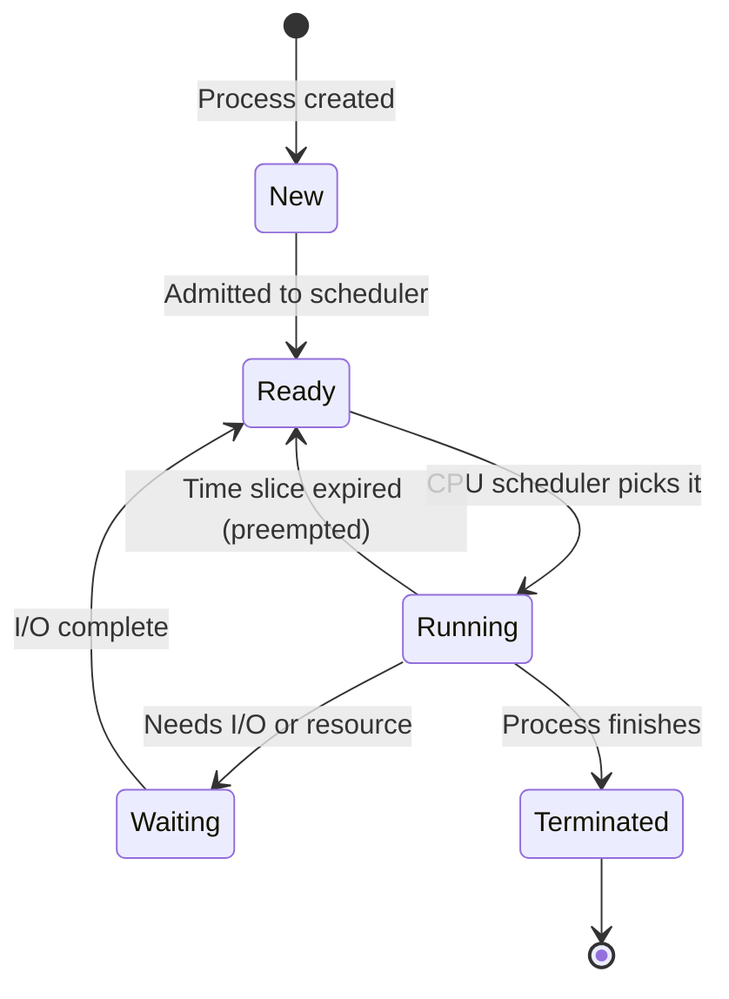
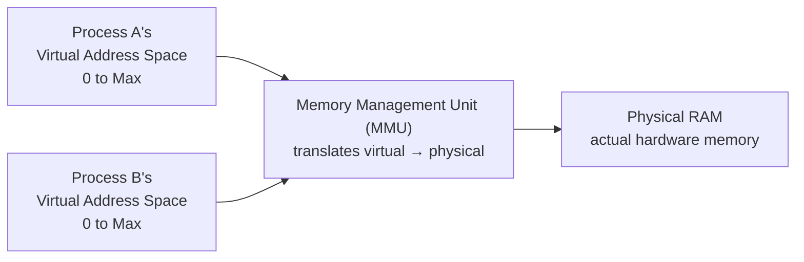
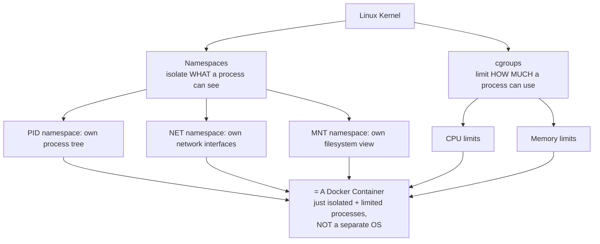

# Operating System Fundamentals – Guide for Docker/K8s/Cloud (Placement Prep)

This is the foundation beneath Docker, Kubernetes, and cloud computing — namespaces, cgroups, and virtualization all build directly on these OS concepts.

---

## Part 1: Concept Walkthrough

### What does an OS actually do?

An Operating System sits between your applications and the physical hardware, managing four things: **processes** (running programs), **memory**, **files/storage**, and **devices/I/O**. Everything Docker and Kubernetes do — isolating processes, limiting resources, managing filesystems — is really just a clever, controlled use of features the OS kernel already provides.



**Key idea:** Applications never touch hardware directly — they ask the kernel to do it on their behalf via **system calls**. This boundary (user space vs kernel space) is exactly what containers exploit: since containers run in user space and share the host's kernel, they're fundamentally different from VMs, which each run their own full kernel.

### The Process Lifecycle

Every running program is a **process**, and every process moves through defined states.



### Virtual Memory — how processes get their own private address space



**Key idea:** Every process believes it has the entire address space to itself, starting from 0 — the OS (via the MMU) transparently maps each process's virtual addresses to different physical RAM locations, and this is *why* one process can't accidentally read another's memory.

### From OS primitives to Docker: Namespaces & cgroups

This is the diagram that connects everything back to your Docker guide.



---

## Part 2: Q&A

### Module 1: OS Basics & Kernel

**Q1. What is an Operating System?**
System software that manages hardware resources (CPU, memory, storage, I/O devices) and provides services to application programs — the layer between your code and the physical machine.

**Q2. What is the Kernel?**
The core of the OS with full, privileged access to hardware — manages processes, memory, and devices, running in a protected mode separate from regular applications.

**Q3. What is the difference between User Space and Kernel Space?**
**Kernel space**: privileged, direct hardware access, where the OS core runs. **User space**: restricted, where regular applications (including containers) run — they cannot directly access hardware and must request services from the kernel.

**Q4. What is a System Call?**
The controlled mechanism by which a user-space program requests a service from the kernel — e.g., reading a file, allocating memory, creating a process — the only sanctioned way to cross from user space into kernel space.

**Q5. Why can't applications access hardware directly?**
Protection and stability — if every application could directly control hardware, one buggy or malicious program could crash the entire system or interfere with other programs. The kernel mediates all access to enforce isolation and fairness.

### Module 2: Processes & Threads

**Q6. What is a Process?**
An instance of a running program — has its own memory space, resources (open files, etc.), and at least one thread of execution, managed and scheduled independently by the OS.

**Q7. What is a Thread, and how does it differ from a Process?**
A thread is a unit of execution *within* a process — multiple threads in the same process **share** the same memory space and resources, unlike separate processes which have isolated memory. Threads are "lighter weight" to create/switch between than processes.

**Q8. What are the typical states in a Process Lifecycle?**
**New** (being created) → **Ready** (waiting for CPU) → **Running** (executing on CPU) → **Waiting/Blocked** (waiting for I/O or a resource) → **Terminated** (finished execution).

**Q9. What is Context Switching?**
The process of the CPU saving the state of a currently running process/thread and loading the state of another, so it can switch execution between them — enables multitasking, but has overhead (time spent not doing useful work).

**Q10. What is a PID (Process ID)?**
A unique numeric identifier assigned to each running process by the OS — used to reference, monitor, or terminate a specific process (e.g., `kill -9 <PID>`).

**Q11. What is the difference between Multitasking and Multithreading?**
**Multitasking**: the OS runs multiple processes concurrently (switching CPU time between them). **Multithreading**: a single process runs multiple threads concurrently, sharing that process's memory space.

**Q12. What is Concurrency vs Parallelism?**
**Concurrency**: multiple tasks make progress during overlapping time periods (may or may not run at the exact same instant — achieved via context switching on a single core). **Parallelism**: multiple tasks literally execute at the exact same instant, requiring multiple CPU cores.

### Module 3: CPU Scheduling

**Q13. What is CPU Scheduling?**
The OS's method of deciding which ready process gets to run on the CPU next — necessary because there are usually far more processes wanting CPU time than there are CPU cores available.

**Q14. What is Preemption, in scheduling terms?**
The OS's ability to interrupt a currently running process (even if it's not finished) to give another process a turn — ensures no single process can monopolize the CPU indefinitely.

**Q15. What is a Time Slice (Quantum)?**
The fixed amount of CPU time allocated to a process before the scheduler potentially preempts it and switches to another process — a core mechanism of fair, responsive multitasking.

### Module 4: Memory Management

**Q16. What is Virtual Memory?**
An abstraction where each process gets its own private, contiguous address space (starting from 0) — the OS/MMU translates these virtual addresses to actual physical RAM locations, hidden from the process itself.

**Q17. Why is Virtual Memory useful?**
Provides process isolation (one process can't accidentally access another's memory), allows using more memory than physically installed (via swapping/paging to disk), and simplifies programming (each process assumes it has a full address space to itself).

**Q18. What is Paging?**
A memory management technique that divides virtual memory into fixed-size blocks ("pages") and physical memory into same-sized blocks ("frames") — pages are mapped to frames as needed, allowing non-contiguous physical storage of a process's memory.

**Q19. What is Swapping (or Paging to disk)?**
When physical RAM is full, the OS temporarily moves inactive memory pages to disk storage, freeing RAM for active processes — accessing swapped-out data later is much slower than RAM, which is why excessive swapping ("thrashing") hurts performance badly.

**Q20. What is a Memory Leak?**
When a program allocates memory but fails to release it after it's no longer needed — over time, this consumes increasing amounts of memory, potentially degrading performance or crashing the application/system.

### Module 5: File Systems

**Q21. What is a File System?**
The OS component that organizes, stores, and retrieves data on persistent storage (disk/SSD) — manages how files/directories are structured, named, and accessed.

**Q22. What is an inode (Linux/Unix concept)?**
A data structure storing metadata about a file (permissions, owner, size, location of data blocks) — the filename is actually just a pointer to an inode, which is why multiple filenames (hard links) can point to the same underlying file data.

**Q23. What is the difference between a Hard Link and a Symbolic (Soft) Link?**
**Hard link**: a direct additional reference to the same inode/data — deleting the original file doesn't remove the data as long as a hard link exists. **Symbolic link**: a separate file that just points to another file's *path* — breaks if the original file is deleted/moved.

**Q24. What are File Permissions in Linux, at a high level?**
Read/Write/Execute permissions defined separately for the file's owner, group, and everyone else — the foundation for access control at the OS level (relevant to Docker's "don't run as root" security best practice).

### Module 6: OS Concepts Behind Docker (The Connection)

**Q25. What is a Linux Namespace, precisely, at the OS level?**
A kernel feature that partitions a specific kind of system resource so a process (or group of processes) sees its own isolated instance of it — e.g., a PID namespace gives a process its own view of "process ID 1," even though the host OS sees it as some other PID.

**Q26. Which namespace types does Docker rely on, and what does each isolate?**
**PID**: process tree (container sees its own process 1). **NET**: network interfaces/IP. **MNT**: filesystem mount points. **UTS**: hostname. **IPC**: inter-process communication. **USER**: user/group ID mapping.

**Q27. What is a cgroup (control group), precisely, at the OS level?**
A Linux kernel feature that groups processes together and limits/accounts for/isolates their usage of resources like CPU, memory, and disk I/O — this is literally the mechanism behind Docker's `--memory` and `--cpus` flags.

**Q28. Why is a container NOT a lightweight virtual machine, technically speaking?**
A container is just one or more **regular host processes** that the kernel has restricted using namespaces (limited visibility) and cgroups (limited resource usage) — it shares the exact same kernel as the host. A VM, by contrast, runs an entirely separate guest OS (with its own kernel) on top of virtualized hardware via a hypervisor.

**Q29. Why does this matter for container startup time vs VM startup time?**
Starting a container just means starting a new (restricted) process on the already-running host kernel — milliseconds to seconds. Starting a VM means booting an entire separate OS kernel from scratch — much slower (often 30+ seconds to minutes).

**Q30. Why can a container only run Linux binaries if the host kernel is Linux (relevant to "Is Docker Linux-only?" from your Docker guide)?**
Since a container shares the host's kernel rather than bringing its own, the binaries inside it must be compatible with that specific host kernel's system call interface — this is why Docker Desktop on Windows/Mac actually runs a lightweight Linux VM under the hood, so Linux containers have a Linux kernel to share.

### Module 7: Common Interview Questions

**Q31. What is a Deadlock?**
A situation where two or more processes are each waiting for a resource held by the other, and neither can proceed — none of them can ever complete without external intervention.

**Q32. What are the four necessary conditions for a Deadlock to occur?**
**Mutual exclusion** (resource can't be shared), **Hold and wait** (a process holds one resource while waiting for another), **No preemption** (resources can't be forcibly taken away), **Circular wait** (a closed chain of processes each waiting on the next).

**Q33. What is Thrashing?**
A state where the system spends more time swapping memory pages in/out than actually executing processes — happens when there's too little physical RAM for the active workload, severely degrading performance.

**Q34. Why does understanding OS fundamentals help you reason about Docker/Kubernetes/Cloud?**
Containers are OS-level process isolation (namespaces + cgroups), VMs are hardware-level virtualization managed by a hypervisor, and cloud compute instances (like EC2) are just VMs — understanding processes, memory, and the kernel/user-space boundary explains *why* these technologies behave, scale, and fail the way they do, rather than just memorizing their command syntax.

---

## Part 3: Hands-On Terminal Commands

Unlike other guides, this one is best explored directly on your own machine (Linux/WSL/Mac terminal) rather than via Python code — you're observing the OS itself.

### 3.1 Inspecting processes

```bash
ps aux                      # list all running processes with details
ps aux | grep firefox        # find a specific process
top                          # live, updating view of processes + CPU/memory usage
htop                         # a nicer, interactive version of top (may need to install)
pstree                       # view the process tree (parent-child relationships)
kill -9 <PID>                 # forcibly terminate a process by its PID
```

### 3.2 Inspecting a specific process in detail (via /proc, Linux)

```bash
echo $$                          # print the PID of your current shell
cat /proc/$$/status               # detailed status of that process (memory, state, etc.)
ls /proc/$$/                      # explore what info the kernel exposes about this process
cat /proc/meminfo                 # system-wide memory information
cat /proc/cpuinfo                 # CPU information
```

### 3.3 Observing memory

```bash
free -h                      # human-readable summary of RAM and swap usage
vmstat 1 5                    # virtual memory stats, updated every 1 second, 5 times
```

### 3.4 Creating your own namespace (the actual mechanism behind `docker run`)

```bash
# Create a new process with its own isolated PID namespace
sudo unshare --pid --fork --mount-proc bash

# Inside this new shell, check the process list:
ps aux
# Notice: your shell now appears as PID 1 — it can't see any of the host's other processes!
# This is EXACTLY what Docker does when it starts a container.

exit    # leave the isolated namespace
```

### 3.5 Creating your own cgroup (the actual mechanism behind `docker run --memory`)

```bash
# On a modern Linux system with cgroups v2 (check: cat /sys/fs/cgroup/cgroup.controllers)
sudo mkdir /sys/fs/cgroup/mygroup
echo "10000000" | sudo tee /sys/fs/cgroup/mygroup/memory.max   # limit to ~10MB

# Add the current shell's PID to this cgroup
echo $$ | sudo tee /sys/fs/cgroup/mygroup/cgroup.procs

# Now try running something memory-intensive in this shell — it will be constrained
# to the 10MB limit, exactly like a container started with `docker run --memory=10m`
```

### 3.6 Viewing file system info

```bash
df -h                         # disk space usage per filesystem/mount point
ls -li file.txt                 # show the inode number of a file
stat file.txt                   # detailed file metadata (permissions, timestamps, inode)
ln file.txt hardlink.txt         # create a hard link
ln -s file.txt symlink.txt       # create a symbolic link
```

---

## Part 4: Mini Assignment

**Goal:** Directly observe the OS mechanisms that Docker abstracts away, so "namespaces" and "cgroups" stop being memorized definitions and become things you've actually seen work.

**Task 1 — Process exploration:**
1. Run `ps aux` and identify at least 5 different processes currently running on your system. For 2 of them, note their PID and (your best guess at) what they do.
2. Run `top` (or `htop`) and watch it for 30 seconds — identify which process is currently using the most CPU and which is using the most memory.
3. Open a text editor, then find its process using `ps aux | grep <editor-name>`, and terminate it using `kill <PID>` instead of closing it normally — observe what happens.

**Task 2 — Recreate the Docker namespace experiment:**
1. Run the `unshare --pid --fork --mount-proc bash` command from Section 3.4.
2. Inside the new shell, run `ps aux` and confirm your shell shows up as PID 1 (or close to it) with almost nothing else visible.
3. In a *separate* terminal window (not inside the unshare session), run `ps aux` normally and confirm you *can* see many more processes, including one that must be your `unshare`d shell (search for `bash` or `unshare` in the output).
4. Write 2-3 sentences connecting this directly back to your Docker guide: what specifically does `docker run` do that mirrors this experiment?

**Task 3 — Recreate the Docker cgroup experiment (if on Linux with cgroups v2):**
1. Follow Section 3.5 to create a cgroup with a small memory limit and add your shell to it.
2. Try running a command that allocates a lot of memory (e.g., `python3 -c "x = ' ' * (50 * 1024 * 1024)"` to allocate ~50MB) — does it get killed/fail due to the limit you set?
3. Write 2-3 sentences connecting this back to `docker run --memory=10m` from your Docker guide — what's actually happening under the hood when you pass that flag?

**Deliverable:** A short write-up with your Task 1 process observations, your Task 2 namespace experiment output + Docker connection, and your Task 3 cgroup experiment output + Docker connection (or a note if you couldn't run Task 3 due to OS/permissions constraints).

---

## Quick Revision Checklist

- [ ] Explain kernel space vs user space, and what a system call is
- [ ] Explain the process lifecycle (New → Ready → Running → Waiting → Terminated)
- [ ] Explain process vs thread, and concurrency vs parallelism
- [ ] Explain virtual memory, paging, and why it enables process isolation
- [ ] Explain what a namespace and a cgroup are, precisely, at the OS level
- [ ] Explain why a container is NOT a lightweight VM (shares host kernel vs separate kernel)
- [ ] Explain why containers start faster than VMs
- [ ] Be able to run `ps`, `top`, and inspect `/proc` on your own machine

---

## 🔗 How this connects back

This guide is retroactive glue for your Docker/Kubernetes/Cloud track:

- **Docker's namespaces & cgroups** (Q13-Q14 in the Docker guide) — now you've actually created one yourself (Section 3.4-3.5) instead of just reading the definition.
- **"Container vs VM"** (Q4 in the Docker guide) — now grounded in kernel-sharing vs separate-kernel-per-guest (Q28-Q30 here), not just "containers are lighter."
- **Kubernetes nodes** — a node is just a machine running an OS; the kubelet and container runtime are themselves just processes managed by that OS's scheduler.
- **AWS EC2 / Cloud virtualization** — a hypervisor creates full virtual machines, each with their own kernel — the Cloud Fundamentals guide's "hypervisor" question now has real OS grounding behind it.

If you want, revisit the Docker guide's Module 2 (Architecture) questions now — they should feel noticeably more concrete than the first time through.