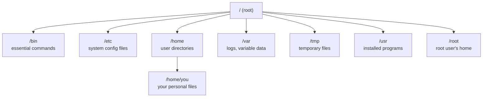
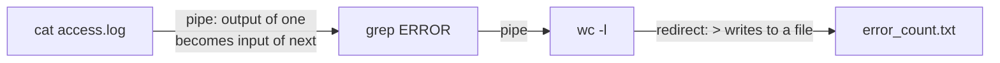
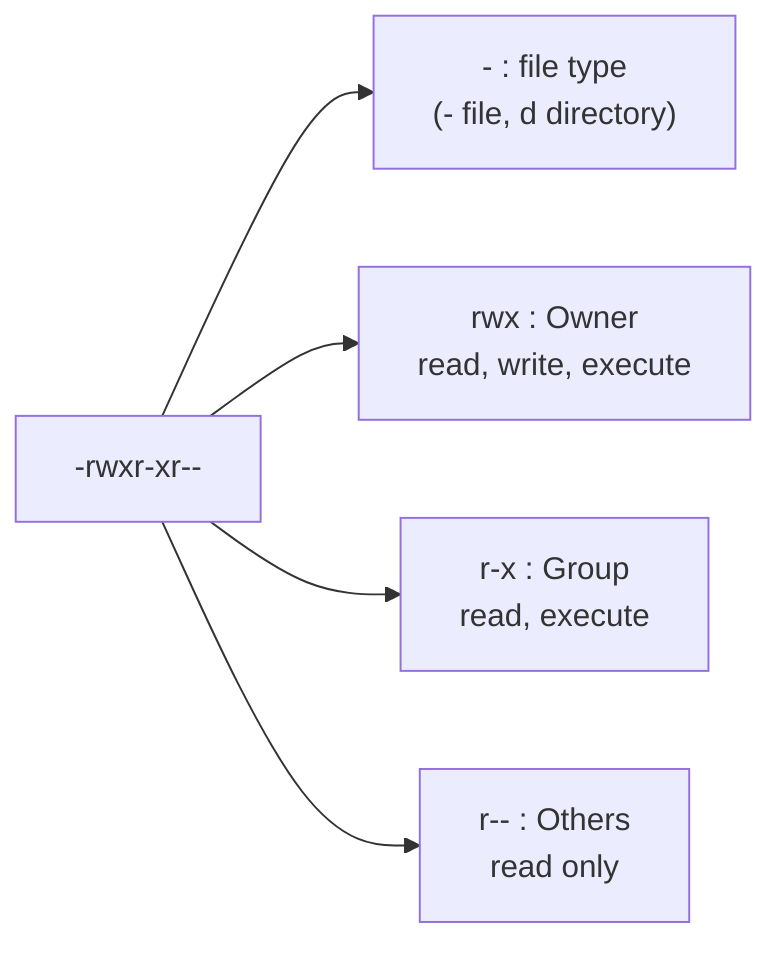

# Linux Command Line – Fundamentals Guide (Placement Prep)

The practical shell fluency that Docker, Kubernetes, and AWS all assume you already have.

---

## Part 1: Concept Walkthrough

### The Linux filesystem hierarchy

Everything in Linux is organized into a single tree, starting at `/` (root) — no separate drive letters like `C:\`.



### Piping and redirection — chaining commands together

The real power of the shell comes from connecting simple commands into pipelines.



**Key idea:** `|` (pipe) sends one command's output directly into the next command's input, letting you build complex operations from small, single-purpose tools — the core Unix philosophy.

### File permissions, decoded



---

## Part 2: Q&A

### Module 1: Navigation & Filesystem

**Q1. What does `pwd` do?**
Prints the current working directory (full path of where you are).

**Q2. What's the difference between an absolute path and a relative path?**
Absolute: starts from root (`/home/user/file.txt`), always points to the same location regardless of where you currently are. Relative: starts from your current directory (`./file.txt` or `../folder`), depends on your current location.

**Q3. What do `.` and `..` mean in a path?**
`.` = current directory. `..` = parent directory (one level up).

**Q4. What is the home directory, and how do you quickly navigate to it?**
Each user's personal directory (e.g., `/home/username`) — navigate to it instantly with `cd` (no arguments) or `cd ~`.

**Q5. What's the difference between `ls`, `ls -l`, and `ls -la`?**
`ls`: basic file/folder listing. `ls -l`: long format (permissions, owner, size, date). `ls -la`: long format including hidden files (those starting with `.`).

### Module 2: File Operations

**Q6. What do `cp`, `mv`, and `rm` do?**
`cp`: copy a file/folder (`cp -r` for folders, recursive). `mv`: move OR rename a file/folder (same command does both). `rm`: delete a file (`rm -r` for folders, `rm -rf` forces deletion without confirmation — dangerous, use carefully).

**Q7. What is the difference between `cat`, `less`, and `head`/`tail`?**
`cat`: dumps entire file content to the terminal at once. `less`: opens the file for scrollable, paginated viewing (better for large files). `head`/`tail`: shows just the first/last N lines (`tail -f` follows a file live — extremely common for watching logs).

**Q8. What does `touch` do?**
Creates an empty file if it doesn't exist, or updates its "last modified" timestamp if it does.

**Q9. What's the difference between `mkdir` and `mkdir -p`?**
`mkdir`: creates one new directory (fails if parent directories don't exist). `mkdir -p`: creates the full nested path, creating any missing parent directories along the way.

### Module 3: Permissions & Ownership

**Q10. How do you read a permission string like `-rwxr-xr--`?**
First character: file type. Next 3: Owner's permissions. Next 3: Group's permissions. Last 3: Everyone else's permissions. Each triplet is Read/Write/Execute, shown as `r`/`w`/`x` or `-` if not granted.

**Q11. What does `chmod` do, and what does `chmod 755 file.sh` mean?**
Changes a file's permissions. `755` in numeric (octal) form: Owner=7 (rwx), Group=5 (r-x), Others=5 (r-x) — a very common setting for executable scripts.

**Q12. How does the numeric permission system work (4/2/1)?**
Read=4, Write=2, Execute=1 — add them per group. E.g., 6 = read+write (4+2), 7 = read+write+execute (4+2+1), 5 = read+execute (4+1).

**Q13. What does `chown` do?**
Changes a file/folder's owner (and optionally group) — e.g., `chown user:group file.txt`.

**Q14. Why does Docker's "don't run as root" best practice connect to these permission concepts?**
A process running as root inside a container has full read/write/execute rights on everything in its view — if compromised, it can do far more damage than a process constrained by normal user permissions, same underlying Linux permission model whether inside or outside a container.

### Module 4: Piping, Redirection & Text Processing

**Q15. What is the difference between `>` and `>>`?**
`>`: redirects output to a file, **overwriting** it if it already exists. `>>`: redirects output, **appending** to the end of the file instead.

**Q16. What does the pipe `|` do?**
Sends the standard output of one command directly as the standard input to the next command — lets you chain multiple simple commands into a single pipeline.

**Q17. What does `grep` do, and give a common usage example.**
Searches text for lines matching a pattern. Example: `grep "ERROR" app.log` prints every line containing "ERROR"; `grep -i` makes it case-insensitive; `grep -r` searches recursively through a directory.

**Q18. What do `sort` and `uniq` do, and why are they often used together?**
`sort`: arranges lines alphabetically/numerically. `uniq`: removes adjacent duplicate lines — since `uniq` only catches *adjacent* duplicates, it's almost always used as `sort file.txt | uniq` to first group identical lines together.

**Q19. What does `wc` do?**
Word count utility — `wc -l` counts lines (very commonly piped at the end of a pipeline to count how many results matched, e.g., `grep ERROR log.txt | wc -l`).

**Q20. What is `awk` used for, at a basic level?**
A text-processing tool for extracting/manipulating columns of structured text — e.g., `awk '{print $1}'` prints just the first whitespace-separated field of each line.

**Q21. What does `<` (input redirection) do?**
Feeds a file's content as input to a command, instead of the command reading from the keyboard — e.g., `sort < names.txt`.

### Module 5: Processes, Environment & Background Jobs

**Q22. How do you run a command in the background, and why would you?**
Append `&` to the command (e.g., `python server.py &`) — frees up your terminal to keep working while the command continues running.

**Q23. What do `jobs`, `fg`, and `bg` do?**
`jobs`: lists background/suspended jobs in the current shell. `fg`: brings a background job to the foreground. `bg`: resumes a suspended job in the background.

**Q24. What is an Environment Variable, and how do you set one?**
A named value available to processes in your shell session — set with `export VAR_NAME=value`; view with `echo $VAR_NAME`. Commonly used for API keys, config paths (e.g., how you'd set `AWS_ACCESS_KEY_ID` for the AWS CLI from earlier guides).

**Q25. What is the `PATH` environment variable?**
A list of directories the shell searches through (in order) to find the executable for a command you type — this is *why* typing `docker` or `python` works without specifying the full file path.

**Q26. What's the difference between `.bashrc` and running `export` directly in the terminal?**
`export` in the terminal only lasts for your current session — closing the terminal loses it. Adding it to `.bashrc` (or `.zshrc`) makes it persist automatically every time you open a new shell.

### Module 6: Package Management & SSH

**Q27. What does a package manager like `apt` (Debian/Ubuntu) do?**
Installs, updates, and removes software along with automatically resolving dependencies — e.g., `sudo apt install docker.io`, `sudo apt update` (refresh package lists), `sudo apt upgrade` (update installed packages).

**Q28. What does `sudo` do?**
Runs a single command with elevated (root/administrator) privileges — required for actions like installing software or modifying system files that a regular user account can't do.

**Q29. What is SSH, and why does it matter for cloud work (connects to your AWS guide)?**
Secure Shell — a protocol for securely connecting to and controlling a remote machine's terminal over a network. This is literally how you connect to an EC2 instance: `ssh -i mykey.pem ec2-user@<public-ip>`.

**Q30. What does `scp` do?**
Securely copies files between your local machine and a remote machine over SSH — e.g., `scp -i mykey.pem file.txt ec2-user@<ip>:/home/ec2-user/`.

---

## Part 3: Hands-On Commands

### 3.1 Navigation practice

```bash
pwd                          # where am I?
ls -la                       # list everything, including hidden files, with details
cd /tmp                      # go to /tmp
cd ~                         # go home
cd -                         # go back to the previous directory
```

### 3.2 File operations practice

```bash
mkdir -p practice/subfolder   # create nested folders in one go
touch practice/notes.txt
echo "Hello Linux" > practice/notes.txt      # overwrite content
echo "Second line" >> practice/notes.txt      # append content
cat practice/notes.txt                        # view it
cp practice/notes.txt practice/notes_copy.txt
mv practice/notes_copy.txt practice/renamed.txt
rm practice/renamed.txt
```

### 3.3 Permissions practice

```bash
touch script.sh
ls -l script.sh               # observe default permissions
chmod 755 script.sh            # make it executable
ls -l script.sh                # observe the change
chmod +x script.sh             # alternative syntax: just add execute permission
```

### 3.4 Piping & text processing practice

```bash
# Create a sample log file
printf "INFO: started\nERROR: disk full\nINFO: retrying\nERROR: timeout\n" > app.log

grep "ERROR" app.log                 # find error lines
grep "ERROR" app.log | wc -l          # count error lines
cat app.log | sort | uniq             # sort and deduplicate
tail -f app.log                       # watch the file live (Ctrl+C to stop)
```

### 3.5 Environment variables practice

```bash
export MY_API_KEY="test123"
echo $MY_API_KEY
env | grep MY_API_KEY                 # confirm it's in the environment
unset MY_API_KEY                      # remove it
```

---

## Part 4: Mini Assignment

**Goal:** Build real muscle memory for the commands that Docker/K8s/AWS work assumes you already know.

**Task 1 — Build a small pipeline:**
1. Create a text file with at least 15 lines, where some lines repeat and some contain the word "FAIL" and others contain "PASS" (simulate a test log).
2. Write a single piped command that counts how many lines contain "FAIL".
3. Write a single piped command that extracts only the unique lines and saves them to a new file.

**Task 2 — Permissions exercise:**
1. Create a script file (`touch myscript.sh`), add `echo "running!"` inside it using `echo ... > myscript.sh`.
2. Try running it directly (`./myscript.sh`) before setting execute permission — observe the "Permission denied" error.
3. Add execute permission with `chmod +x`, then run it successfully. Explain in 1 sentence what changed.

**Task 3 — Background jobs:**
1. Start a long-running command in the background (e.g., `sleep 60 &`).
2. Use `jobs` to confirm it's running.
3. Bring it to the foreground with `fg`, then interrupt it early with Ctrl+C.

**Deliverable:** A short write-up showing your Task 1 pipeline commands + output, your Task 2 before/after permission test, and your Task 3 background job commands.

---

## Quick Revision Checklist

- [ ] Navigate confidently with `cd`, `pwd`, `ls -la`
- [ ] Explain absolute vs relative paths
- [ ] Read and set permissions with `chmod` (both symbolic and numeric)
- [ ] Explain piping (`|`) vs redirection (`>`, `>>`, `<`)
- [ ] Use `grep`, `sort`, `uniq`, `wc` in a pipeline
- [ ] Explain environment variables and `PATH`
- [ ] Explain SSH and why it matters for cloud/EC2 access
- [ ] Run a background job and manage it with `jobs`/`fg`/`bg`

---

*Next: Git & Version Control — the other prerequisite before diving into Docker and the rest of the stack.*