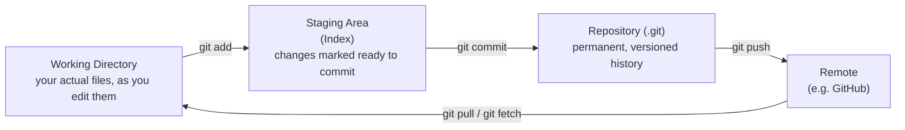
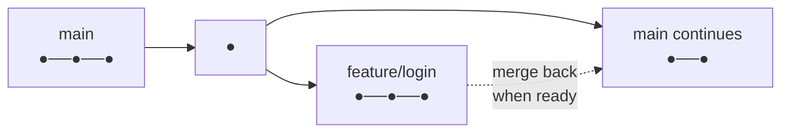
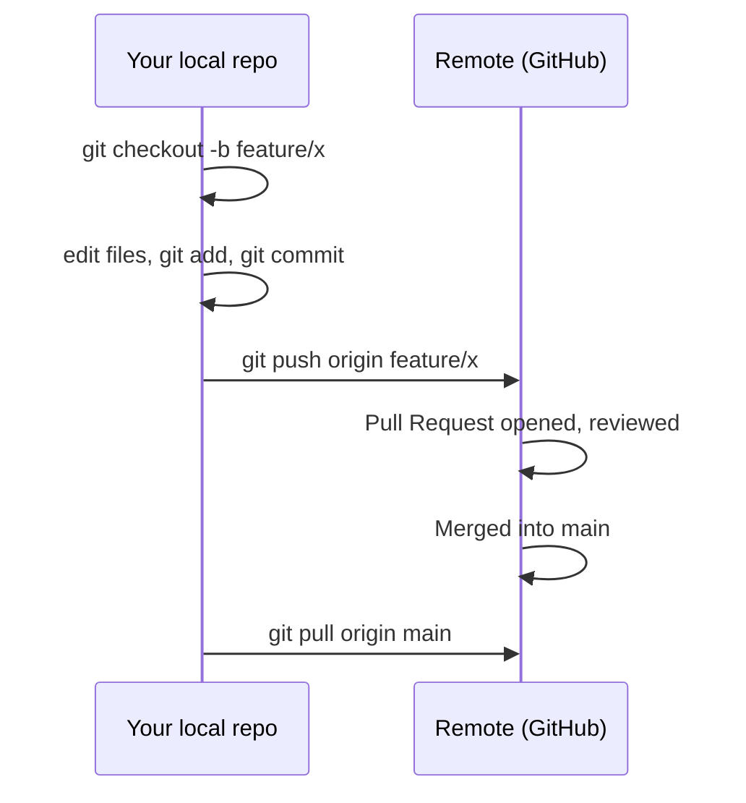

# Git & Version Control – Fundamentals Guide (Placement Prep)

The second prerequisite before diving into Docker/Kubernetes/Cloud — nearly every real-world workflow in that stack assumes git fluency.

---

## Part 1: Concept Walkthrough

### What problem does Git solve?

Without version control, tracking changes to code means manually copying files (`app_v1.py`, `app_v2_final.py`, `app_v2_FINAL_actually.py`) — error-prone and impossible to collaborate on safely. Git tracks every change to your codebase over time, lets multiple people work on the same project without overwriting each other's work, and lets you safely experiment (via branches) without risking the working codebase.

### Git's three trees — the core mental model

Understanding these three areas is the single most important concept in Git.



**Key idea:** `git add` doesn't save your changes permanently — it just marks them as "ready to be committed." `git commit` is what actually creates a permanent snapshot in your project's history. This two-step process lets you carefully choose exactly which changes go into each commit.

### Branching — working on parallel versions



**Key idea:** A branch is just a movable pointer to a commit. Creating a branch is instant and cheap — it lets you develop a new feature in isolation, without touching the stable `main` branch, then merge your changes back in once they're ready and tested.

### The typical local + remote workflow



---

## Part 2: Q&A

### Module 1: Version Control Fundamentals

**Q1. What is Version Control?**
A system that records changes to files over time, so you can recall specific versions later, track who changed what and why, and collaborate without overwriting each other's work.

**Q2. What is Git, specifically?**
A distributed version control system — meaning every contributor has a full copy of the entire project history on their own machine, not just a snapshot of the current files (unlike older centralized systems).

**Q3. What is the difference between Git and GitHub?**
**Git**: the version control tool/software itself, runs locally, works without any internet connection. **GitHub**: a cloud-hosted platform for storing Git repositories remotely, adding collaboration features (Pull Requests, Issues, code review) on top of Git — GitLab and Bitbucket are similar alternatives.

**Q4. What is a Repository ("repo")?**
A project's full set of files plus its entire history of changes, tracked by Git — stored in a hidden `.git` folder within the project directory.

**Q5. What is the difference between a local repository and a remote repository?**
Local: lives on your own machine. Remote: a version hosted elsewhere (e.g., on GitHub), used to share code and collaborate with others or back up your work.

### Module 2: The Core Workflow

**Q6. What does `git init` do?**
Initializes a new, empty Git repository in the current directory — creates the hidden `.git` folder that Git uses to track everything.

**Q7. What does `git status` show?**
The current state of your working directory and staging area — which files are modified, staged, or untracked (new files Git doesn't know about yet).

**Q8. What does `git add` do, precisely?**
Moves changes from the working directory into the staging area — marking them as "ready to be included in the next commit." Does NOT create a permanent record yet.

**Q9. What does `git commit` do?**
Takes everything currently in the staging area and permanently saves it as a new snapshot in the repository's history, along with a commit message describing the change.

**Q10. Why is a good commit message important?**
It documents *why* a change was made (not just what), which becomes essential when reviewing history months later, debugging when something broke, or collaborating with a team — a vague message like "fixed stuff" provides no useful context later.

**Q11. What does `git log` show?**
The commit history — by default, each commit's unique hash, author, date, and message, in reverse chronological order (most recent first).

**Q12. What does `git diff` show?**
The exact line-by-line differences between your working directory and the last commit (or between any two commits/branches) — shows what's actually changed, not just which files.

### Module 3: Branching & Merging

**Q13. What is a Branch, technically?**
A lightweight, movable pointer to a specific commit — creating a branch doesn't copy any files, it just creates a new named reference you can move independently as you commit.

**Q14. What is the default branch typically called, and what does it represent?**
Historically `master`, now commonly `main` — conventionally represents the stable, production-ready version of the codebase.

**Q15. How do you create and switch to a new branch?**
`git branch feature/login` creates it; `git checkout feature/login` switches to it — or in one step: `git checkout -b feature/login`. Newer Git versions also support `git switch -c feature/login`.

**Q16. What does `git merge` do?**
Combines the changes from one branch into another (typically merging a feature branch back into `main`) — creates a new "merge commit" that ties both histories together.

**Q17. What is a Merge Conflict, and why does it happen?**
Occurs when Git can't automatically combine changes because the same lines of the same file were modified differently in both branches being merged — requires manual resolution, where you choose which changes to keep (or combine them).

**Q18. How do you resolve a merge conflict, at a high level?**
Git marks the conflicting sections directly in the file (with `<<<<<<<`, `=======`, `>>>>>>>` markers) — you manually edit the file to keep the correct final content, remove the markers, then `git add` the resolved file and `git commit` to complete the merge.

**Q19. What is Git Rebase, and how does it differ from Merge?**
**Merge**: combines two branches' histories with a new merge commit, preserving both histories as they happened. **Rebase**: replays your branch's commits on top of the target branch, creating a linear history as if you'd started your work later — commonly used to keep history clean, but rewrites commit history (risky on shared/public branches).

### Module 4: Remote Repositories

**Q20. What does `git clone` do?**
Downloads a complete copy of a remote repository (including its full history) to your local machine, automatically setting up the remote connection.

**Q21. What is the difference between `git fetch` and `git pull`?**
`git fetch`: downloads new commits/branches from the remote but does NOT merge them into your current branch — lets you review changes first. `git pull`: fetches AND immediately merges (essentially `git fetch` + `git merge` combined).

**Q22. What does `git push` do?**
Uploads your local commits to a remote repository, updating the remote branch to match your local one.

**Q23. What is "origin" in Git terminology?**
The conventional default name given to the remote repository you cloned from or first configured — just a label/alias for a remote URL (you can have multiple remotes with different names).

**Q24. What happens if you `git push` but someone else has already pushed conflicting changes to the same branch?**
Git rejects the push (fails with a "non-fast-forward" error) — you must `git pull` first to incorporate their changes (resolving any conflicts), then push again.

### Module 5: Practical Workflow & Common Interview Questions

**Q25. What is a Pull Request (PR) / Merge Request (MR)?**
A GitHub/GitLab feature (not a core Git concept) that proposes merging one branch into another, enabling code review, discussion, and automated checks (like CI/CD tests) before the merge actually happens.

**Q26. What is `.gitignore` used for?**
A file listing patterns of files/folders Git should never track (e.g., `node_modules/`, `.env`, `__pycache__/`, compiled binaries) — prevents cluttering the repo with generated files or accidentally committing secrets.

**Q27. What is the Feature Branch Workflow?**
A common team convention: `main` stays stable; each new feature/fix is developed on its own separate branch, then merged back via a reviewed Pull Request — keeps `main` always deployable and isolates in-progress work.

**Q28. What does `git revert` do, and how does it differ from `git reset`?**
`git revert`: creates a NEW commit that undoes the changes of a previous commit — safe for shared history since nothing is deleted/rewritten. `git reset`: moves the branch pointer backward, actually removing commits from history (dangerous on shared branches, useful for cleaning up local-only mistakes).

**Q29. What is a Commit Hash?**
A unique identifier (SHA-1 checksum) automatically generated for every commit, based on its content and history — used to reference specific commits precisely (e.g., in `git checkout <hash>` or `git revert <hash>`).

**Q30. Why does the Docker/CI-CD world care so much about Git?**
Modern deployment pipelines are typically **triggered by git events** — e.g., "when code is pushed/merged to `main`, automatically build a new Docker image and deploy it" — Git isn't just for code history, it's the trigger mechanism for most modern automated build/deploy workflows (this is exactly what you'll see when CI/CD comes up alongside Docker/Kubernetes).

---

## Part 3: Hands-On Commands

### 3.1 Setting up and making your first commit

```bash
git config --global user.name "Your Name"
git config --global user.email "you@example.com"

mkdir my-project && cd my-project
git init
echo "# My Project" > README.md
git status                        # see README.md as untracked
git add README.md
git status                        # see it as staged
git commit -m "Initial commit: add README"
git log                           # see your commit
```

### 3.2 Branching and merging practice

```bash
git checkout -b feature/greeting     # create + switch to new branch
echo "print('Hello!')" > greeting.py
git add greeting.py
git commit -m "Add greeting script"

git checkout main                     # switch back to main
git merge feature/greeting             # bring the changes into main
git log --oneline --graph --all         # visualize the branch history
```

### 3.3 Simulating and resolving a merge conflict

```bash
# On main:
echo "version 1" > conflict.txt
git add conflict.txt && git commit -m "main: version 1"

git checkout -b feature/change
echo "version 2 from feature" > conflict.txt
git add conflict.txt && git commit -m "feature: version 2"

git checkout main
echo "version 1 but edited on main" > conflict.txt
git add conflict.txt && git commit -m "main: edited version"

git merge feature/change    # CONFLICT! Git will tell you here.
cat conflict.txt              # see the <<<<<<< ======= >>>>>>> markers

# Manually edit conflict.txt to resolve it, then:
git add conflict.txt
git commit -m "Resolve merge conflict"
```

### 3.4 Working with a remote (GitHub)

```bash
# After creating an empty repo on GitHub:
git remote add origin https://github.com/yourusername/my-project.git
git push -u origin main            # -u sets upstream tracking for future pushes

# Later, after someone else made changes:
git pull origin main

# Cloning an existing repo elsewhere:
git clone https://github.com/yourusername/my-project.git
```

### 3.5 .gitignore in action

```bash
echo "__pycache__/" > .gitignore
echo ".env" >> .gitignore
echo "*.log" >> .gitignore

git add .gitignore
git commit -m "Add gitignore"

# Now create files matching those patterns and confirm `git status` ignores them:
mkdir __pycache__ && touch __pycache__/cache.pyc
touch secret.log
git status    # __pycache__ and secret.log should NOT appear as untracked
```

---

## Part 4: Mini Assignment

**Goal:** Build real muscle memory for the branch → commit → merge → conflict-resolution cycle you'll use constantly in real projects.

**Task 1 — Full solo workflow:**
1. Follow Section 3.1 and 3.2 to create a project, make an initial commit, create a feature branch, commit a change on it, and merge it back into `main`.
2. Run `git log --oneline --graph --all` and paste/describe what the branch history looks like.

**Task 2 — Deliberately create and resolve a merge conflict:**
1. Follow Section 3.3 exactly to create a real conflict.
2. Resolve it manually, and write 2-3 sentences explaining what the `<<<<<<<`, `=======`, `>>>>>>>` markers represented in your specific case and what you chose to keep.

**Task 3 — Push to a real remote:**
1. Create a free GitHub account if you don't have one, create a new empty repository.
2. Push your local project from Task 1 to it using Section 3.4.
3. Make one more small change locally, commit it, and push again — confirm it appears on GitHub.

**Deliverable:** A short write-up with your Task 1 branch graph output, your Task 2 conflict resolution explanation, and a link (or screenshot) confirming your Task 3 push succeeded.

---

## Quick Revision Checklist

- [ ] Explain Git's three trees: Working Directory → Staging Area → Repository
- [ ] Explain `git add` vs `git commit`
- [ ] Explain what a branch actually is (a movable pointer)
- [ ] Explain merge conflicts and how to resolve them
- [ ] Explain `git fetch` vs `git pull`
- [ ] Explain `.gitignore` and why it matters
- [ ] Explain `git revert` vs `git reset`
- [ ] Explain why CI/CD pipelines are typically triggered by git events

---

## 🔗 Prerequisites complete

**OS Fundamentals → Linux CLI → Git** — you now have the full foundation beneath Docker, Kubernetes, and the entire cloud/AWS stack. Every Dockerfile you write, every `kubectl` session, and every CI/CD pipeline assumes exactly this: comfort in a terminal, understanding of the OS primitives containers rely on, and fluency moving code through a git workflow.

You're ready to start (or revisit) Docker with the full foundation underneath it.