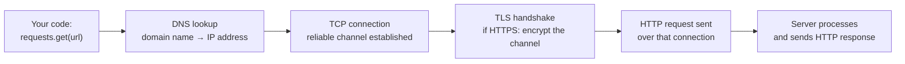
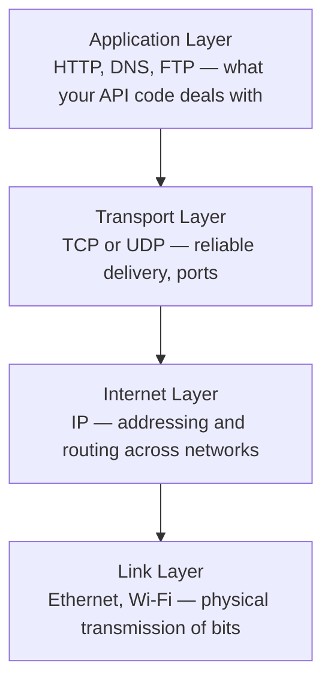
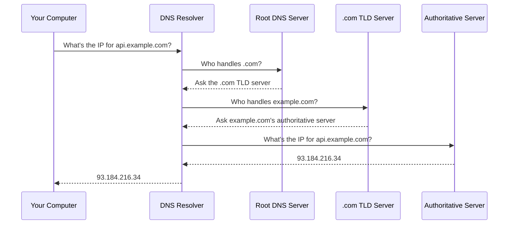
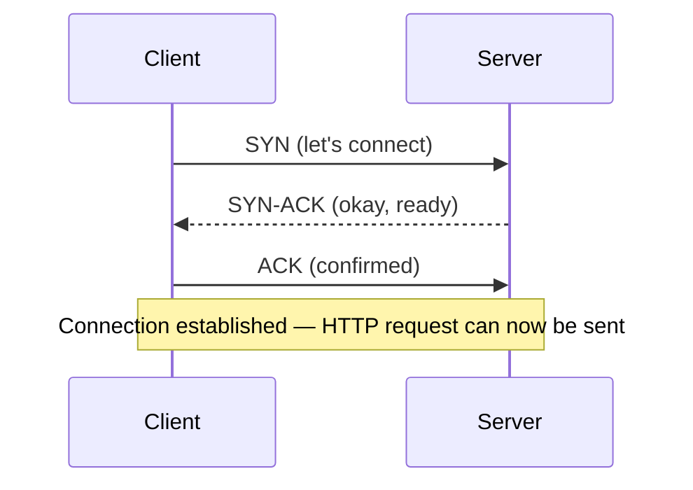

# Networking Fundamentals – Guide for Understanding APIs (Placement Prep)

---

## Part 1: Concept Walkthrough

### Why networking matters before REST

Every API call you made in the previous guide (`requests.get(...)`) triggers a whole chain of events under the hood: your computer finds the server's address (DNS), opens a reliable connection (TCP), and only then sends the actual HTTP request. Understanding this chain makes debugging, performance reasoning, and REST API design make far more sense.



### The layered model of networking (TCP/IP model)

Networking is built in **layers**, each handling a different responsibility — and each layer only needs to know about the one directly below/above it.



**Key idea:** When you call `requests.get()`, you're only interacting with the **Application layer**. Everything below it — finding the route, breaking data into packets, ensuring delivery — happens automatically, but understanding it explains *why* APIs behave the way they do (timeouts, connection errors, latency).

### DNS resolution — how a domain becomes an IP address



### TCP's 3-way handshake — establishing a reliable connection

Before any HTTP request can travel, TCP first establishes a verified, two-way connection.



---

## Part 2: Q&A

### Module 1: Core Networking Concepts

**Q1. What is a computer network?**
A collection of interconnected devices that can communicate and share data/resources with each other, using agreed-upon protocols.

**Q2. What is an IP Address?**
A unique numerical identifier assigned to a device on a network, used for routing data to the correct destination — e.g., `93.184.216.34` (IPv4) or a longer hexadecimal format (IPv6).

**Q3. IPv4 vs IPv6 — what's the key difference?**
IPv4: 32-bit addresses (~4.3 billion possible addresses, now largely exhausted). IPv6: 128-bit addresses (vastly larger address space), designed to solve IPv4 exhaustion as more devices connect to the internet.

**Q4. What is a Protocol, in networking terms?**
An agreed-upon set of rules that defines how data is formatted, transmitted, and interpreted between devices — e.g., HTTP, TCP, DNS are all protocols.

**Q5. What is the difference between the Internet and the Web (WWW)?**
The **Internet** is the underlying global network infrastructure (cables, routers, protocols like TCP/IP). The **Web** is one application built on top of it — a system of interlinked documents/resources accessed via HTTP/HTTPS.

### Module 2: The Layered Networking Model

**Q6. What is the TCP/IP model, and why is networking organized in layers?**
A 4-layer model (Application, Transport, Internet, Link) describing how data moves from an application on one device to an application on another. Layering lets each layer solve one problem independently — e.g., HTTP doesn't need to know how Wi-Fi transmits bits, it just needs TCP to reliably deliver its data.

**Q7. What does the Application Layer handle?**
Protocols that applications directly use — HTTP/HTTPS (web/APIs), DNS (name resolution), FTP (file transfer), SMTP (email). This is the layer your API code operates at.

**Q8. What does the Transport Layer handle?**
Ensuring data gets from one application to another correctly — primarily via **TCP** (reliable, ordered) or **UDP** (fast, no delivery guarantee) — and uses **ports** to direct data to the correct application on a device.

**Q9. What does the Internet Layer handle?**
Addressing and routing — the **IP protocol** determines how packets find their way across multiple networks from source to destination device, based on IP addresses.

**Q10. What does the Link Layer handle?**
The physical/local transmission of raw bits over a specific medium — Ethernet cables, Wi-Fi radio signals — between directly connected devices.

**Q11. How does the OSI model differ from the TCP/IP model (awareness-level)?**
OSI is a more detailed, 7-layer theoretical model (adds Presentation and Session layers, and splits Application further) — mostly used for teaching/conceptual reference. TCP/IP's 4-layer model is what's actually implemented in real-world networking.

### Module 3: TCP vs UDP

**Q12. What is TCP (Transmission Control Protocol)?**
A connection-oriented transport protocol that guarantees reliable, ordered delivery of data — establishes a connection first (3-way handshake), retransmits lost packets, and ensures data arrives in the correct order.

**Q13. What is UDP (User Datagram Protocol)?**
A connectionless transport protocol that sends data without establishing a connection or guaranteeing delivery/order — faster and lower-overhead than TCP, but data can be lost or arrive out of order.

**Q14. Why does HTTP (and therefore most APIs) use TCP instead of UDP?**
API requests/responses need reliability — you can't have half a JSON response arrive, or a POST request silently get dropped. TCP's guaranteed, ordered delivery is essential for correctness in most API use cases.

**Q15. When would UDP be preferred over TCP?**
When speed matters more than perfect reliability, and occasional data loss is acceptable — e.g., video streaming, online gaming, voice calls (VoIP) — a dropped frame/packet is less disruptive than the delay caused by TCP's retransmission and ordering guarantees.

**Q16. What is the TCP 3-way handshake?**
The process of establishing a TCP connection before any data is sent: **SYN** (client requests connection) → **SYN-ACK** (server acknowledges and agrees) → **ACK** (client confirms) — after this, the connection is established and data can flow.

### Module 4: Ports & Sockets

**Q17. What is a Port?**
A numbered endpoint (0–65535) on a device that identifies which specific application/service should receive incoming data — allows a single device with one IP address to run many networked applications simultaneously.

**Q18. What are some well-known default ports?**
**80** (HTTP), **443** (HTTPS), **22** (SSH), **21** (FTP), **53** (DNS), **3306** (MySQL default).

**Q19. What is a Socket?**
A combination of an IP address and a port number (e.g., `192.168.1.5:443`) that uniquely identifies one end of a network connection — the actual programming construct used to send/receive data over a network.

**Q20. Why does an API URL like `https://api.example.com` not usually show a port number?**
Because it's using the **default port** for the protocol — 443 for HTTPS, 80 for HTTP — these are implied automatically unless a different port is explicitly specified (e.g., `:8080`).

### Module 5: HTTP/HTTPS & Security Basics

**Q21. What is HTTP (HyperText Transfer Protocol)?**
The Application-layer protocol that defines how requests and responses are structured for transferring data on the web — the protocol underlying nearly all REST APIs.

**Q22. What is HTTPS, and how does it differ from HTTP?**
HTTPS is HTTP layered on top of **TLS/SSL encryption** — encrypts data in transit so it can't be read or tampered with by intermediaries, while HTTP sends data in plain text.

**Q23. What is a TLS/SSL handshake, briefly?**
A process that happens after the TCP connection is established (for HTTPS) where client and server agree on encryption methods and exchange keys/certificates to set up a secure, encrypted channel before any actual HTTP data is sent.

**Q24. What is a Certificate (SSL/TLS Certificate), and why does it matter?**
A digitally signed file that verifies a server's identity and enables encrypted communication — issued by a trusted Certificate Authority (CA); browsers/clients check it to confirm they're talking to the legitimate server, not an imposter.

**Q25. What is Latency, in networking terms?**
The time delay between sending a request and the first byte of response arriving — influenced by physical distance, network congestion, and number of hops the data must travel through.

**Q26. What is Bandwidth, and how does it differ from Latency?**
Bandwidth: how much data can be transferred per unit of time (capacity, e.g., Mbps). Latency: how long a single piece of data takes to arrive (delay). A connection can have high bandwidth but still have high latency, and vice versa.

### Module 6: Common Interview Questions

**Q27. Walk through what happens, network-wise, when you call `requests.get("https://api.example.com/users")`.**
1) DNS resolves `api.example.com` to an IP address. 2) A TCP connection is established via the 3-way handshake. 3) Since it's HTTPS, a TLS handshake follows to encrypt the channel. 4) The HTTP GET request is sent over that secure connection. 5) The server processes it and sends back an HTTP response. 6) The response travels back over the same connection to your code.

**Q28. Why might an API call time out?**
Could occur at multiple stages: DNS resolution failure, inability to establish a TCP connection (server down/unreachable/firewall blocking), or the server receiving the request but taking too long to respond (slow processing) — timeouts are configured to fail gracefully instead of waiting indefinitely.

**Q29. What is a Firewall, at a conceptual level?**
A security system (hardware or software) that monitors and controls incoming/outgoing network traffic based on defined rules — can block traffic on certain ports or from certain IP addresses, which is a common cause of "why can't I reach this API" issues.

**Q30. Why is understanding ports important when deploying an API/web server?**
Your server must "listen" on a specific port for incoming requests, and that port must be open/allowed through any firewalls — misconfigured ports are a very common real-world deployment issue ("connection refused" errors).

**Q31. What does "stateless" mean at the networking/HTTP level, and why does it matter for APIs (preview for REST)?**
Each HTTP request is independent — the server doesn't automatically remember anything about previous requests from the same client just because they used the same connection. This underlying statelessness is a foundational reason REST APIs are designed the way they are (covered in depth in the REST guide).

---

## Part 3: Code Snippets

### 3.1 DNS resolution in Python

```python
import socket

hostname = "api.github.com"
ip_address = socket.gethostbyname(hostname)
print(f"{hostname} resolves to {ip_address}")
```

### 3.2 Opening a raw TCP socket connection (seeing the handshake in action)

```python
import socket
import time

host = "example.com"
port = 80  # HTTP default port

start = time.time()
sock = socket.socket(socket.AF_INET, socket.SOCK_STREAM)  # TCP socket
sock.connect((host, port))  # triggers the 3-way handshake under the hood
elapsed = time.time() - start

print(f"TCP connection to {host}:{port} established in {elapsed:.3f}s")
sock.close()
```

### 3.3 Manually sending a raw HTTP request over a socket (seeing what `requests` does for you)

```python
import socket

host = "example.com"
port = 80

sock = socket.socket(socket.AF_INET, socket.SOCK_STREAM)
sock.connect((host, port))

# Manually construct a raw HTTP GET request
request = f"GET / HTTP/1.1\r\nHost: {host}\r\nConnection: close\r\n\r\n"
sock.sendall(request.encode())

response = b""
while True:
    chunk = sock.recv(4096)
    if not chunk:
        break
    response += chunk

sock.close()
print(response.decode(errors="ignore")[:500])  # print first 500 chars of raw response
```

### 3.4 Measuring latency vs checking bandwidth-related timing

```python
import requests
import time

url = "https://api.github.com"

# Measure latency (time to first response)
start = time.time()
response = requests.get(url)
latency = time.time() - start

print(f"Status: {response.status_code}")
print(f"Latency: {latency*1000:.2f} ms")
print(f"Response size: {len(response.content)} bytes")
```

---

## Part 4: Mini Assignment

**Goal:** See the invisible networking machinery behind every API call you make.

**Task 1 — Trace DNS + latency for multiple hosts:**
Using Section 3.1 and 3.4:
1. Resolve the IP addresses of 3 different domains (e.g., `google.com`, `github.com`, a site hosted in a different region if you know one).
2. Measure the latency to each using Section 3.4's pattern.
3. Which had the lowest/highest latency? Form a hypothesis about why (server location, network conditions, etc.) — you don't need to prove it, just reason about it.

**Task 2 — Compare raw socket vs `requests` library:**
Using Section 3.3:
1. Run the raw socket HTTP request and observe the raw response — note the status line, headers, and body structure you get back manually.
2. Compare this to what `requests.get()` gives you automatically (from earlier guides) — list at least 3 things the `requests` library is doing for you that you had to do manually here (e.g., parsing headers, handling redirects, decoding).

**Task 3 — Diagnose a hypothetical timeout (no code, reasoning only):**
You call an API and it times out. Using what you learned in Module 6 (Q27-Q30), list the 4 different possible stages/reasons the timeout could be occurring, in the order they'd happen chronologically (DNS → TCP → TLS → Server processing). For each, briefly note one way you could investigate whether that stage is the culprit (e.g., "check if DNS resolves at all using `nslookup` or `socket.gethostbyname`").

**Deliverable:** A short write-up with your Task 1 latency comparison + hypothesis, your Task 2 raw-vs-library comparison list, and your Task 3 timeout diagnosis checklist.

---

## Quick Revision Checklist

- [ ] Explain the TCP/IP 4-layer model and what each layer handles
- [ ] Explain the difference between the Internet and the Web
- [ ] Explain TCP vs UDP and when to use each
- [ ] Explain the TCP 3-way handshake
- [ ] Explain ports and sockets, and name common default ports (80, 443, 22, 53)
- [ ] Explain HTTP vs HTTPS and what TLS adds
- [ ] Explain latency vs bandwidth
- [ ] Walk through what happens network-wise for a single API call, start to finish

---

*Next: REST — deep dive into HTTP methods, status codes, statelessness, and REST API design principles, now with the networking foundation to fully understand why REST is designed the way it is.*